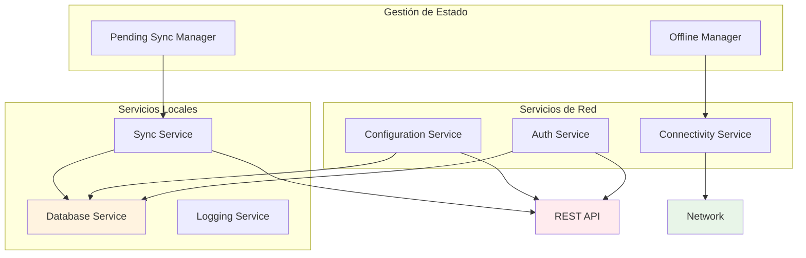
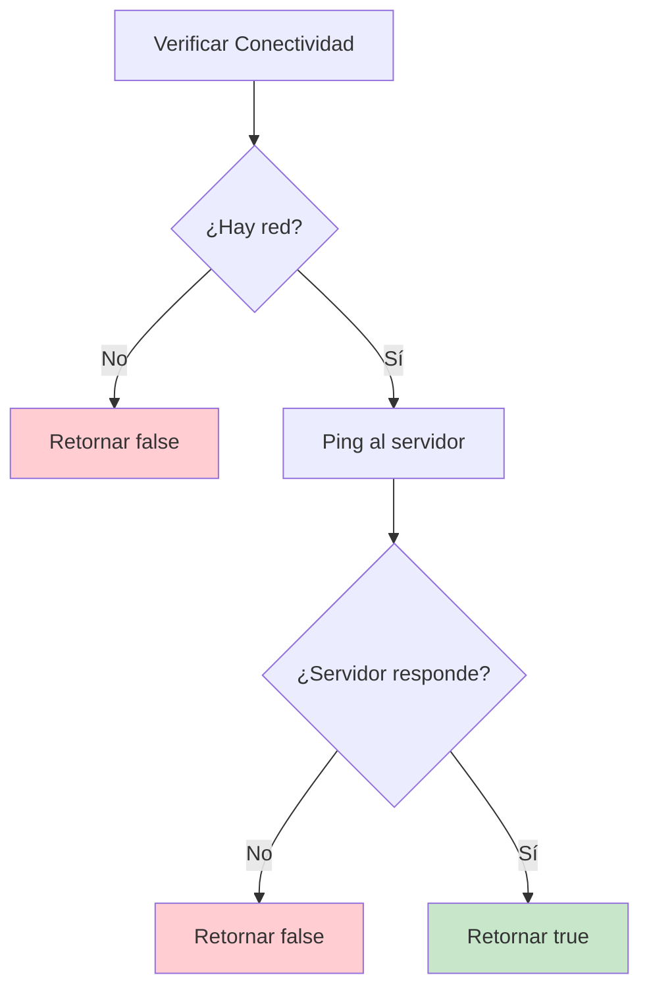
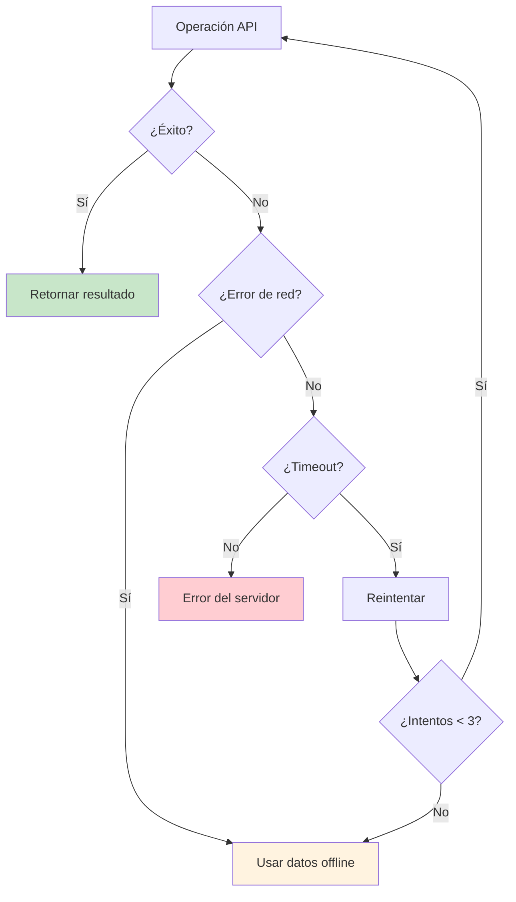

# API y Servicios

## Visión General

GanaderaSoft se comunica con un backend REST API para sincronización de datos y operaciones en línea. La aplicación está diseñada para funcionar completamente offline, utilizando la API solo para sincronización cuando hay conectividad disponible.

## Configuración de API

### Endpoint Base
**Servidor**: `http://52.53.127.245:8000`  
**API Base**: `http://52.53.127.245:8000/api`

### Configuración
**Ubicación**: `lib/config/app_config.dart`

```dart
class AppConfig {
  static const String _baseUrl = 'http://52.53.127.245:8000';
  
  static String get baseUrl => _baseUrl;
  static String get apiUrl => '$_baseUrl/api';
  
  // Endpoints principales
  static String get loginUrl => '$apiUrl/auth/login';
  static String get logoutUrl => '$apiUrl/auth/logout';
  static String get profileUrl => '$apiUrl/profile';
  // ... más endpoints
}
```

## Arquitectura de Servicios



## Endpoints de API

### Autenticación

#### Login
- **URL**: `POST /api/auth/login`
- **Descripción**: Autenticación de usuario
- **Request Body**:
```json
{
  "email": "usuario@ejemplo.com",
  "password": "contraseña"
}
```
- **Response**:
```json
{
  "success": true,
  "token": "jwt_token_here",
  "user": {
    "id": 1,
    "name": "Juan Pérez",
    "email": "usuario@ejemplo.com",
    "type_user": "Propietario"
  }
}
```

#### Logout
- **URL**: `POST /api/auth/logout`
- **Headers**: `Authorization: Bearer {token}`
- **Response**:
```json
{
  "message": "Logout successful"
}
```

#### Perfil
- **URL**: `GET /api/profile`
- **Headers**: `Authorization: Bearer {token}`
- **Response**:
```json
{
  "user": {
    "id": 1,
    "name": "Juan Pérez",
    "email": "usuario@ejemplo.com",
    "type_user": "Propietario",
    "image": "url_imagen"
  }
}
```

### Gestión de Fincas

#### Listar Fincas
- **URL**: `GET /api/fincas`
- **Headers**: `Authorization: Bearer {token}`
- **Response**:
```json
{
  "data": [
    {
      "id_finca": 1,
      "id_propietario": 1,
      "nombre": "Finca El Porvenir",
      "explotacion_tipo": "Lechera",
      "created_at": "2024-01-01T00:00:00Z",
      "updated_at": "2024-01-01T00:00:00Z"
    }
  ]
}
```

### Gestión de Animales

#### Listar Animales
- **URL**: `GET /api/animales`
- **Query Parameters**:
  - `id_finca`: ID de la finca (opcional)
  - `id_rebano`: ID del rebaño (opcional)
- **Headers**: `Authorization: Bearer {token}`
- **Response**:
```json
{
  "data": [
    {
      "id_animal": 1,
      "id_rebano": 1,
      "nombre": "Vaca Luna",
      "codigo_animal": "VL001",
      "sexo": "F",
      "fecha_nacimiento": "2022-01-15",
      "procedencia": "Interna",
      "fk_composicion_raza": 1,
      "estado_id": 1,
      "etapa_id": 2,
      "created_at": "2024-01-01T00:00:00Z",
      "updated_at": "2024-01-01T00:00:00Z"
    }
  ]
}
```

#### Crear Animal
- **URL**: `POST /api/animales`
- **Headers**: `Authorization: Bearer {token}`
- **Request Body**:
```json
{
  "id_rebano": 1,
  "nombre": "Vaca Nueva",
  "codigo_animal": "VN001",
  "sexo": "F",
  "fecha_nacimiento": "2024-01-01",
  "procedencia": "Externa",
  "fk_composicion_raza": 1,
  "estado_id": 1,
  "etapa_id": 1
}
```

#### Actualizar Animal
- **URL**: `PUT /api/animales/{id}`
- **Headers**: `Authorization: Bearer {token}`
- **Request Body**: Igual al crear animal

### Gestión de Rebaños

#### Listar Rebaños
- **URL**: `GET /api/rebanos`
- **Query Parameters**: `id_finca` (opcional)
- **Headers**: `Authorization: Bearer {token}`

#### Crear Rebaño
- **URL**: `POST /api/rebanos`
- **Headers**: `Authorization: Bearer {token}`
- **Request Body**:
```json
{
  "id_finca": 1,
  "nombre": "Rebaño Lechero",
  "proposito": "Producción de leche"
}
```

### Personal de Finca

#### Listar Personal
- **URL**: `GET /api/personal-finca`
- **Query Parameters**: `id_finca` (opcional)

#### Crear Personal
- **URL**: `POST /api/personal-finca`
- **Request Body**:
```json
{
  "id_finca": 1,
  "cedula": 12345678,
  "nombre": "Juan",
  "apellido": "Trabajador",
  "telefono": "3001234567",
  "correo": "juan@finca.com",
  "tipo_trabajador": "Operario"
}
```

### Registros de Gestión

#### Cambios de Animal
- **URL**: `GET /api/cambios-animal`
- **URL**: `POST /api/cambios-animal`
- **Request Body**:
```json
{
  "fecha_cambio": "2024-01-01",
  "etapa_cambio": "Juvenil",
  "peso": 150.5,
  "altura": 80.0,
  "comentario": "Cambio de etapa normal",
  "cambios_etapa_anid": 1,
  "cambios_etapa_etid": 2
}
```

#### Peso Corporal
- **URL**: `GET /api/peso-corporal`
- **URL**: `POST /api/peso-corporal`
- **Request Body**:
```json
{
  "peso": 180.5,
  "fecha_registro": "2024-01-01",
  "comentario": "Peso mensual",
  "peso_corporal_anid": 1
}
```

#### Lactancia
- **URL**: `GET /api/lactancia`
- **URL**: `POST /api/lactancia`
- **Request Body**:
```json
{
  "lactancia_fecha_inicio": "2024-01-01",
  "lactancia_fecha_fin": "2024-10-01",
  "lactancia_secado": "Natural",
  "lactancia_anid": 1
}
```

#### Registros de Leche
- **URL**: `GET /api/leche`
- **URL**: `POST /api/leche`
- **Request Body**:
```json
{
  "fecha_ordeno": "2024-01-01",
  "cantidad_litros": 25.5,
  "observaciones": "Ordeño matutino",
  "leche_anid": 1
}
```

### Configuración del Sistema

#### Composición Racial
- **URL**: `GET /api/composicion-raza`
- **Response**:
```json
{
  "data": {
    "data": [
      {
        "id_composicion": 1,
        "nombre": "Holstein",
        "siglas": "HOL",
        "pelaje": "Negro y blanco",
        "proposito": "Lechera",
        "tipo_raza": "Pura",
        "origen": "Holanda"
      }
    ]
  }
}
```

## Servicios de Conectividad

### ConnectivityService

**Ubicación**: `lib/services/connectivity_service.dart`

#### Verificación de Conectividad

```dart
class ConnectivityService {
  // Verifica conectividad de red y accesibilidad del servidor
  static Future<bool> isConnected() async {
    // 1. Verificar conectividad de red
    final ConnectivityResult result = await _connectivity.checkConnectivity();
    if (result == ConnectivityResult.none) return false;
    
    // 2. Verificar accesibilidad del servidor
    return await _isServerReachable();
  }
  
  // Stream de cambios de conectividad
  static Stream<bool> get connectionStream => _connectionController!.stream;
}
```

#### Flujo de Verificación



### AuthService

**Ubicación**: `lib/services/auth_service.dart`

#### Gestión de Autenticación Híbrida

```dart
class AuthService {
  // Login híbrido (online/offline)
  Future<User> login(String email, String password) async {
    if (await ConnectivityService.isConnected()) {
      return await _loginOnline(email, password);
    } else {
      return await _loginOffline(email, password);
    }
  }
  
  // Login online con API
  Future<User> _loginOnline(String email, String password) async {
    final response = await http.post(
      Uri.parse(AppConfig.loginUrl),
      headers: {'Content-Type': 'application/json'},
      body: jsonEncode({'email': email, 'password': password}),
    );
    // ... procesar respuesta
  }
  
  // Login offline con credenciales hash
  Future<User> _loginOffline(String email, String password) async {
    final hashedPassword = _hashPassword(password);
    return await DatabaseService.getUserByCredentials(email, hashedPassword);
  }
}
```

### ConfigurationService

**Ubicación**: `lib/services/configuration_service.dart`

#### Estrategia de Cache-First

```dart
class ConfigurationService {
  // Obtener configuraciones con fallback offline
  static Future<ComposicionRazaResponse> getComposicionRaza() async {
    try {
      if (await ConnectivityService.isConnected()) {
        // Intentar obtener desde servidor
        final response = await _fetchFromServer();
        // Guardar en cache local
        await DatabaseService.saveComposicionRazaOffline(response.data);
        return response;
      } else {
        // Usar cache offline
        return await _getOfflineComposicionRaza();
      }
    } catch (e) {
      // Fallback a datos offline en caso de error
      return await _getOfflineComposicionRaza();
    }
  }
}
```

## Manejo de Errores de Red

### Estrategia de Reintentos



### Implementación de Timeouts

```dart
class ApiTimeouts {
  static const Duration httpTimeout = Duration(seconds: 10);
  static const Duration connectionTimeout = Duration(seconds: 5);
  
  static Future<http.Response> makeRequest(String url) async {
    return await http.get(
      Uri.parse(url),
      headers: await _getHeaders(),
    ).timeout(httpTimeout);
  }
}
```

## Autenticación y Seguridad

### Gestión de Tokens JWT

```dart
class TokenManager {
  // Guardar token original para uso online
  static Future<void> saveToken(String token) async {
    final prefs = await SharedPreferences.getInstance();
    await prefs.setString(AppConstants.tokenKey, token);
  }
  
  // Generar token offline temporal
  static Future<void> saveOfflineToken(String userId) async {
    final offlineToken = 'offline_${userId}_${DateTime.now().millisecondsSinceEpoch}';
    final prefs = await SharedPreferences.getInstance();
    await prefs.setString(AppConstants.tokenKey, offlineToken);
  }
  
  // Headers para requests autenticados
  static Future<Map<String, String>> getAuthHeaders() async {
    final token = await getToken();
    return {
      'Content-Type': 'application/json',
      'Authorization': 'Bearer $token',
    };
  }
}
```

### Hash de Contraseñas

```dart
import 'package:crypto/crypto.dart';

class PasswordSecurity {
  // Hash SHA-256 para almacenamiento offline
  static String hashPassword(String password) {
    final bytes = utf8.encode(password);
    final digest = sha256.convert(bytes);
    return digest.toString();
  }
  
  // Verificar contraseña offline
  static bool verifyPassword(String password, String hash) {
    return hashPassword(password) == hash;
  }
}
```

## Logging y Monitoreo

### LoggingService

**Ubicación**: `lib/services/logging_service.dart`

```dart
class LoggingService {
  static void debug(String message, String service) {
    print('[DEBUG] [$service] $message');
  }
  
  static void info(String message, String service) {
    print('[INFO] [$service] $message');
  }
  
  static void warning(String message, String service) {
    print('[WARNING] [$service] $message');
  }
  
  static void error(String message, String service, [dynamic error]) {
    print('[ERROR] [$service] $message${error != null ? ' - $error' : ''}');
  }
}
```

### Monitoreo de Performance

```dart
class ApiPerformance {
  static Future<T> measureApiCall<T>(
    String endpoint,
    Future<T> Function() apiCall,
  ) async {
    final stopwatch = Stopwatch()..start();
    
    try {
      final result = await apiCall();
      stopwatch.stop();
      
      LoggingService.info(
        'API call to $endpoint completed in ${stopwatch.elapsedMilliseconds}ms',
        'ApiPerformance'
      );
      
      return result;
    } catch (e) {
      stopwatch.stop();
      
      LoggingService.error(
        'API call to $endpoint failed after ${stopwatch.elapsedMilliseconds}ms',
        'ApiPerformance',
        e
      );
      
      rethrow;
    }
  }
}
```

## Mejores Prácticas

### 1. Manejo de Errores Robusto
```dart
try {
  final result = await apiCall();
  return result;
} on TimeoutException {
  return await fallbackToOffline();
} on SocketException {
  return await fallbackToOffline();
} catch (e) {
  LoggingService.error('Unexpected error', 'ApiService', e);
  return await fallbackToOffline();
}
```

### 2. Cache Inteligente
```dart
// Siempre intentar cache primero para mejor UX
if (useCache && await hasCachedData()) {
  final cachedData = await getCachedData();
  
  // Actualizar en background si hay conectividad
  if (await ConnectivityService.isConnected()) {
    _updateCacheInBackground();
  }
  
  return cachedData;
}
```

### 3. Validación de Datos
```dart
static bool isValidResponse(Map<String, dynamic> json) {
  return json.containsKey('data') || 
         json.containsKey('success') || 
         json.containsKey('message');
}
```

---

*Siguiente: [Testing](./testing.md)*