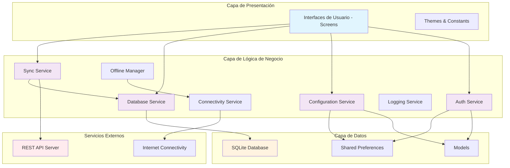
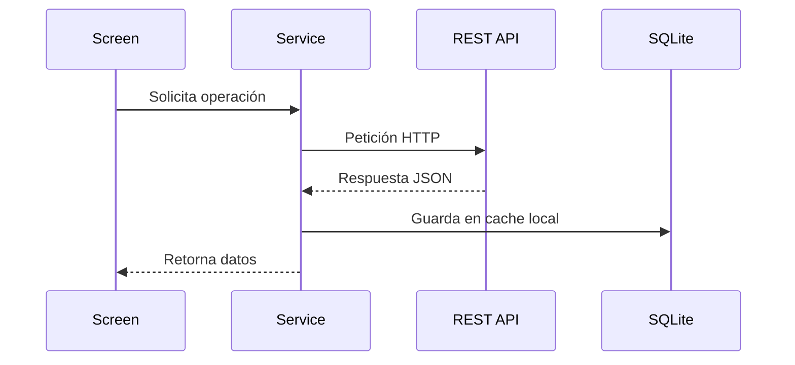
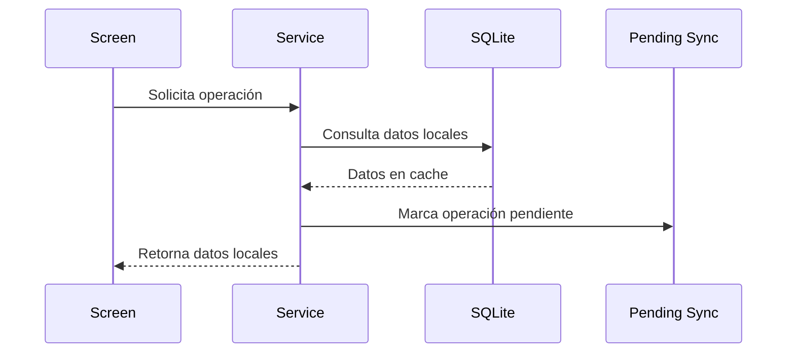

# Arquitectura de la Aplicación

## Visión General

GanaderaSoft está construida con una arquitectura modular que separa claramente las responsabilidades y permite un mantenimiento eficiente. La aplicación sigue el patrón **Model-View-Service (MVS)** con soporte completo para operaciones offline.

## Diagrama de Arquitectura General

## Capas de la Arquitectura

### 1. Capa de Presentación
**Ubicación:** `lib/screens/`, `lib/theme/`, `lib/constants/`

Contiene todas las interfaces de usuario y elementos visuales:

- **Screens**: Pantallas principales de la aplicación
- **Themes**: Configuración de temas y estilos
- **Constants**: Constantes de la aplicación (textos, configuraciones UI)

### 2. Capa de Lógica de Negocio
**Ubicación:** `lib/services/`

Contiene toda la lógica de negocio y servicios principales:

#### 2.1 Auth Service (`auth_service.dart`)
- Gestión de autenticación y autorización
- Manejo de tokens JWT
- Autenticación offline con credenciales hash
- Gestión de sesiones de usuario

#### 2.2 Database Service (`database_service.dart`)
- Gestión de la base de datos SQLite local
- Operaciones CRUD offline
- Migraciones de esquema
- Sincronización de datos

#### 2.3 Configuration Service (`configuration_service.dart`)
- Gestión de datos de configuración
- Caché de configuraciones offline
- Actualización de configuraciones del servidor

#### 2.4 Sync Service (`sync_service.dart`)
- Sincronización de datos con el servidor
- Gestión de conflictos
- Operaciones pendientes offline
- Estado de sincronización

#### 2.5 Connectivity Service (`connectivity_service.dart`)
- Monitoreo de conectividad de red
- Detección de estado online/offline
- Verificación de accesibilidad del servidor

#### 2.6 Offline Manager (`offline_manager.dart`)
- Coordinación del modo offline
- Gestión de transiciones online/offline
- Monitoreo de conectividad

#### 2.7 Logging Service (`logging_service.dart`)
- Sistema de logging unificado
- Diferentes niveles de log (debug, info, warning, error)
- Trazabilidad de operaciones

### 3. Capa de Datos
**Ubicación:** `lib/models/`, Base de datos SQLite, Shared Preferences

#### 3.1 Models
- **User**: Modelo de usuario
- **Finca**: Modelo de finca
- **Animal**: Modelo de animal
- **Farm Management Models**: Modelos de gestión de finca
- **Configuration Models**: Modelos de configuración
- **Pending Sync Models**: Modelos para sincronización pendiente

#### 3.2 Almacenamiento Local
- **SQLite**: Base de datos principal para datos offline
- **Shared Preferences**: Configuración y tokens

### 4. Servicios Externos
- **REST API Server**: Servidor backend con endpoints REST
- **Internet Connectivity**: Conectividad de red

## Flujo de Datos

### Operación Online

### Operación Offline

## Principios de Diseño

### 1. Separación de Responsabilidades
- Cada servicio tiene una responsabilidad específica
- Las screens solo manejan lógica de presentación
- Los modelos son entidades de datos puras

### 2. Inversión de Dependencias
- Los servicios dependen de abstracciones, no de implementaciones concretas
- Facilita testing y mantenimiento

### 3. Offline-First
- Todas las operaciones funcionan offline
- Los datos se sincronizan cuando hay conectividad
- La experiencia de usuario es consistente

### 4. Configurabilidad
- Endpoints de API configurables
- Timeouts configurables
- Diferentes niveles de logging

## Gestión de Estado

La aplicación utiliza el patrón **Service Locator** donde:

1. Los servicios son singleton
2. Las screens acceden a los servicios directamente
3. Los cambios de estado se notifican a través de callbacks
4. El estado offline/online se mantiene globalmente

## Seguridad

### Autenticación
- Tokens JWT para autenticación con el servidor
- Hash SHA-256 de contraseñas para autenticación offline
- Almacenamiento seguro en Shared Preferences

### Datos
- Validación de entrada en todos los formularios
- Sanitización de datos antes de almacenamiento
- Hash SHA-256 de contraseñas para autenticación offline

## Escalabilidad

### Horizontal
- Nuevos módulos pueden agregarse fácilmente
- Nuevos servicios siguen el mismo patrón
- API REST permite escalado del backend

### Vertical
- Base de datos SQLite puede manejar grandes volúmenes
- Sincronización por lotes para eficiencia
- Cache inteligente para reducir uso de memoria

---

*Siguiente: [Estrategia Offline](./estrategia-offline.md)*