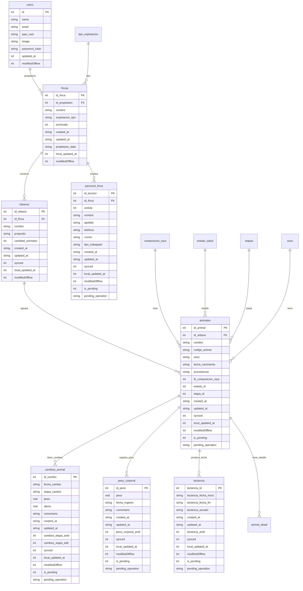
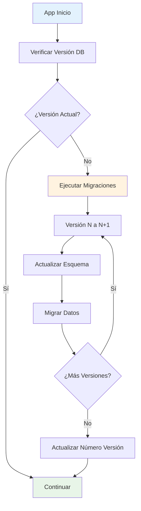

# Base de Datos

## Visión General

GanaderaSoft utiliza **SQLite** como base de datos local para almacenamiento offline. La base de datos está diseñada para almacenar todos los datos necesarios para el funcionamiento offline de la aplicación y mantener sincronización con el servidor a través de la REST API.

## Arquitectura de Base de Datos

### Características Principales
- **SQLite 3**: Base de datos embebida y ligera
- **Versionado**: Sistema de migraciones automáticas
- **Soporte Offline**: Diseñada para funcionamiento sin conexión
- **Sincronización**: Columnas especiales para manejo de sync
- **Integridad**: Constraints y relaciones definidas

## Esquema de Base de Datos

### Diagrama Entidad-Relación



## Gestión de Versiones y Migraciones

### Sistema de Versionado

La base de datos utiliza un sistema de versiones para manejo de migraciones:

```dart
// Ubicación: lib/services/database_service.dart
static const int _databaseVersion = 11;
```

### Historial de Migraciones

#### Versión 1 (Inicial)
- Tablas básicas: users, fincas, configuraciones
- Estructura inicial de animales y rebaños

#### Versión 2
- Añadida tabla `rebanos`
- Mejorada estructura de animales

#### Versión 3
- Añadidas columnas de sincronización
- Campos `synced`, `local_updated_at`, `modifiedOffline`

#### Versión 4
- Añadida tabla `personal_finca`
- Gestión de empleados de finca

#### Versión 5
- Añadidas tablas de configuración extendidas
- Mejoras en tipos de datos

#### Versión 6
- Añadida tabla `animal_detail`
- Soporte para detalles extendidos de animales

#### Versión 7
- Añadidas tablas de gestión de finca:
  - `cambios_animal`
  - `lactancia`
  - `peso_corporal`

#### Versión 8-10
- Mejoras en columnas de sincronización
- Optimizaciones de rendimiento

#### Versión 11 (Actual)
- Añadidas columnas `is_pending` y `pending_operation`
- Soporte completo para operaciones offline

### Proceso de Migración



## Columnas de Control de Sincronización

### Columnas Estándar

Cada tabla principal incluye las siguientes columnas para control de sincronización:

#### `synced` (INTEGER)
- **0**: No sincronizado con el servidor
- **1**: Sincronizado con el servidor
- **Uso**: Identificar registros que necesitan sincronización

#### `local_updated_at` (INTEGER)
- **Valor**: Timestamp de última modificación local
- **Uso**: Control de versiones y detección de cambios

#### `modifiedOffline` (INTEGER)
- **0**: No modificado offline (valor por defecto)
- **1**: Modificado mientras estaba offline
- **Uso**: Proteger datos modificados offline durante sync

#### `is_pending` (INTEGER)
- **0**: No hay operaciones pendientes
- **1**: Hay operaciones pendientes de sincronización
- **Uso**: Identificar registros en cola de sincronización

#### `pending_operation` (TEXT)
- **Valores**: 'CREATE', 'UPDATE', 'DELETE'
- **Uso**: Tipo de operación pendiente de sincronización

### Ejemplo de Estructura

```sql
CREATE TABLE animales (
    id_animal INTEGER PRIMARY KEY,
    id_rebano INTEGER NOT NULL,
    nombre TEXT NOT NULL,
    codigo_animal TEXT NOT NULL,
    sexo TEXT NOT NULL,
    fecha_nacimiento TEXT NOT NULL,
    procedencia TEXT NOT NULL,
    fk_composicion_raza INTEGER NOT NULL,
    estado_id INTEGER NOT NULL,
    etapa_id INTEGER NOT NULL,
    created_at TEXT NOT NULL,
    updated_at TEXT NOT NULL,
    synced INTEGER DEFAULT 0,
    local_updated_at INTEGER NOT NULL,
    modifiedOffline INTEGER DEFAULT 0,
    is_pending INTEGER DEFAULT 0,
    pending_operation TEXT
);
```

## Operaciones de Base de Datos

### Servicio de Base de Datos

**Ubicación**: `lib/services/database_service.dart`

#### Inicialización

```dart
static Future<Database> get database async {
  _database ??= await _initDatabase();
  return _database!;
}

static Future<Database> _initDatabase() async {
  final documentsDirectory = await getApplicationDocumentsDirectory();
  final path = join(documentsDirectory.path, 'ganaderasoft.db');
  
  return await openDatabase(
    path,
    version: _databaseVersion,
    onCreate: _createDatabase,
    onUpgrade: _upgradeDatabase,
  );
}
```

#### Operaciones CRUD Offline

##### Crear Registro Offline
```dart
static Future<int> savePendingAnimalOffline({
  required int idRebano,
  required String nombre,
  // ... otros parámetros
}) async {
  final db = await database;
  
  // Generar ID temporal negativo
  final tempId = -(DateTime.now().millisecondsSinceEpoch);
  
  await db.insert('animales', {
    'id_animal': tempId,
    'id_rebano': idRebano,
    'nombre': nombre,
    // ... otros campos
    'is_pending': 1,
    'pending_operation': 'CREATE',
    'synced': 0,
    'modifiedOffline': 1,
    'local_updated_at': DateTime.now().millisecondsSinceEpoch,
  });
  
  return tempId;
}
```

##### Actualizar Registro Offline
```dart
static Future<void> savePendingAnimalUpdateOffline({
  required int idAnimal,
  required String nombre,
  // ... otros parámetros
}) async {
  final db = await database;
  
  await db.update(
    'animales',
    {
      'nombre': nombre,
      // ... otros campos
      'is_pending': 1,
      'pending_operation': 'UPDATE',
      'modifiedOffline': 1,
      'local_updated_at': DateTime.now().millisecondsSinceEpoch,
    },
    where: 'id_animal = ?',
    whereArgs: [idAnimal],
  );
}
```

##### Consultar Registros Offline
```dart
static Future<List<Animal>> getAnimalesOffline({
  int? idFinca,
  String? sexoFilter,
  int? estadoFilter,
}) async {
  final db = await database;
  
  String whereClause = '';
  List<dynamic> whereArgs = [];
  
  if (idFinca != null) {
    whereClause = 'r.id_finca = ?';
    whereArgs.add(idFinca);
  }
  
  final maps = await db.rawQuery('''
    SELECT a.*, r.nombre as rebano_nombre
    FROM animales a
    JOIN rebanos r ON a.id_rebano = r.id_rebano
    ${whereClause.isNotEmpty ? 'WHERE $whereClause' : ''}
    ORDER BY a.nombre
  ''', whereArgs);
  
  return maps.map((map) => Animal.fromJson(map)).toList();
}
```

### Gestión de Registros Pendientes

#### Obtener Registros Pendientes
```dart
static Future<List<Map<String, dynamic>>> getAllPendingRecords() async {
  final db = await database;
  
  // Consultar todas las tablas con registros pendientes
  final pendingRecords = <Map<String, dynamic>>[];
  
  final tables = [
    'animales', 'personal_finca', 'cambios_animal',
    'peso_corporal', 'lactancia', 'rebanos'
  ];
  
  for (final table in tables) {
    final records = await db.query(
      table,
      where: 'is_pending = ?',
      whereArgs: [1],
    );
    
    for (final record in records) {
      pendingRecords.add({
        'table': table,
        'operation': record['pending_operation'],
        'data': record,
      });
    }
  }
  
  return pendingRecords;
}
```

#### Marcar como Sincronizado
```dart
static Future<void> markAnimalAsSynced(int tempId, int realId) async {
  final db = await database;
  
  await db.update(
    'animales',
    {
      'id_animal': realId,
      'synced': 1,
      'is_pending': 0,
      'pending_operation': null,
      'modifiedOffline': 0,
    },
    where: 'id_animal = ?',
    whereArgs: [tempId],
  );
}
```

## Optimizaciones de Performance

### Índices

```sql
-- Índices para mejorar rendimiento de consultas
CREATE INDEX idx_animales_rebano ON animales(id_rebano);
CREATE INDEX idx_animales_pending ON animales(is_pending);
CREATE INDEX idx_animales_synced ON animales(synced);
CREATE INDEX idx_personal_finca ON personal_finca(id_finca);
CREATE INDEX idx_cambios_animal ON cambios_animal(cambios_etapa_anid);
```

### Consultas Optimizadas

#### Joins Eficientes
```sql
-- Consulta optimizada de animales con información de rebaño
SELECT 
    a.id_animal,
    a.nombre,
    a.codigo_animal,
    r.nombre as rebano_nombre,
    cr.nombre as raza_nombre
FROM animales a
JOIN rebanos r ON a.id_rebano = r.id_rebano
JOIN composicion_raza cr ON a.fk_composicion_raza = cr.id_composicion
WHERE a.is_pending = 0
ORDER BY a.nombre;
```

#### Paginación
```dart
static Future<List<Animal>> getAnimalesPaginated({
  int offset = 0,
  int limit = 50,
}) async {
  final db = await database;
  
  final maps = await db.query(
    'animales',
    limit: limit,
    offset: offset,
    orderBy: 'nombre ASC',
  );
  
  return maps.map((map) => Animal.fromJson(map)).toList();
}
```

## Backup y Recuperación

### Estrategia de Backup

1. **Backup Automático**: Los datos están respaldados en el servidor
2. **Cache Local**: SQLite mantiene copia de todos los datos
3. **Sincronización**: Recuperación automática desde servidor

### Recuperación de Datos

```dart
static Future<void> clearAndResyncDatabase() async {
  final db = await database;
  
  // Eliminar solo datos sincronizados (preservar offline)
  await db.delete('animales', where: 'modifiedOffline = ? OR modifiedOffline IS NULL', whereArgs: [0]);
  await db.delete('rebanos', where: 'modifiedOffline = ? OR modifiedOffline IS NULL', whereArgs: [0]);
  
  // Marcar para re-sincronización
  await SyncService.syncData();
}
```

## Monitoreo y Debugging

### Logging de Operaciones

```dart
static Future<void> _logDatabaseOperation(String operation, String table, [dynamic data]) async {
  LoggingService.debug(
    'DB Operation: $operation on $table${data != null ? ' - Data: $data' : ''}',
    'DatabaseService'
  );
}
```

### Verificación de Integridad

```dart
static Future<bool> verifyDatabaseIntegrity() async {
  final db = await database;
  
  try {
    final result = await db.rawQuery('PRAGMA integrity_check');
    return result.first['integrity_check'] == 'ok';
  } catch (e) {
    LoggingService.error('Database integrity check failed', 'DatabaseService', e);
    return false;
  }
}
```

---

*Siguiente: [API y Servicios](./api-servicios.md)*