# Diagrama de Secuencia - Sincronización de Datos de Animales

Este diagrama muestra el flujo completo de sincronización de datos de animales cuando se reestablece la conexión a internet en la aplicación GanaderaSoft.

```mermaid
sequenceDiagram
    participant U as Usuario
    participant CS as ConnectivityService
    participant SS as SyncService
    participant AS as AuthService
    participant DS as DatabaseService
    participant SC as SyncController
    participant PSS as PendingSyncScreen

    Note over U, PSS: Proceso de Sincronización al Reestablecer Conexión

    %% ========== FASE 1: VERIFICACIÓN Y PREPARACIÓN ==========
    rect rgb(230, 245, 255)
        Note over SS, CS: FASE 1: Verificación y Preparación
        SS->>CS: isConnected()
        CS-->>SS: true/false
        
        alt No hay conexión
            SS->>SC: SyncData(error, "No hay conexión a internet")
            SS-->>U: return false
        else Hay conexión disponible
            SS->>SC: SyncData(syncing, "Iniciando sincronización...", 0.05)
        end
    end

    %% ========== FASE 2: SINCRONIZACIÓN DE DATOS BASE ==========
    rect rgb(240, 255, 240)
        Note over SS, DS: FASE 2: Sincronización de Datos Base
        
        %% Usuario
        SS->>SC: SyncData(syncing, "Sincronizando datos del usuario...", 0.1)
        SS->>AS: getProfile()
        AS-->>SS: user
        SS->>DS: saveUserOffline(user)
        SS->>AS: saveUser(user)
        
        %% Fincas
        SS->>SC: SyncData(syncing, "Sincronizando datos de fincas...", 0.2)
        SS->>AS: getFincas()
        AS-->>SS: fincasResponse
        SS->>DS: saveFincasOffline(fincas)
        
        %% Rebaños
        SS->>SC: SyncData(syncing, "Sincronizando datos de rebaños...", 0.25)
        SS->>AS: getRebanos()
        AS-->>SS: rebanosResponse
        SS->>DS: saveRebanosOffline(rebanos)
    end

    %% ========== FASE 3: SINCRONIZACIÓN DE ANIMALES (PRINCIPAL) ==========
    rect rgb(255, 250, 235)
        Note over SS, DS: FASE 3: Sincronización de Animales (Proceso Principal)
        
        %% Datos básicos de animales
        SS->>SC: SyncData(syncing, "Sincronizando datos de animales...", 0.3)
        SS->>AS: getAnimales()
        AS-->>SS: animalesResponse
        SS->>DS: saveAnimalesOffline(animales)
        
        %% Detalles de animales (bucle intensivo)
        Note over SS, DS: Sincronización de Detalles (Proceso Intensivo)
        
        loop Para cada animal
            SS->>AS: getAnimalDetail(animal.idAnimal)
            AS-->>SS: animalDetailResponse
            SS->>DS: saveAnimalDetailOffline(animalDetail)
            SS->>SS: syncedAnimals++
            SS->>SS: calcular progreso (0.3 + 0.2 * syncedAnimals/totalAnimals)
            SS->>SC: SyncData(syncing, "Sincronizando detalles... (X/Y)", progreso)
            
            alt Error en animal individual
                Note over SS: Warning logged, continúa con siguiente
            end
        end
        
        Note over SS: Animales sincronizados: N items, M detalles
    end

    %% ========== FASE 4: DATOS DE GESTIÓN DE FINCA ==========
    rect rgb(255, 240, 245)
        Note over SS, DS: FASE 4: Sincronización de Datos de Gestión de Finca
        
        %% Cambios de Animales
        SS->>SC: SyncData(syncing, "Sincronizando cambios de animales...", 0.52)
        SS->>AS: getCambiosAnimal()
        AS-->>SS: cambiosResponse
        SS->>DS: saveCambiosAnimalOffline(cambios)
        
        %% Peso Corporal
        SS->>SC: SyncData(syncing, "Sincronizando peso corporal...", 0.54)
        SS->>AS: getPesoCorporal()
        AS-->>SS: pesoResponse
        SS->>DS: savePesoCorporalOffline(peso)
        
        %% Personal de Finca
        SS->>SC: SyncData(syncing, "Sincronizando personal de finca...", 0.56)
        SS->>AS: getPersonalFinca()
        AS-->>SS: personalResponse
        SS->>DS: savePersonalFincaOffline(personal)
        
        %% Lactancia
        SS->>SC: SyncData(syncing, "Sincronizando registros de lactancia...", 0.58)
        SS->>AS: getLactancia()
        AS-->>SS: lactanciaResponse
        SS->>DS: saveLactanciaOffline(lactancia)
    end

    %% ========== FASE 5: DATOS DE CONFIGURACIÓN ==========
    rect rgb(245, 245, 255)
        Note over SS, DS: FASE 5: Sincronización de Datos de Configuración
        SS->>SC: SyncData(syncing, "Sincronizando estados de salud...", 0.55)
        Note over SS, DS: Se sincronizan múltiples tipos de configuración
        Note over SS, DS: (Estados de Salud, Etapas, Composición de Raza, etc.)
    end

    %% ========== FASE 6: FINALIZACIÓN ==========
    rect rgb(240, 255, 240)
        Note over SS, SC: FASE 6: Finalización del Proceso Principal
        SS->>SC: SyncData(success, "Sincronización completada exitosamente", 1.0)
        SS-->>U: return true
    end

    %% ========== PROCESO PARALELO: REGISTROS PENDIENTES ==========
    rect rgb(255, 245, 230)
        Note over PSS, DS: PROCESO PARALELO: Sincronización de Registros Pendientes
        
        %% Inicialización
        PSS->>DS: getAllPendingRecords()
        DS-->>PSS: pendingRecords
        PSS->>CS: isConnected()
        CS-->>PSS: true
        
        %% Animales Pendientes
        PSS->>DS: getPendingAnimalsOffline()
        DS-->>PSS: pendingAnimals
        
        alt No hay animales pendientes
            PSS->>PSS: mensaje "No hay animales pendientes"
        else Hay animales pendientes
            loop Para cada animal pendiente
                PSS->>DS: isAnimalAlreadySynced(tempId)
                DS-->>PSS: false
                
                alt Operación CREATE
                    PSS->>AS: createAnimal(animalData)
                    AS-->>PSS: animal (con ID real)
                    PSS->>DS: markAnimalAsSynced(tempId, realId)
                    Note over DS: tempId → realId, synced=1, is_pending=0
                    
                else Operación UPDATE
                    PSS->>AS: updateAnimal(animalData)
                    AS-->>PSS: éxito
                    PSS->>DS: markAnimalUpdateAsSynced(tempId)
                    Note over DS: synced=1, is_pending=0
                end
                
                PSS->>PSS: actualizar progreso (50% para animales)
                
                alt Error en animal individual
                    Note over PSS: Error logged, continúa con siguiente
                end
            end
        end
        
        %% Personal Finca Pendiente
        Note over PSS, DS: Similar proceso para Personal de Finca (50% restante)
        
        %% Finalización
        PSS->>DS: getAllPendingRecords()
        DS-->>PSS: pendingRecords (actualizados)
        PSS->>PSS: restablece estado de sincronización
    end

    %% ========== MANEJO DE ERRORES ==========
    rect rgb(255, 240, 240)
        Note over SS, PSS: Manejo de Errores
        
        alt Error Crítico (usuario, fincas, rebaños, animales principales)
            SS->>SC: SyncData(error, "Error crítico: ...", progreso)
            SS-->>U: return false
            Note over SS: Se detiene todo el proceso
            
        else Error No Crítico (detalles individuales, gestión finca)
            SS->>SS: Log warning
            Note over SS: Continúa con el siguiente elemento
        end
    end

    %% ========== RESULTADO FINAL ==========
    rect rgb(230, 255, 230)
        Note over U, PSS: Resultado Final
        Note over U: Usuario ve progreso completado
        Note over DS: Datos sincronizados en base de datos local
        Note over PSS: Registros pendientes procesados
        Note over U: Aplicación lista para uso normal
    end
```

## Descripción de Participantes

### Servicios Principales
- **SyncService (SS)**: Orquestador principal que coordina toda la sincronización
- **AuthService (AS)**: Maneja comunicación HTTP con el servidor API
- **DatabaseService (DS)**: Gestiona operaciones de base de datos SQLite local
- **ConnectivityService (CS)**: Verifica estado de conectividad de red

### Componentes de Control
- **SyncController (SC)**: Stream que comunica progreso y estado de sincronización
- **PendingSyncScreen (PSS)**: Pantalla que maneja sincronización de cambios locales
- **Usuario (U)**: Representa al usuario final de la aplicación

## Fases del Proceso

### 1. Verificación y Preparación (Color: Azul Claro)
- Verificación de conectividad
- Inicialización del proceso de sincronización

### 2. Sincronización de Datos Base (Color: Verde Claro)
- Usuario, fincas y rebaños
- Datos fundamentales requeridos

### 3. Sincronización de Animales (Color: Naranja Claro)
- Datos básicos de animales
- Detalles individuales (proceso intensivo)

### 4. Datos de Gestión de Finca (Color: Rosa Claro)
- Cambios de animales, peso corporal, personal, lactancia
- Datos operacionales de la finca

### 5. Datos de Configuración (Color: Lila Claro)
- Estados, etapas, composición de razas
- Configuraciones del sistema

### 6. Finalización (Color: Verde Claro)
- Confirmación de éxito
- Reporte de finalización

### Proceso Paralelo: Registros Pendientes (Color: Beige)
- Manejo de cambios locales offline
- Sincronización bidireccional

### Manejo de Errores (Color: Rosa Claro)
- Errores críticos vs no críticos
- Estrategias de recuperación

## Puntos Clave del Diagrama

1. **Secuencialidad**: El proceso principal es secuencial para garantizar integridad
2. **Paralelismo**: Los registros pendientes se pueden procesar independientemente
3. **Tolerancia a Fallos**: Errores individuales no detienen todo el proceso
4. **Progreso Granular**: Se reporta progreso detallado al usuario
5. **Transacciones Atómicas**: Cada operación de base de datos es atómica
6. **Recuperación de Estado**: Los registros pendientes mantienen estado entre sesiones