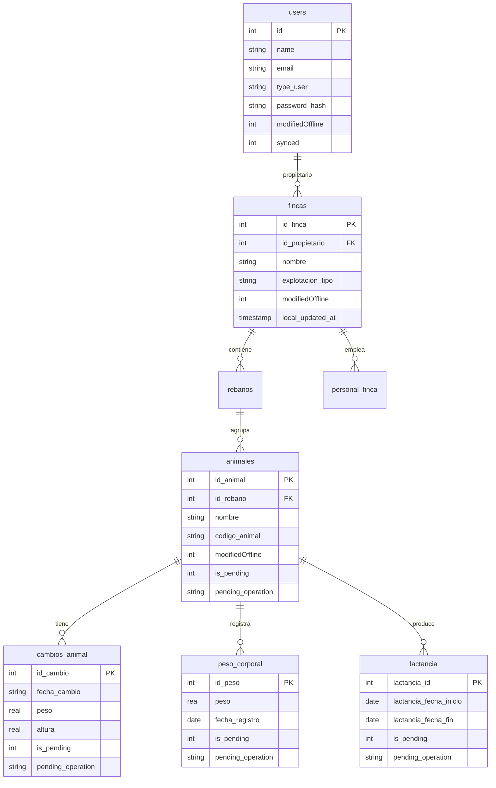
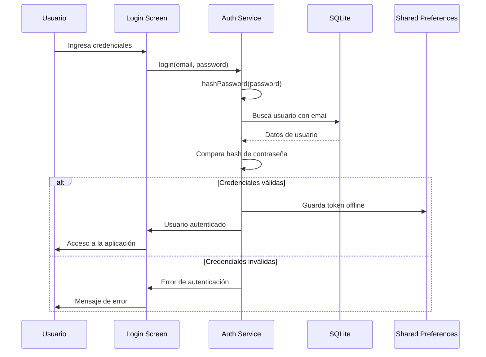
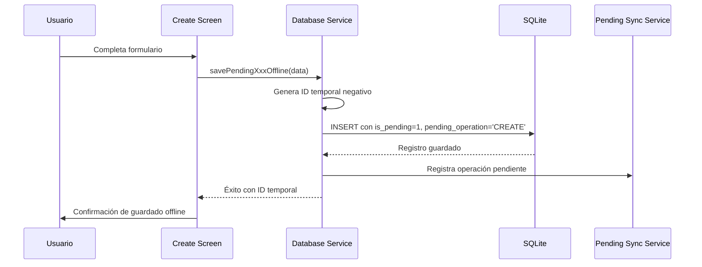
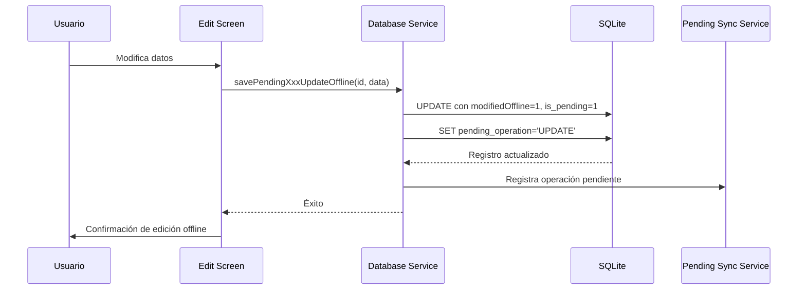
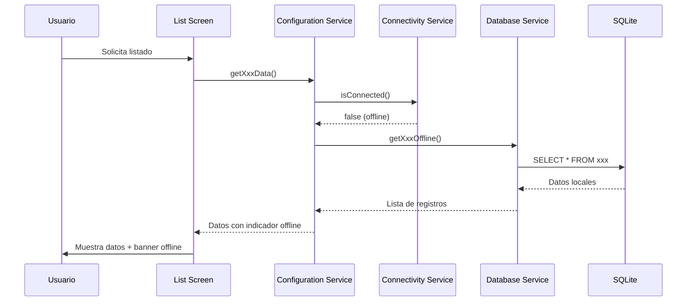
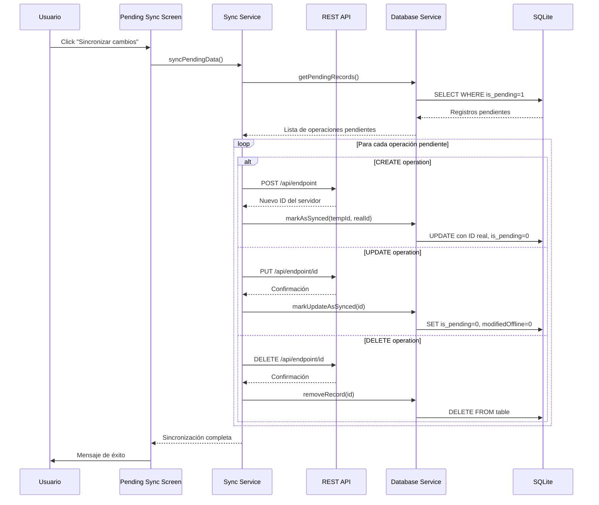
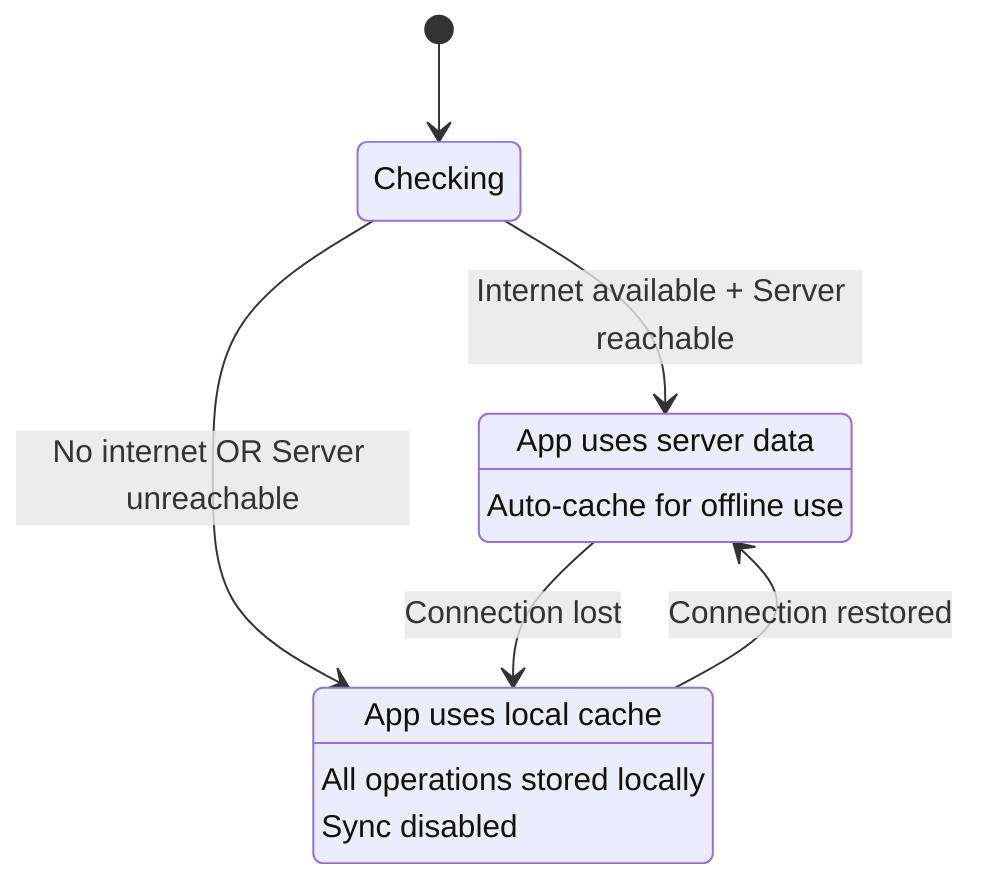
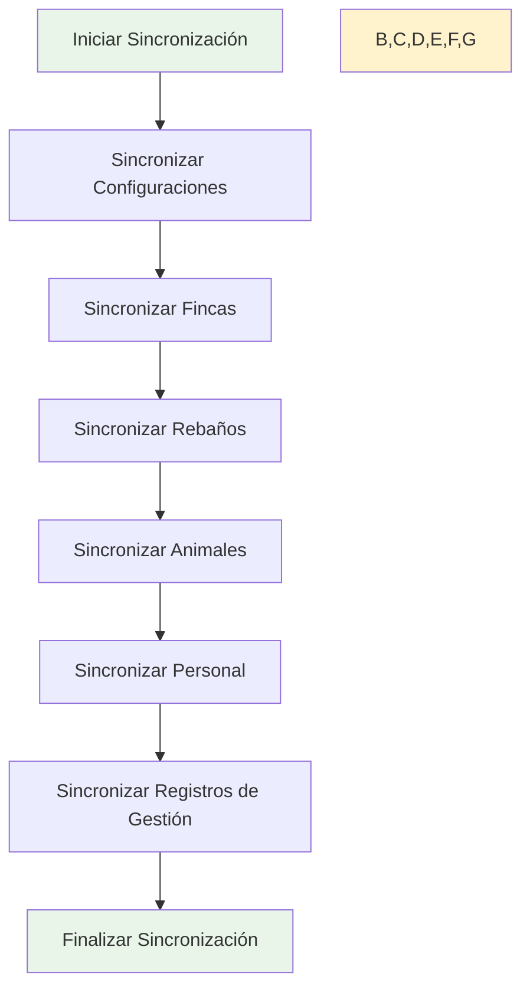
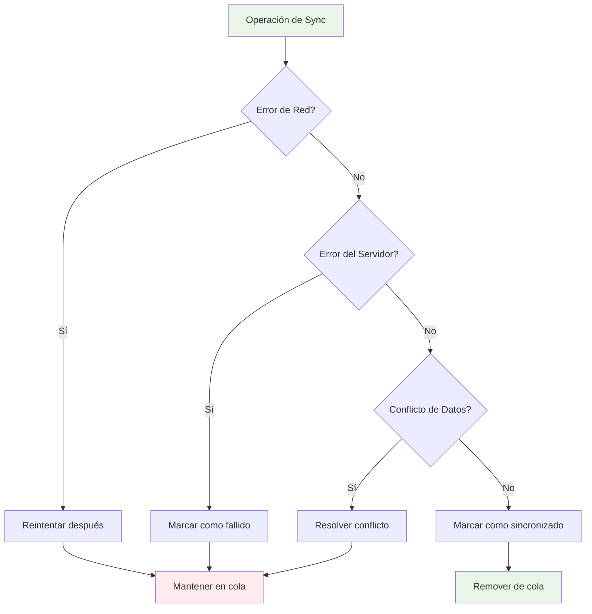

# Estrategia Offline

## Visión General

GanaderaSoft implementa una estrategia **offline-first** que permite a los usuarios trabajar completamente sin conexión a internet. Todos los datos se almacenan localmente en SQLite y se sincronizan con el servidor cuando hay conectividad disponible.

## Características de la Implementación Offline

### ✅ Funcionalidades Offline Completas
- Autenticación con credenciales almacenadas localmente
- Creación, edición y eliminación de registros
- Consulta de todos los datos desde cache local
- Gestión completa de fincas, animales y personal
- Registros de producción (leche, peso corporal, lactancia)
- Datos de configuración en cache

### ✅ Sincronización Inteligente
- Sincronización manual a través del botón "Sincronizar cambios"
- Detección automática de conflictos
- Preservación de datos modificados offline
- Sincronización por lotes para eficiencia

## Arquitectura de Datos Offline

### Base de Datos SQLite Local

### Columnas de Control Offline

Cada tabla tiene columnas específicas para el manejo offline:

- **`modifiedOffline`**: Indica si el registro fue modificado offline
- **`synced`**: Indica si el registro está sincronizado con el servidor
- **`is_pending`**: Indica si hay operaciones pendientes de sincronización
- **`pending_operation`**: Tipo de operación pendiente (CREATE, UPDATE, DELETE)
- **`local_updated_at`**: Timestamp de última modificación local

## Flujos de Operación Offline

### 1. Autenticación Offline

### 2. Creación de Registros Offline

### 3. Edición de Registros Offline

### 4. Consulta de Datos Offline

### 5. Sincronización Manual

## Gestión de Estados de Conectividad

### Detección de Estado Offline

### Indicadores Visuales de Estado

1. **Banner Offline**: Se muestra en todas las pantallas cuando no hay conectividad
2. **Indicador en AppBar**: Muestra "Offline" en la barra superior
3. **Mensajes Contextuales**: Informan sobre operaciones offline
4. **Pantalla de Registros Pendientes**: Lista todas las operaciones por sincronizar

## Estrategia de Sincronización

### Principios de Sincronización

1. **Manual Only**: No hay sincronización automática
2. **Batch Operations**: Las operaciones se sincronizan en lotes
3. **Conflict Detection**: Se detectan y manejan conflictos
4. **Data Preservation**: Los datos offline nunca se pierden
5. **Atomic Operations**: Cada operación de sync es atómica

### Orden de Sincronización

### Manejo de Errores de Sincronización

## Funcionalidades Offline Soportadas

### ✅ Completamente Offline
- **Autenticación**: Login con credenciales hash locales
- **Gestión de Fincas**: CRUD completo
- **Gestión de Rebaños**: CRUD completo
- **Gestión de Animales**: CRUD completo
- **Personal de Finca**: CRUD completo
- **Cambios de Animales**: Creación y consulta
- **Peso Corporal**: Creación y consulta
- **Lactancia**: Creación y consulta
- **Registros de Leche**: Consulta de datos en cache

### ⚠️ Requiere Sincronización
- **Configuraciones del Sistema**: Actualización desde servidor
- **Datos de Nuevos Usuarios**: Registro de nuevos usuarios
- **Reportes Globales**: Análisis que requieren datos del servidor

## Beneficios de la Estrategia Offline

1. **Disponibilidad Total**: La aplicación funciona sin conexión
2. **Experiencia Fluida**: No hay interrupciones por problemas de red
3. **Productividad**: Los usuarios pueden trabajar en cualquier lugar
4. **Confiabilidad**: Los datos nunca se pierden
5. **Flexibilidad**: Sincronización cuando es conveniente para el usuario

---

*Siguiente: [Módulos y Funcionalidades](./modulos.md)*