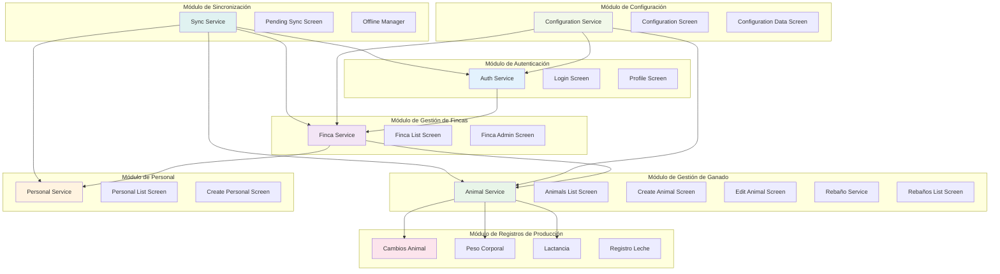
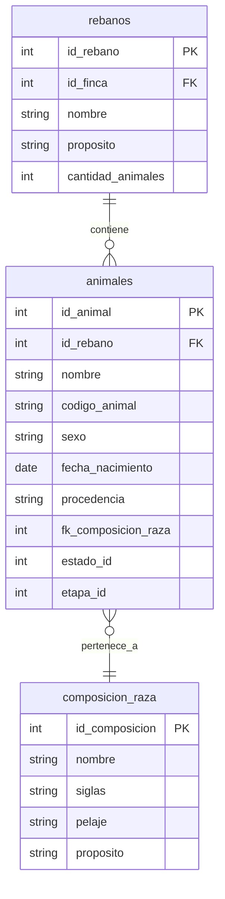
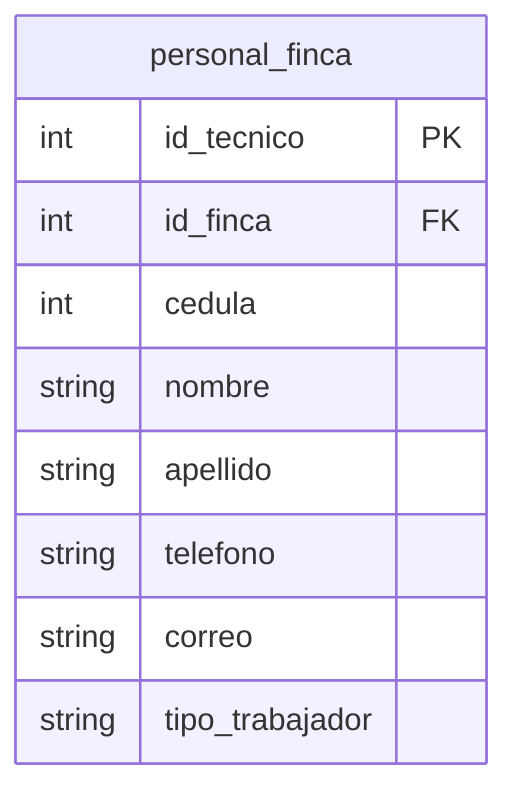
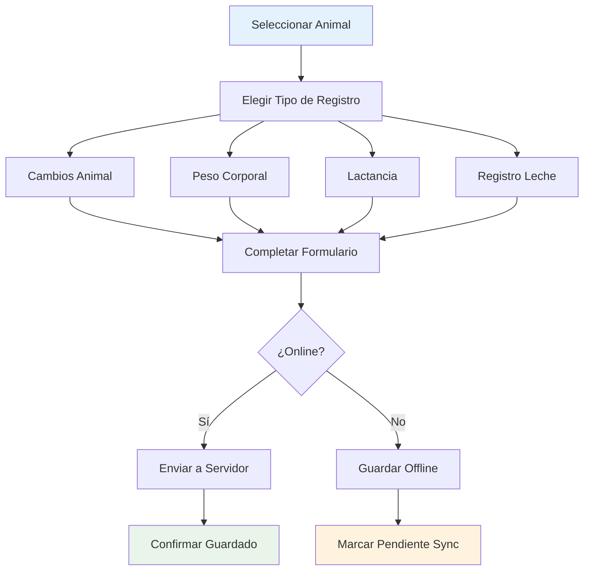
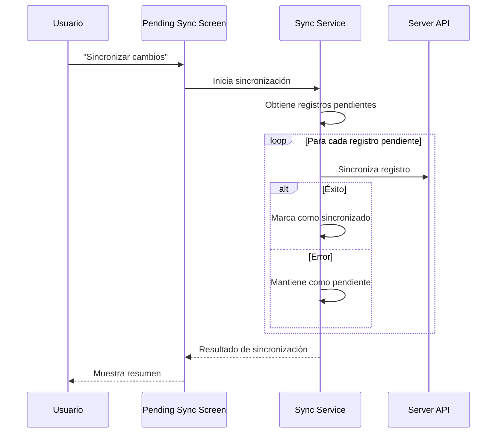
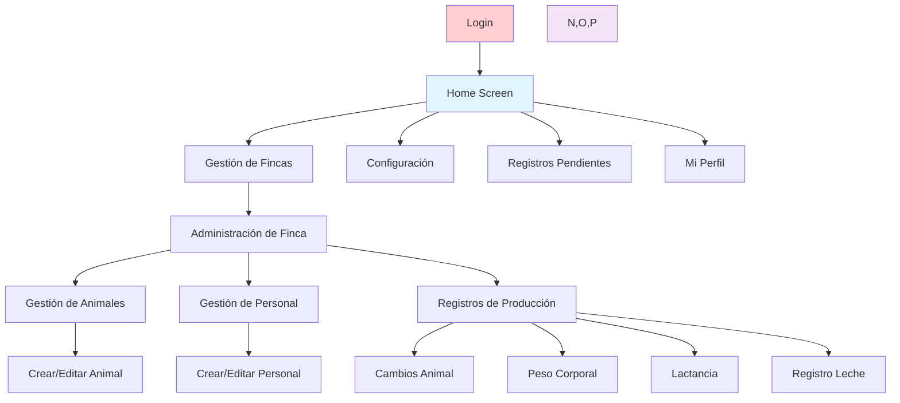

# Módulos y Funcionalidades

## Visión General

GanaderaSoft está organizada en módulos funcionales que cubren todos los aspectos de la gestión de fincas ganaderas. Cada módulo tiene responsabilidades específicas y trabaja de manera coordinada con otros módulos.

## Diagrama de Módulos

## 1. Módulo de Autenticación

### Responsabilidades
- Gestión de login/logout de usuarios
- Autenticación offline con credenciales hash
- Gestión de sesiones y tokens
- Perfil de usuario

### Componentes Principales

#### `AuthService` (`lib/services/auth_service.dart`)
- **Login online/offline**: Autenticación con servidor o credenciales locales
- **Gestión de tokens**: JWT para servidor, hash local para offline
- **Gestión de sesiones**: Mantenimiento de estado de autenticación
- **Hash de contraseñas**: SHA-256 para seguridad offline

#### `LoginScreen` (`lib/screens/login_screen.dart`)
- Interfaz de autenticación
- Validación de credenciales
- Navegación post-login

#### `ProfileScreen` (`lib/screens/profile_screen.dart`)
- Visualización de datos del usuario
- Edición de perfil
- Configuraciones de usuario

### Funcionalidades
- ✅ Login con email y contraseña
- ✅ Autenticación offline
- ✅ Gestión de sesiones persistentes
- ✅ Logout seguro
- ✅ Visualización y edición de perfil

## 2. Módulo de Gestión de Fincas

### Responsabilidades
- Administración de fincas ganaderas
- Gestión de propietarios
- Configuración de tipos de explotación
- Navegación entre fincas

### Componentes Principales

#### Servicios
- **AuthService**: Gestión de fincas a través de endpoints
- **DatabaseService**: Almacenamiento offline de fincas

#### Pantallas
- **`FincasScreen`** (`lib/screens/finca_list_screen.dart`): Listado de fincas
- **`FincaAdministracionScreen`** (`lib/screens/finca_administracion_screen.dart`): Panel de administración

### Funcionalidades
- ✅ Listado de fincas del usuario
- ✅ Navegación a gestión de finca específica
- ✅ Visualización de datos de propietario
- ✅ Acceso a módulos de la finca (animales, personal, etc.)
- ✅ Funcionamiento offline completo

## 3. Módulo de Gestión de Ganado

### Responsabilidades
- Registro y gestión de animales
- Organización en rebaños
- Seguimiento individual de animales
- Gestión de razas y características

### Componentes Principales

#### Servicios
- **AuthService**: APIs para animales y rebaños
- **DatabaseService**: Almacenamiento offline
- **ConfigurationService**: Datos de configuración (razas, etc.)

#### Pantallas de Animales
- **`AnimalesListScreen`**: Listado de animales con filtros
- **`CreateAnimalScreen`**: Creación de nuevos animales
- **`EditAnimalScreen`**: Edición de animales existentes

#### Pantallas de Rebaños
- **`RebanosListScreen`**: Gestión de rebaños
- **`CreateRebanoScreen`**: Creación de rebaños

### Funcionalidades

#### Gestión de Animales
- ✅ Registro de animales con datos completos
- ✅ Edición offline de información
- ✅ Filtros por rebaño, sexo, estado de salud
- ✅ Búsqueda por nombre o código
- ✅ Asignación a rebaños
- ✅ Gestión de razas y composición racial

#### Gestión de Rebaños
- ✅ Creación y edición de rebaños
- ✅ Asignación de animales
- ✅ Organización por propósito

### Modelo de Datos

## 4. Módulo de Personal

### Responsabilidades
- Gestión del personal de la finca
- Registro de trabajadores
- Información de contacto y roles

### Componentes Principales

#### Servicios
- **AuthService**: APIs de personal de finca
- **DatabaseService**: Almacenamiento offline

#### Pantallas
- **`PersonalFincaListScreen`**: Listado del personal
- **`CreatePersonalFincaScreen`**: Registro de nuevo personal
- **`EditPersonalFincaScreen`**: Edición de información

### Funcionalidades
- ✅ Registro completo de personal
- ✅ Gestión de tipos de trabajador
- ✅ Información de contacto
- ✅ Edición offline
- ✅ Sincronización con servidor

### Modelo de Datos

## 5. Módulo de Registros de Producción

### Responsabilidades
- Seguimiento de cambios en animales
- Registro de peso corporal
- Gestión de lactancia
- Registros de producción lechera

### Componentes Principales

#### 5.1 Cambios de Animales
**Pantallas:**
- `CambiosAnimalListScreen`: Historial de cambios
- `CreateCambiosAnimalScreen`: Registro de nuevos cambios

**Funcionalidades:**
- ✅ Registro de cambios de etapa
- ✅ Medidas corporales (peso, altura)
- ✅ Comentarios descriptivos
- ✅ Creación offline completa

#### 5.2 Peso Corporal
**Pantallas:**
- `PesoCorporalListScreen`: Historial de pesos
- `CreatePesoCorporalScreen`: Registro de peso

**Funcionalidades:**
- ✅ Registro de peso con fecha
- ✅ Seguimiento histórico
- ✅ Creación offline

#### 5.3 Lactancia
**Pantallas:**
- `LactanciaListScreen`: Períodos de lactancia
- `CreateLactanciaScreen`: Registro de lactancia

**Funcionalidades:**
- ✅ Gestión de períodos de lactancia
- ✅ Fechas de inicio y fin
- ✅ Proceso de secado
- ✅ Creación offline

#### 5.4 Registros de Leche
**Pantallas:**
- `RegistrosLecheListScreen`: Producción lechera
- `CreateRegistroLecheScreen`: Registro de producción

**Funcionalidades:**
- ✅ Registro diario de producción
- ✅ Filtros por fecha y animal
- ✅ Consulta offline de datos en cache

### Flujo de Registros de Producción

## 6. Módulo de Configuración

### Responsabilidades
- Gestión de datos de configuración del sistema
- Cache offline de configuraciones
- Actualización desde servidor

### Componentes Principales

#### `ConfigurationService` (`lib/services/configuration_service.dart`)
- Gestión de configuraciones del sistema
- Cache offline inteligente
- Sincronización con servidor

#### Pantallas
- **`ConfigurationDataScreen`**: Visualización de configuraciones
- **`SyncScreen`**: Sincronización de configuraciones

### Tipos de Configuración
- **Estados de Salud**: Estados de salud animal
- **Etapas**: Etapas de desarrollo animal
- **Composición Racial**: Razas y características
- **Tipos de Explotación**: Clasificación de fincas
- **Sexos**: Clasificación de sexo animal
- **Fuentes de Agua**: Tipos de agua disponible
- **Métodos de Riego**: Sistemas de riego
- **pH del Suelo**: Clasificación de acidez
- **Textura del Suelo**: Tipos de suelo
- **Tipos de Relieve**: Características geográficas

### Funcionalidades
- ✅ Cache automático de configuraciones
- ✅ Actualización desde servidor cuando hay conectividad
- ✅ Fallback a datos offline
- ✅ Sincronización selectiva

## 7. Módulo de Sincronización

### Responsabilidades
- Gestión de sincronización de datos
- Monitoreo de conectividad
- Gestión de operaciones pendientes

### Componentes Principales

#### `SyncService` (`lib/services/sync_service.dart`)
- Sincronización manual de datos
- Gestión de operaciones pendientes
- Resolución de conflictos

#### `OfflineManager` (`lib/services/offline_manager.dart`)
- Monitoreo de conectividad
- Gestión de transiciones online/offline

#### `ConnectivityService` (`lib/services/connectivity_service.dart`)
- Detección de estado de red
- Verificación de accesibilidad del servidor

#### Pantallas
- **`PendingSyncScreen`**: Lista de operaciones pendientes
- **`SyncScreen`**: Control manual de sincronización

### Funcionalidades
- ✅ Sincronización manual por módulos
- ✅ Vista de operaciones pendientes
- ✅ Indicadores visuales de estado offline
- ✅ Manejo de errores de sincronización
- ✅ Preservación de datos offline

### Flujo de Sincronización

## Integración entre Módulos

### Flujo de Navegación

### Dependencias entre Módulos

1. **Autenticación** → Base para todos los módulos
2. **Configuración** → Datos necesarios para otros módulos
3. **Fincas** → Contexto para animales y personal
4. **Animales** → Base para registros de producción
5. **Sincronización** → Coordina todos los módulos

---

*Siguiente: [Base de Datos](./base-datos.md)*