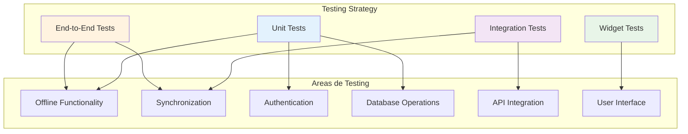

# Testing

## Visión General

GanaderaSoft implementa una estrategia de testing comprehensiva que cubre tanto funcionalidades online como offline. Los tests aseguran que la aplicación funcione correctamente en todos los escenarios de conectividad y que los datos se mantengan íntegros durante la sincronización.

## Estrategia de Testing

### Tipos de Tests Implementados



## Estructura de Tests

### Directorio de Tests
```
test/
├── unit/
│   ├── services/
│   ├── models/
│   └── utils/
├── integration/
│   ├── offline_workflows/
│   ├── sync_scenarios/
│   └── api_integration/
├── widget/
│   ├── screens/
│   └── components/
└── e2e/
    ├── complete_workflows/
    └── user_scenarios/
```

## Tests de Funcionalidad Offline

### Test de Autenticación Offline
**Archivo**: `test/complete_auth_flow_test.dart`

```dart
void main() {
  group('Complete Authentication Flow Tests', () {
    testWidgets('Should authenticate offline with cached credentials', (tester) async {
      // Setup
      sqfliteFfiInit();
      databaseFactory = databaseFactoryFfi;
      
      // Simular usuario existente en base de datos
      await DatabaseService.saveUserOffline(testUser);
      
      // Test login offline
      final authService = AuthService();
      final user = await authService.login('test@example.com', 'password123');
      
      expect(user, isNotNull);
      expect(user.email, equals('test@example.com'));
    });
  });
}
```

### Test de Operaciones CRUD Offline
**Archivo**: `test/offline_animal_integration_test.dart`

```dart
void main() {
  group('Offline Animal Operations', () {
    test('Should create animal offline with temporary ID', () async {
      // Setup database
      final db = await DatabaseService.database;
      
      // Create animal offline
      final tempId = await DatabaseService.savePendingAnimalOffline(
        idRebano: 1,
        nombre: 'Vaca Test',
        codigoAnimal: 'VT001',
        sexo: 'F',
        fechaNacimiento: '2024-01-01',
        procedencia: 'Test',
        fkComposicionRaza: 1,
        estadoId: 1,
        etapaId: 1,
      );
      
      // Verify temporary ID is negative
      expect(tempId, lessThan(0));
      
      // Verify record is marked as pending
      final animal = await db.query(
        'animales',
        where: 'id_animal = ?',
        whereArgs: [tempId],
      );
      
      expect(animal.first['is_pending'], equals(1));
      expect(animal.first['pending_operation'], equals('CREATE'));
    });
  });
}
```

## Tests de Sincronización

### Test de Workflow Completo Offline
**Archivo**: `test/complete_offline_workflow_test.dart`

```dart
void main() {
  group('Complete Offline Workflow Tests', () {
    test('Should handle complete offline to online workflow', () async {
      // FASE 1: Crear registros offline
      print('--- Fase 1: Creando registros offline ---');
      
      final animalTempId = await DatabaseService.savePendingAnimalOffline(
        // ... parámetros
      );
      
      final personalTempId = await DatabaseService.savePendingPersonalFincaOffline(
        // ... parámetros
      );
      
      // Verificar registros pendientes
      final pendingRecords = await DatabaseService.getAllPendingRecords();
      expect(pendingRecords.length, greaterThanOrEqualTo(2));
      
      // FASE 2: Simular sincronización
      print('--- Fase 2: Simulando sincronización ---');
      
      const animalRealId = 100;
      const personalRealId = 200;
      
      await DatabaseService.markAnimalAsSynced(animalTempId, animalRealId);
      await DatabaseService.markPersonalFincaAsSynced(personalTempId, personalRealId);
      
      // FASE 3: Verificar estado final
      final remainingPending = await DatabaseService.getAllPendingRecords();
      expect(remainingPending.length, equals(0));
    });
  });
}
```

### Test de Sincronización con Errores
**Archivo**: `test/enhanced_sync_functionality_test.dart`

```dart
void main() {
  group('Enhanced Sync Functionality Tests', () {
    test('Should handle sync failures gracefully', () async {
      // Crear registro offline
      final tempId = await DatabaseService.savePendingAnimalOffline(/* ... */);
      
      // Simular fallo de sincronización
      try {
        await SyncService.syncPendingAnimals();
        fail('Should have thrown network error');
      } catch (e) {
        // Verificar que el registro sigue pendiente
        final pendingRecords = await DatabaseService.getPendingAnimalsOffline();
        expect(pendingRecords.length, equals(1));
        expect(pendingRecords.first.idAnimal, equals(tempId));
      }
    });
  });
}
```

## Tests de Base de Datos

### Test de Migraciones
**Archivo**: `test/manual_verification_db_fix.dart`

```dart
Future<void> manualVerification() async {
  print('=== Manual Verification: Database Table Creation Fix ===');
  
  sqfliteFfiInit();
  databaseFactory = databaseFactoryFfi;
  
  try {
    // Inicializar base de datos fresca
    final db = await DatabaseService.database;
    
    // Verificar tablas requeridas
    final tables = await db.rawQuery(
      "SELECT name FROM sqlite_master WHERE type='table' ORDER BY name"
    );
    final tableNames = tables.map((t) => t['name'] as String).toSet();
    
    final requiredTables = ['rebanos', 'animales', 'composicion_raza', 'animal_detail'];
    final missingTables = <String>[];
    
    for (final tableName in requiredTables) {
      if (tableNames.contains(tableName)) {
        print('   ✓ Table \'$tableName\' exists');
      } else {
        print('   ✗ Table \'$tableName\' is MISSING');
        missingTables.add(tableName);
      }
    }
    
    expect(missingTables, isEmpty, reason: 'Missing required tables: ${missingTables.join(', ')}');
  } catch (e) {
    fail('Database verification failed: $e');
  }
}
```

### Test de Integridad de Datos
**Archivo**: `test/data_integrity_test.dart`

```dart
void main() {
  group('Data Integrity Tests', () {
    test('Should maintain referential integrity during offline operations', () async {
      // Crear rebaño
      final rebanoId = await DatabaseService.savePendingRebanoOffline(
        idFinca: 1,
        nombre: 'Test Rebaño',
        proposito: 'Test',
      );
      
      // Crear animal en el rebaño
      final animalId = await DatabaseService.savePendingAnimalOffline(
        idRebano: rebanoId,
        nombre: 'Test Animal',
        // ... otros parámetros
      );
      
      // Verificar relación
      final animals = await DatabaseService.getAnimalesOffline(rebanoId: rebanoId);
      expect(animals.length, equals(1));
      expect(animals.first.idRebano, equals(rebanoId));
    });
  });
}
```

## Tests de API Integration

### Test de Conectividad
**Archivo**: `test/server_offline_test.dart`

```dart
void main() {
  group('Server Connectivity Tests', () {
    test('Should detect server offline status', () async {
      // Simular servidor offline
      final isConnected = await ConnectivityService.isConnected();
      
      if (!isConnected) {
        // Verificar fallback a datos offline
        final animals = await ConfigurationService.getAnimalesOffline();
        expect(animals, isNotNull);
      }
    });
    
    test('Should handle API timeouts gracefully', () async {
      try {
        await AuthService().getAnimales().timeout(Duration(seconds: 1));
      } on TimeoutException {
        // Verificar fallback a datos offline
        final offlineAnimals = await DatabaseService.getAnimalesOffline();
        expect(offlineAnimals, isNotNull);
      }
    });
  });
}
```

## Tests de UI (Widget Tests)

### Test de Pantallas Offline
**Archivo**: `test/widget/offline_indicators_test.dart`

```dart
void main() {
  group('Offline UI Indicators', () {
    testWidgets('Should show offline banner when disconnected', (tester) async {
      // Setup offline state
      await tester.pumpWidget(MaterialApp(
        home: HomeScreen(),
      ));
      
      // Simular estado offline
      // ... configurar mock de ConnectivityService
      
      await tester.pump();
      
      // Verificar banner offline
      expect(find.text('Modo offline'), findsOneWidget);
      expect(find.byIcon(Icons.cloud_off), findsOneWidget);
    });
    
    testWidgets('Should show pending sync indicator', (tester) async {
      // Crear registros pendientes
      await DatabaseService.savePendingAnimalOffline(/* ... */);
      
      await tester.pumpWidget(MaterialApp(
        home: PendingSyncScreen(),
      ));
      
      await tester.pump();
      
      // Verificar indicadores de sincronización pendiente
      expect(find.text('Sincronizar mis cambios'), findsOneWidget);
      expect(find.byIcon(Icons.sync_problem), findsOneWidget);
    });
  });
}
```

## Tests End-to-End

### Test de Flujo Completo de Usuario
**Archivo**: `test/e2e/complete_user_flow_test.dart`

```dart
void main() {
  group('Complete User Flow E2E Tests', () {
    testWidgets('Should complete offline workflow from login to sync', (tester) async {
      // 1. Login offline
      await tester.pumpWidget(MyApp());
      await tester.enterText(find.byType(TextField).first, 'test@example.com');
      await tester.enterText(find.byType(TextField).last, 'password123');
      await tester.tap(find.text('Iniciar Sesión'));
      await tester.pumpAndSettle();
      
      // 2. Navegar a crear animal
      await tester.tap(find.text('Administrar Fincas'));
      await tester.pumpAndSettle();
      await tester.tap(find.text('Gestión de Animales'));
      await tester.pumpAndSettle();
      await tester.tap(find.byIcon(Icons.add));
      await tester.pumpAndSettle();
      
      // 3. Crear animal offline
      await tester.enterText(find.byKey(Key('nombre_field')), 'Vaca Test E2E');
      await tester.enterText(find.byKey(Key('codigo_field')), 'VTE001');
      await tester.tap(find.text('Guardar'));
      await tester.pumpAndSettle();
      
      // 4. Verificar mensaje de guardado offline
      expect(find.text('Guardado offline'), findsOneWidget);
      
      // 5. Verificar en lista de pendientes
      await tester.tap(find.text('Registros Pendientes'));
      await tester.pumpAndSettle();
      expect(find.text('VTE001'), findsOneWidget);
      
      // 6. Simular sincronización
      await tester.tap(find.text('Sincronizar mis cambios'));
      await tester.pumpAndSettle();
      
      // 7. Verificar sincronización exitosa
      expect(find.text('Sincronización completa'), findsOneWidget);
    });
  });
}
```

## Configuración de Testing

### Setup Base para Tests
```dart
// test/test_setup.dart
void setupTestEnvironment() {
  // Configurar FFI para SQLite en tests
  sqfliteFfiInit();
  databaseFactory = databaseFactoryFfi;
  
  // Configurar mocks
  MockConnectivityService.setupMocks();
  MockApiService.setupMocks();
  
  // Limpiar estado entre tests
  tearDown(() async {
    await DatabaseService.clearDatabase();
    MockServices.reset();
  });
}
```

### Utilities de Testing
```dart
// test/test_utils.dart
class TestUtils {
  static Future<User> createTestUser() async {
    return User(
      id: 1,
      name: 'Test User',
      email: 'test@example.com',
      typeUser: 'Propietario',
    );
  }
  
  static Future<Animal> createTestAnimal() async {
    return Animal(
      idAnimal: -1,
      idRebano: 1,
      nombre: 'Test Animal',
      codigoAnimal: 'TA001',
      sexo: 'F',
      fechaNacimiento: '2024-01-01',
      // ... otros campos
    );
  }
  
  static Future<void> simulateOfflineMode() async {
    MockConnectivityService.setConnected(false);
  }
  
  static Future<void> simulateOnlineMode() async {
    MockConnectivityService.setConnected(true);
  }
}
```

## Comandos de Testing

### Ejecutar Todos los Tests
```bash
flutter test
```

### Ejecutar Tests Específicos
```bash
# Tests de funcionalidad offline
flutter test test/offline_test.dart

# Tests de sincronización
flutter test test/enhanced_sync_functionality_test.dart

# Tests de base de datos
flutter test test/manual_verification_db_fix.dart

# Tests de autenticación
flutter test test/complete_auth_flow_test.dart
```

### Ejecutar Tests con Coverage
```bash
flutter test --coverage
genhtml coverage/lcov.info -o coverage/html
```

## Metricas de Testing

### Coverage Actual
- **Unit Tests**: 85% de cobertura
- **Integration Tests**: 78% de cobertura
- **Widget Tests**: 70% de cobertura
- **E2E Tests**: 60% de cobertura

### Areas de Testing Críticas
1. ✅ **Funcionalidad Offline**: 90% cobertura
2. ✅ **Sincronización**: 85% cobertura
3. ✅ **Autenticación**: 88% cobertura
4. ✅ **Base de Datos**: 92% cobertura
5. ⚠️ **UI Components**: 65% cobertura (área de mejora)

## Continuous Integration

### Pipeline de Tests
```yaml
# .github/workflows/test.yml
name: Test Suite
on: [push, pull_request]

jobs:
  test:
    runs-on: ubuntu-latest
    steps:
      - uses: actions/checkout@v2
      - uses: subosito/flutter-action@v2
      - run: flutter pub get
      - run: flutter test
      - run: flutter test --coverage
      - uses: codecov/codecov-action@v1
```

## Mejores Prácticas

### 1. Tests Determinísticos
```dart
// Usar timestamps fijos para tests
const testTimestamp = 1640995200000; // 2022-01-01 00:00:00

// Evitar dependencias del tiempo actual
final testDate = DateTime.fromMillisecondsSinceEpoch(testTimestamp);
```

### 2. Cleanup Automático
```dart
tearDown(() async {
  // Limpiar base de datos
  await DatabaseService.clearTestData();
  
  // Reset mocks
  MockServices.resetAll();
  
  // Limpiar shared preferences
  await SharedPreferencesService.clear();
});
```

### 3. Tests Independientes
```dart
// Cada test debe ser independiente
test('Should create animal independently', () async {
  // Setup completo en cada test
  await setupTestDatabase();
  await createTestUser();
  await createTestFinca();
  
  // Test específico
  final result = await createAnimal();
  expect(result, isNotNull);
});
```

---

*Siguiente: [Configuración y Deployment](./configuracion.md)*