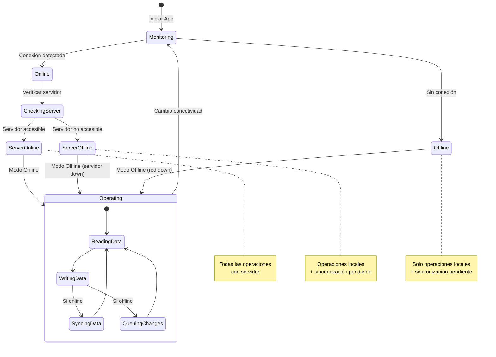

# Modelo de Arquitectura 4+1 Vistas - GanaderaSoft

## Introducción

Este documento presenta la arquitectura de GanaderaSoft utilizando el modelo de arquitectura 4+1 vistas propuesto por Philippe Kruchten. Este modelo organiza la descripción de la arquitectura del software usando cinco vistas concurrentes, cada una abordando un conjunto específico de preocupaciones de los diferentes stakeholders del sistema.

## Índice
1. [Vista Lógica](#1-vista-lógica)
2. [Vista de Procesos](#2-vista-de-procesos)
3. [Vista de Desarrollo](#3-vista-de-desarrollo)
4. [Vista Física](#4-vista-física)
5. [Escenarios (Vista +1)](#5-escenarios-vista-1)

---

## 1. Vista Lógica

### Propósito
La vista lógica describe la funcionalidad que el sistema proporciona a los usuarios finales. Se enfoca en la estructura de clases, paquetes y sus relaciones.

### Diagrama de Paquetes Principales


### Diagrama de Clases Principales


### Módulos Funcionales


---

## 2. Vista de Procesos

### Propósito
La vista de procesos aborda los aspectos dinámicos del sistema, incluyendo los procesos y threads, su comunicación e sincronización.

### Flujo de Autenticación Online/Offline


### Flujo de Creación de Animal Offline


### Proceso de Sincronización


### Proceso de Monitoreo de Conectividad



### Concurrencia y Threads

```mermaid
graph TB
    subgraph "Main Thread"
        UI[UI Rendering]
        EVENTS[Event Handling]
    end
    
    subgraph "Background Threads"
        DB_OPS[Database Operations]
        NETWORK[Network Requests]
        SYNC_OPS[Sync Operations]
        FILE_OPS[File Operations]
    end
    
    subgraph "Monitoring Thread"
        CONN_MON[Connectivity Monitor]
        AUTO_SYNC[Auto Sync Trigger]
    end
    
    UI -.-> DB_OPS: Future/async
    UI -.-> NETWORK: Future/async
    EVENTS -.-> SYNC_OPS: Future/async
    
    CONN_MON --> AUTO_SYNC
    AUTO_SYNC -.-> SYNC_OPS
    
    DB_OPS -.-> UI: Callbacks
    NETWORK -.-> UI: Callbacks
    SYNC_OPS -.-> UI: Callbacks
    
    style UI fill:#e1f5fe
    style DB_OPS fill:#e8f5e9
    style NETWORK fill:#fff3e0
    style CONN_MON fill:#f3e5f5
```

---

## 3. Vista de Desarrollo

### Propósito
La vista de desarrollo describe la organización estática del software en su entorno de desarrollo, incluyendo la estructura de módulos, librerías y componentes.

### Estructura de Directorios


### Diagrama de Componentes


### Capas y Dependencias


### Gestión de Dependencias

```yaml
# pubspec.yaml - Dependencias principales
dependencies:
  flutter: sdk
  
  # State Management
  provider: ^6.0.5
  
  # Networking
  http: ^1.1.0
  connectivity_plus: ^5.0.2
  
  # Local Storage
  sqflite: ^2.3.0
  shared_preferences: ^2.2.2
  path: ^1.8.3
  
  # Security
  crypto: ^3.0.3

dev_dependencies:
  flutter_test: sdk
  flutter_lints: ^6.0.0
  sqflite_common_ffi: ^2.3.0
  flutter_launcher_icons: ^0.13.1
```

---

## 4. Vista Física

### Propósito
La vista física describe el mapeo del software en el hardware y refleja los aspectos distribuidos del sistema.

### Topología de Despliegue


### Arquitectura de Despliegue Detallada


### Flujo de Comunicación


### Distribución Geográfica


---

## 5. Escenarios (Vista +1)

### Propósito
Los escenarios ilustran la arquitectura con casos de uso importantes y sirven como validación de las otras cuatro vistas.

### Escenario 1: Autenticación y Primer Acceso

**Descripción**: Usuario se autentica por primera vez en la aplicación y configura su perfil.


**Componentes Involucrados**:
- Vista Lógica: AuthService, DatabaseService, ConfigurationService
- Vista de Procesos: Thread principal (UI), threads background (API calls)
- Vista de Desarrollo: lib/services/auth_service.dart, lib/screens/login_screen.dart
- Vista Física: Dispositivo móvil, servidor API, base de datos

### Escenario 2: Creación de Animal en Modo Offline

**Descripción**: Usuario crea un nuevo animal sin conexión a internet.


**Componentes Involucrados**:
- Vista Lógica: DatabaseService, Animal Model, PendingSyncModels
- Vista de Procesos: Operaciones locales, sin comunicación con servidor
- Vista de Desarrollo: lib/screens/create_animal_screen.dart, lib/services/database_service.dart
- Vista Física: Solo dispositivo local y SQLite local

### Escenario 3: Sincronización de Cambios Pendientes

**Descripción**: Usuario sincroniza cambios realizados offline cuando recupera conectividad.


**Componentes Involucrados**:
- Vista Lógica: SyncService, DatabaseService, AuthService
- Vista de Procesos: Sincronización asíncrona, múltiples requests concurrentes
- Vista de Desarrollo: lib/services/sync_service.dart, lib/screens/sync_screen.dart
- Vista Física: Dispositivo cliente, red, servidor API, base de datos remota

### Escenario 4: Consulta de Registros de Producción

**Descripción**: Usuario consulta registros de producción lechera de un animal específico.


**Componentes Involucrados**:
- Vista Lógica: DatabaseService, ConfigurationService, Farm Management Models
- Vista de Procesos: Consultas asíncronas, operaciones de filtrado
- Vista de Desarrollo: lib/screens/registros_leche_list_screen.dart
- Vista Física: Dispositivo local o red según disponibilidad

### Escenario 5: Gestión de Conflictos en Sincronización

**Descripción**: Manejo de conflictos cuando el mismo registro fue modificado offline y online.


**Componentes Involucrados**:
- Vista Lógica: SyncService, DatabaseService, PendingSyncModels
- Vista de Procesos: Resolución de conflictos, transacciones
- Vista de Desarrollo: lib/services/sync_service.dart, resolución de conflictos en UI
- Vista Física: Comunicación bidireccional cliente-servidor

### Escenario 6: Trabajo Multi-Finca

**Descripción**: Usuario gestiona múltiples fincas y cambia entre ellas.

```mermaid
sequenceDiagram
    actor User as Usuario
    participant App as Aplicación
    participant Home as Home Screen
    participant FincaList as Finca List Screen
    participant DB as Database Service
    participant Auth as Auth Service
    participant API as Backend API
    
    User->>App: Login exitoso
    Auth->>DB: getFincasOffline(user_id)
    DB-->>Auth: [Finca1, Finca2, Finca3]
    Auth-->>App: Usuario con 3 fincas
    
    App->>Home: Mostrar home
    Home->>User: Mostrar selector fincas
    
    User->>Home: Selecciona "Finca Don Pedro"
    Home->>App: setCurrentFinca(finca_id=1)
    App->>DB: Cargar datos de finca 1
    DB-->>App: Datos cargados
    App->>Home: Actualizar contexto
    Home->>User: Dashboard Finca Don Pedro
    
    User->>Home: "Ver animales"
    App->>DB: getAnimalesOffline(finca_id=1)
    DB-->>App: 50 animales
    App->>User: Mostrar lista
    
    Note over User,DB: Usuario trabaja en Finca 1
    
    User->>Home: Cambiar a "Finca La Esperanza"
    Home->>App: setCurrentFinca(finca_id=2)
    App->>DB: Limpiar cache finca anterior
    App->>DB: Cargar datos finca 2
    
    alt Datos en cache local
        DB-->>App: Datos finca 2 (offline)
        App->>User: Dashboard Finca La Esperanza
    else Necesita datos del servidor
        App->>API: GET /api/fincas/2/dashboard
        API-->>App: Datos completos
        App->>DB: Actualizar cache
        App->>User: Dashboard actualizado
    end
```

**Componentes Involucrados**:
- Vista Lógica: AuthService, DatabaseService, Finca Model
- Vista de Procesos: Cambio de contexto, gestión de cache
- Vista de Desarrollo: lib/screens/home_screen.dart, lib/screens/finca_list_screen.dart
- Vista Física: Datos distribuidos entre múltiples contextos de finca

---

## Resumen de Relaciones entre Vistas

| Vista | Enfoque Principal | Stakeholders |
|-------|------------------|-------------|
| **Lógica** | Funcionalidad y estructura de clases | Usuarios finales, analistas |
| **Procesos** | Concurrencia, rendimiento, escalabilidad | Integradores, testers de rendimiento |
| **Desarrollo** | Organización del código y módulos | Desarrolladores, gestores de configuración |
| **Física** | Topología de hardware y red | Arquitectos de sistemas, administradores de sistemas |
| **Escenarios** | Casos de uso y validación | Todos los stakeholders |

## Conclusiones

El modelo 4+1 vistas proporciona una descripción comprehensiva de la arquitectura de GanaderaSoft:

1. **Vista Lógica**: Muestra una arquitectura en capas clara con separación de responsabilidades entre UI, lógica de negocio y datos.

2. **Vista de Procesos**: Demuestra el manejo robusto de operaciones asíncronas y sincronización offline/online.

3. **Vista de Desarrollo**: Presenta una organización modular del código que facilita el mantenimiento y escalabilidad.

4. **Vista Física**: Ilustra una arquitectura distribuida con soporte para múltiples plataformas y operación offline-first.

5. **Escenarios**: Validan que la arquitectura soporta todos los casos de uso críticos del sistema, especialmente el trabajo en modo offline.

Esta arquitectura garantiza:
- ✅ **Robustez**: Funciona offline y online sin pérdida de funcionalidad
- ✅ **Escalabilidad**: Soporta múltiples dispositivos y plataformas
- ✅ **Mantenibilidad**: Código organizado y modular
- ✅ **Rendimiento**: Operaciones locales rápidas con sincronización eficiente
- ✅ **Usabilidad**: Experiencia consistente independiente de conectividad

---

*Documento creado como parte de la documentación metodológica de GanaderaSoft*
*Fecha: Octubre 2025*
