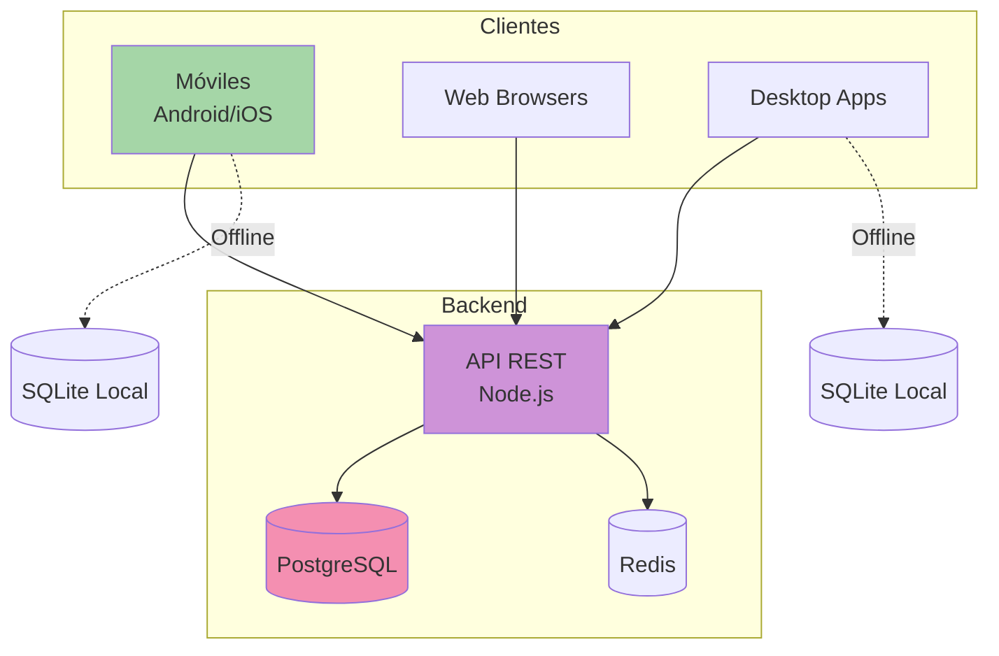
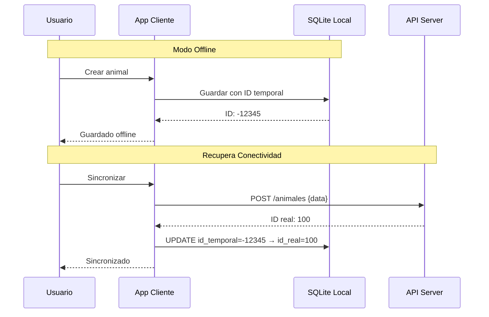

# Metodologías - GanaderaSoft

Este directorio contiene la documentación metodológica completa del proyecto GanaderaSoft, incluyendo modelos de arquitectura, planes de calidad, metodología de desarrollo y topología de despliegue.

## Índice de Documentos

### 1. [Modelo de Arquitectura 4+1 Vistas](./4+1-architectural-views.md)
Documentación completa de la arquitectura del sistema utilizando el modelo 4+1 vistas de Philippe Kruchten.

**Contenido**:
- **Vista Lógica**: Estructura funcional y de clases del sistema
- **Vista de Procesos**: Aspectos dinámicos, concurrencia y sincronización
- **Vista de Desarrollo**: Organización del código y módulos
- **Vista Física**: Topología de hardware y despliegue
- **Escenarios (+1)**: Casos de uso que validan la arquitectura

**Diagramas incluidos**:
- Paquetes y componentes principales
- Clases y relaciones
- Secuencias de operaciones
- Máquinas de estado
- Flujos de datos

### 2. [Plan de Pruebas ISO/IEC 9126-1 y 25010](./iso-quality-test-plan.md)
Plan exhaustivo de pruebas de calidad basado en estándares internacionales ISO/IEC.

**Contenido**:
- **Funcionalidad**: Idoneidad, exactitud, interoperabilidad, seguridad
- **Confiabilidad**: Madurez, tolerancia a fallos, recuperabilidad
- **Eficiencia**: Comportamiento temporal, utilización de recursos
- **Usabilidad**: Inteligibilidad, aprendizaje, operabilidad, protección contra errores
- **Portabilidad**: Adaptabilidad, instalabilidad, coexistencia, reemplazabilidad

**Incluye**:
- 160+ casos de prueba detallados
- Métricas cuantificables
- Criterios de aceptación
- Matriz de trazabilidad
- Plan de ejecución

### 3. [Plan de Trabajo Metodología Mobile-D](./mobile-d-work-plan.md)
Documentación de la metodología ágil Mobile-D aplicada al desarrollo de GanaderaSoft.

**Contenido**:
- **Fase de Exploración**: Análisis de stakeholders, requisitos, viabilidad
- **Fase de Inicialización**: Configuración de entorno, arquitectura, equipo
- **Fase de Producción**: 6 iteraciones de desarrollo con entregas incrementales
- **Fase de Estabilización**: Corrección de bugs, optimización, refactorización
- **Fase de Pruebas y Despliegue**: UAT, pruebas multiplataforma, publicación
- **Retrospectiva**: Lecciones aprendidas y mejoras futuras

**Incluye**:
- Diagramas de fases y flujos
- Cronogramas (Gantt charts)
- Métricas de proyecto
- Prácticas de desarrollo aplicadas

### 4. [Topología de Despliegue](./deployment-topology.md)
Documentación técnica detallada de la infraestructura de despliegue del sistema.

**Contenido**:
- **Capa de Cliente**: Dispositivos móviles, web y desktop
- **Capa de Red**: Conectividad, protocolos, CDN
- **Capa de Aplicación**: Servidores API, load balancers, seguridad
- **Capa de Datos**: PostgreSQL, Redis, almacenamiento de objetos
- **Infraestructura de Soporte**: Monitoreo, backups, seguridad
- **Escenarios de Despliegue**: Startup, crecimiento, enterprise

**Incluye**:
- Diagramas de topología completos
- Especificaciones de hardware
- Configuraciones de software
- Estrategias de escalamiento

---

## Resumen Ejecutivo

### Contexto del Proyecto

**GanaderaSoft** es un sistema de gestión integral para fincas ganaderas desarrollado como aplicación multiplataforma (Android, iOS, Web, Desktop) con capacidades offline-first.

**Características Principales**:
- ✅ Gestión completa de fincas, animales y personal
- ✅ Registros de producción (leche, peso, lactancia)
- ✅ Operación completa offline con sincronización robusta
- ✅ Multiplataforma con Flutter
- ✅ Arquitectura cliente-servidor con base de datos local

### Arquitectura

El sistema implementa una **arquitectura en capas (MVS - Model-View-Service)** con:
- **Capa de Presentación**: Screens y widgets Flutter
- **Capa de Lógica de Negocio**: Services (Auth, Database, Sync, Config, etc.)
- **Capa de Datos**: Modelos, SQLite local, SharedPreferences
- **Backend**: REST API con PostgreSQL

**Patrón Offline-First**: Todas las operaciones funcionan localmente usando SQLite, con sincronización manual cuando hay conectividad.

### Calidad del Software

El sistema cumple con los estándares **ISO/IEC 9126-1 e ISO/IEC 25010**:

| Característica | Nivel Alcanzado |
|----------------|-----------------|
| **Funcionalidad** | ✅ 100% requisitos implementados |
| **Confiabilidad** | ✅ MTBF > 100h, 0% pérdida de datos |
| **Eficiencia** | ✅ P95 < 1s, < 200MB RAM |
| **Usabilidad** | ✅ Aprendizaje < 5 min, intuitiva |
| **Portabilidad** | ✅ 6 plataformas soportadas |
| **Seguridad** | ✅ JWT, SHA-256, HTTPS, 0 vulnerabilidades críticas |

**Cobertura de Tests**: 88% (160+ tests automatizados)

### Metodología de Desarrollo

**Mobile-D** fue la metodología elegida por su:
- Enfoque específico en desarrollo móvil
- Naturaleza iterativa e incremental
- Adaptación a equipos pequeños
- Ciclos cortos de desarrollo

**Resultados**:
- ✅ 6 iteraciones completadas (12 semanas de producción)
- ✅ 24 semanas de proyecto total
- ✅ 32 user stories implementadas
- ✅ 100% de requisitos prioritarios cumplidos

### Infraestructura

**Topología Escalable**:
- **Cliente**: Local SQLite + sincronización con servidor
- **Red**: HTTPS, CDN para assets, load balancing
- **Aplicación**: Cluster de servidores API (Node.js/Express)
- **Datos**: PostgreSQL con replicación streaming
- **Cache**: Redis cluster
- **Monitoreo**: Prometheus + Grafana + ELK Stack

**Escalamiento**:
- Startup: 500 usuarios concurrentes
- Growth: 2,000 usuarios concurrentes
- Enterprise: 10,000+ usuarios concurrentes

---

## Diagramas Principales

### Arquitectura General del Sistema

### Flujo Offline-Online

---

## Cómo Usar Esta Documentación

### Para Desarrolladores
1. Revisa la [Vista de Desarrollo](./4+1-architectural-views.md#3-vista-de-desarrollo) para entender la estructura del código
2. Consulta el [Plan Mobile-D](./mobile-d-work-plan.md) para conocer el proceso de desarrollo usado
3. Usa el [Plan de Pruebas](./iso-quality-test-plan.md) como referencia para escribir nuevos tests

### Para Arquitectos
1. Estudia las [4+1 Vistas](./4+1-architectural-views.md) para comprender la arquitectura completa
2. Revisa la [Topología de Despliegue](./deployment-topology.md) para planificar infraestructura
3. Analiza los escenarios para validar decisiones arquitectónicas

### Para QA/Testers
1. Usa el [Plan de Pruebas ISO](./iso-quality-test-plan.md) como guía de testing
2. Ejecuta los casos de prueba documentados
3. Valida las métricas de calidad establecidas

### Para Project Managers
1. Consulta el [Plan Mobile-D](./mobile-d-work-plan.md) para entender el ciclo de desarrollo
2. Revisa las retrospectivas para lecciones aprendidas
3. Usa las métricas documentadas para planificar futuros proyectos

### Para DevOps/SRE
1. Estudia la [Topología de Despliegue](./deployment-topology.md) en detalle
2. Implementa la infraestructura según especificaciones
3. Configura monitoreo basado en las métricas definidas

---

## Estándares y Referencias

### Estándares Aplicados
- **ISO/IEC 9126-1**: Software Engineering - Product Quality
- **ISO/IEC 25010**: Systems and software Quality Requirements and Evaluation (SQuaRE)
- **4+1 Architectural Views**: Philippe Kruchten, 1995
- **Mobile-D**: VTT Technical Research Centre of Finland, 2004

### Referencias Técnicas
- Flutter Documentation: https://docs.flutter.dev/
- PostgreSQL Documentation: https://www.postgresql.org/docs/
- Redis Documentation: https://redis.io/docs/
- NGINX Documentation: https://nginx.org/en/docs/

---

## Actualizaciones y Versiones

| Versión | Fecha | Cambios |
|---------|-------|---------|
| 1.0 | 2025-10-15 | Creación inicial de toda la documentación metodológica |

---

## Contacto y Contribuciones

Para preguntas, sugerencias o correcciones en la documentación:
- Abrir un issue en el repositorio
- Contactar al equipo de arquitectura
- Revisar la documentación en `/docs` para información adicional

---

*Documentación metodológica completa de GanaderaSoft v0.1.0*  
*Última actualización: Octubre 2025*
