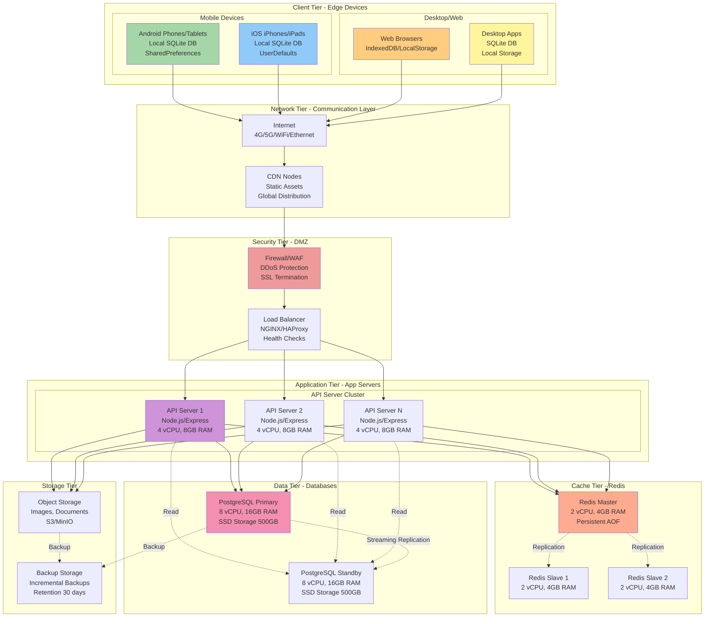

# Topología de Despliegue - GanaderaSoft
## Sistema de Gestión Integral para Fincas Ganaderas

---

## Índice
1. [Introducción](#1-introducción)
2. [Arquitectura de Despliegue General](#2-arquitectura-de-despliegue-general)
3. [Capa de Cliente](#3-capa-de-cliente)
4. [Capa de Red y Comunicaciones](#4-capa-de-red-y-comunicaciones)
5. [Capa de Aplicación](#5-capa-de-aplicación)
6. [Capa de Datos](#6-capa-de-datos)
7. [Infraestructura de Soporte](#7-infraestructura-de-soporte)
8. [Escenarios de Despliegue](#8-escenarios-de-despliegue)
9. [Especificaciones Técnicas](#9-especificaciones-técnicas)

---

## 1. Introducción

### 1.1 Propósito
Este documento describe la topología de despliegue de GanaderaSoft, detallando la distribución física de componentes del sistema en la infraestructura de hardware y red.

### 1.2 Alcance
La topología cubre:
- Dispositivos cliente (móviles, tablets, desktops, web)
- Infraestructura de red
- Servidores de aplicación
- Servidores de base de datos
- Servicios de soporte (CDN, caché, monitoreo)
- Mecanismos de seguridad y alta disponibilidad

### 1.3 Características Clave del Despliegue

| Característica | Descripción |
|----------------|-------------|
| **Arquitectura** | Cliente-Servidor con capacidad offline |
| **Distribución** | Multi-región (opcional) |
| **Escalabilidad** | Horizontal en capa de aplicación |
| **Disponibilidad** | 99.5% uptime objetivo |
| **Seguridad** | HTTPS, autenticación JWT, datos encriptados |
| **Backup** | Diario automatizado |

---

## 2. Arquitectura de Despliegue General

### 2.1 Vista de Alto Nivel


### 2.2 Diagrama de Componentes Físicos



---

## 3. Capa de Cliente

### 3.1 Dispositivos Móviles

#### 3.1.1 Android
**Especificaciones Mínimas**:
- Android 8.0 (API level 26) o superior
- 2GB RAM
- 100MB espacio disponible
- Opcional: GPS, cámara

**Componentes Locales**:
```
Android Device
├── GanaderaSoft APK (~40MB)
├── SQLite Database (~50MB para 1000 registros)
├── SharedPreferences (configuración, tokens)
├── Cache de imágenes (~20MB)
└── Logs locales (~5MB)
```

**Conectividad**:
- WiFi (preferido)
- Datos móviles 4G/5G
- Modo offline completo

#### 3.1.2 iOS
**Especificaciones Mínimas**:
- iOS 12.0 o superior
- 2GB RAM
- 100MB espacio disponible

**Componentes Locales**:
```
iOS Device
├── GanaderaSoft.app (~42MB)
├── SQLite Database (~50MB para 1000 registros)
├── UserDefaults (configuración, tokens)
├── Cache de archivos (~20MB)
└── Logs locales (~5MB)
```

### 3.2 Navegadores Web

**Navegadores Soportados**:
| Navegador | Versión Mínima |
|-----------|----------------|
| Chrome | 90+ |
| Firefox | 88+ |
| Safari | 14+ |
| Edge | 90+ |

**Almacenamiento Local**:
- IndexedDB para base de datos (cuota ~50MB)
- LocalStorage para configuración (5-10MB)
- Service Worker para cache offline

### 3.3 Aplicaciones Desktop

#### Windows
- Windows 10 (64-bit) o superior
- 4GB RAM
- 150MB espacio en disco

#### macOS
- macOS 10.14 Mojave o superior
- 4GB RAM
- 150MB espacio en disco

#### Linux
- Ubuntu 20.04, Fedora 34, o equivalente
- 4GB RAM
- 150MB espacio en disco

---

## 4. Capa de Red y Comunicaciones

### 4.1 Conectividad de Internet


### 4.2 Protocolo de Comunicación

**Protocolos Utilizados**:
- **HTTPS (TLS 1.2+)**: Todas las comunicaciones API
- **WebSocket (WSS)**: Actualizaciones en tiempo real (futuro)
- **HTTP/2**: Mejora de rendimiento

**Endpoints de API**:
```
Base URL: https://api.ganaderasoft.com/v1

Endpoints:
├── /auth/login          POST   - Autenticación
├── /auth/logout         POST   - Cerrar sesión
├── /fincas              GET    - Listar fincas
├── /fincas/:id          GET    - Detalle de finca
├── /animales            GET    - Listar animales
├── /animales            POST   - Crear animal
├── /animales/:id        PUT    - Actualizar animal
├── /animales/:id        DELETE - Eliminar animal
├── /rebanos             GET    - Listar rebaños
├── /personal-finca      GET    - Listar personal
├── /registros-leche     GET    - Registros de leche
├── /sincronizacion      POST   - Sincronizar datos
└── /configuracion       GET    - Obtener configuraciones
```

### 4.3 Content Delivery Network (CDN)

**Propósito**:
- Distribución de assets estáticos (JS, CSS, imágenes)
- Reducción de latencia
- Descarga del servidor principal

**Configuración**:
```
CDN Configuration:
  Provider: CloudFlare / AWS CloudFront
  
  Cached Resources:
    - Static assets (JS, CSS, fonts)
    - Images and icons
    - Web app bundle
    
  Cache TTL:
    - Images: 7 days
    - JS/CSS: 1 day
    - HTML: No cache
    
  Edge Locations:
    - América del Norte: 3 nodes
    - América del Sur: 2 nodes
    - Europa: 2 nodes (futuro)
```

---

## 5. Capa de Aplicación

### 5.1 Zona Desmilitarizada (DMZ)

#### 5.1.1 Firewall / WAF (Web Application Firewall)

**Funciones**:
- Filtrado de tráfico malicioso
- Protección DDoS
- Detección de intrusiones (IDS/IPS)
- SSL/TLS termination

**Configuración**:
```yaml
Firewall Rules:
  Inbound:
    - Allow: 443 (HTTPS) from any
    - Allow: 80 (HTTP) from any → Redirect to 443
    - Deny: All other ports
  
  Outbound:
    - Allow: 443 (HTTPS) to API servers
    - Allow: 5432 (PostgreSQL) to DB servers
    - Allow: 6379 (Redis) to cache servers
  
  WAF Rules:
    - SQL Injection protection
    - XSS protection
    - Rate limiting: 100 req/min per IP
    - Geographic blocking (optional)
```

#### 5.1.2 Load Balancer

**Tecnología**: NGINX / HAProxy

**Configuración**:
```nginx
upstream api_backend {
    least_conn;  # Algoritmo de balanceo
    
    server api1.internal:3000 max_fails=3 fail_timeout=30s;
    server api2.internal:3000 max_fails=3 fail_timeout=30s;
    server api3.internal:3000 max_fails=3 fail_timeout=30s;
}

server {
    listen 443 ssl http2;
    server_name api.ganaderasoft.com;
    
    ssl_certificate /etc/ssl/certs/ganaderasoft.crt;
    ssl_certificate_key /etc/ssl/private/ganaderasoft.key;
    
    location / {
        proxy_pass http://api_backend;
        proxy_set_header Host $host;
        proxy_set_header X-Real-IP $remote_addr;
        proxy_set_header X-Forwarded-For $proxy_add_x_forwarded_for;
        
        # Health check
        health_check interval=10s fails=3 passes=2;
    }
}
```

**Características**:
- Health checks automáticos
- Session persistence (opcional)
- SSL offloading
- Failover automático

### 5.2 Servidores de Aplicación

#### 5.2.1 Especificaciones de Servidor API

**Configuración por Servidor**:
```yaml
API Server Specs:
  Type: Virtual Machine / Container
  CPU: 4 vCPUs
  RAM: 8 GB
  Storage: 50 GB SSD
  OS: Ubuntu 22.04 LTS
  
  Software Stack:
    - Node.js 18 LTS
    - Express.js 4.x
    - PM2 (Process Manager)
    - Nginx (Reverse Proxy)
  
  Environment:
    - NODE_ENV: production
    - PORT: 3000
    - DATABASE_URL: postgresql://...
    - REDIS_URL: redis://...
    - JWT_SECRET: ***
```

#### 5.2.2 Arquitectura de API Server


#### 5.2.3 Escalamiento Horizontal

**Estrategia**:
```
Current Setup (Low Traffic):
  └── 2 API Servers
      ├── Server 1: Active
      └── Server 2: Active

Medium Traffic (100-500 concurrent users):
  └── 3-4 API Servers
      ├── Servers 1-3: Active
      └── Server 4: Hot standby

High Traffic (500-1000+ concurrent users):
  └── 5-10 API Servers
      ├── Auto-scaling based on metrics
      └── Kubernetes orchestration (optional)
```

**Métricas de Auto-scaling**:
- CPU > 70% → Agregar instancia
- Memory > 80% → Agregar instancia
- Request queue > 100 → Agregar instancia
- CPU < 30% (10 min) → Remover instancia

---

## 6. Capa de Datos

### 6.1 Base de Datos PostgreSQL

#### 6.1.1 Configuración de Servidor Primario

```yaml
PostgreSQL Primary Server:
  Version: PostgreSQL 14+
  Hardware:
    CPU: 8 vCPUs
    RAM: 16 GB
    Storage: 500 GB SSD (RAID 10)
    Network: 10 Gbps
  
  Configuration:
    max_connections: 200
    shared_buffers: 4GB
    effective_cache_size: 12GB
    work_mem: 64MB
    maintenance_work_mem: 1GB
    
  Backup:
    Type: Streaming replication + WAL archiving
    Frequency: Continuous WAL, Full backup daily
    Retention: 30 days
```

#### 6.1.2 Replicación y Alta Disponibilidad

```mermaid
graph TB
    subgraph "Database Cluster"
        PRIMARY[(PostgreSQL Primary<br/>Read/Write)]
        
        subgraph "Standby Servers"
            STANDBY1[(Standby 1<br/>Read-Only<br/>Hot Standby)]
            STANDBY2[(Standby 2<br/>Read-Only<br/>Hot Standby)]
        end
        
        BACKUP_SERVER[Backup Server<br/>WAL Archive]
    end
    
    subgraph "API Servers"
        API1[API Server 1]
        API2[API Server 2]
        API3[API Server N]
    end
    
    API1 -->|Write| PRIMARY
    API2 -->|Write| PRIMARY
    API3 -->|Write| PRIMARY
    
    API1 -.Read.-> STANDBY1
    API2 -.Read.-> STANDBY2
    API3 -.Read.-> STANDBY1
    
    PRIMARY -.Streaming Replication.-> STANDBY1
    PRIMARY -.Streaming Replication.-> STANDBY2
    PRIMARY -.WAL Archiving.-> BACKUP_SERVER
    
    style PRIMARY fill:#f48fb1
    style STANDBY1 fill:#ce93d8
    style STANDBY2 fill:#ce93d8
```



**Características de Replicación**:
- **Tipo**: Streaming Replication (asíncrona)
- **Lag Máximo**: 5 segundos
- **Failover**: Automático con Patroni/Consul
- **Promotion**: Standby → Primary en < 30 segundos

#### 6.1.3 Esquema de Base de Datos

**Principales Tablas**:
```sql
-- Usuarios y autenticación
users (id, name, email, password_hash, type_user)

-- Fincas
fincas (id_finca, nombre_finca, nombre_propietario, tipo_explotacion)

-- Animales y rebaños
rebanos (id_rebano, id_finca, nombre, proposito)
animales (id_animal, id_rebano, nombre, codigo_animal, sexo, fecha_nacimiento)
composicion_raza (id_composicion, nombre, siglas, proposito)

-- Registros de producción
registros_leche (id_registro, id_animal, fecha, cantidad_litros)
peso_corporal (id_peso, id_animal, fecha, peso_kg)
lactancia (id_lactancia, id_animal, fecha_inicio, fecha_fin)
cambios_animal (id_cambio, id_animal, fecha, descripcion)

-- Personal
personal_finca (id_tecnico, id_finca, nombre, apellido, tipo_trabajador)

-- Configuraciones
estados_salud (id_estado, nombre, descripcion)
etapas_vida (id_etapa, nombre, descripcion)
tipos_explotacion (id_tipo, nombre)

-- Sincronización
sync_log (id, operation, table_name, record_id, timestamp, status)
```

**Índices Principales**:
```sql
CREATE INDEX idx_animales_rebano ON animales(id_rebano);
CREATE INDEX idx_animales_finca ON rebanos(id_finca);
CREATE INDEX idx_registros_leche_animal ON registros_leche(id_animal);
CREATE INDEX idx_registros_leche_fecha ON registros_leche(fecha);
CREATE INDEX idx_personal_finca ON personal_finca(id_finca);
```

### 6.2 Redis Cache Cluster

#### 6.2.1 Configuración

```yaml
Redis Cluster:
  Version: Redis 7.0+
  
  Master Node:
    CPU: 2 vCPUs
    RAM: 4 GB
    Storage: 20 GB SSD
    Persistence: AOF + RDB
  
  Slave Nodes: 2
    CPU: 2 vCPUs
    RAM: 4 GB
    Replication: Async
  
  Configuration:
    maxmemory: 3GB
    maxmemory-policy: allkeys-lru
    appendonly: yes
    appendfsync: everysec
```

#### 6.2.2 Estrategia de Cache

**Datos Cacheados**:
```yaml
Cache Strategy:
  Session Tokens:
    Key: "session:{user_id}"
    TTL: 24 hours
    
  User Data:
    Key: "user:{user_id}"
    TTL: 1 hour
    
  Fincas List:
    Key: "fincas:user:{user_id}"
    TTL: 30 minutes
    
  Configuraciones:
    Key: "config:{type}"
    TTL: 24 hours
    
  API Rate Limiting:
    Key: "ratelimit:{ip}:{endpoint}"
    TTL: 1 minute
```

### 6.3 Almacenamiento de Objetos

#### 6.3.1 Object Storage (S3/MinIO)

**Configuración**:
```yaml
Object Storage:
  Type: S3-compatible (AWS S3 / MinIO)
  
  Buckets:
    - ganaderasoft-images
    - ganaderasoft-documents
    - ganaderasoft-backups
  
  Storage Class:
    - Standard: Hot data (< 30 days)
    - Infrequent Access: Warm data (30-90 days)
    - Glacier: Cold data (> 90 days, backups)
  
  Access:
    - Pre-signed URLs (tiempo limitado)
    - CDN integration para imágenes
```

---

## 7. Infraestructura de Soporte

### 7.1 Monitoreo y Observabilidad

#### 7.1.1 Stack de Monitoreo


#### 7.1.2 Métricas Monitoreadas

**Métricas de Aplicación**:
- Requests por segundo (RPS)
- Latencia de respuesta (P50, P95, P99)
- Tasa de errores (4xx, 5xx)
- Throughput de sincronización
- Usuarios activos concurrentes

**Métricas de Infraestructura**:
- CPU utilization
- Memory usage
- Disk I/O
- Network bandwidth
- Database connections

**Alertas Configuradas**:
```yaml
Alerts:
  - name: HighErrorRate
    condition: error_rate > 5%
    duration: 5m
    severity: critical
    
  - name: HighLatency
    condition: p95_latency > 2s
    duration: 5m
    severity: warning
    
  - name: DatabaseReplicationLag
    condition: replication_lag > 10s
    duration: 2m
    severity: critical
    
  - name: DiskSpaceWarning
    condition: disk_usage > 80%
    duration: 10m
    severity: warning
```

### 7.2 Copias de Seguridad

#### 7.2.1 Estrategia de Backup

```yaml
Backup Strategy:
  Database:
    Full Backup:
      Frequency: Daily at 2:00 AM
      Method: pg_basebackup
      Retention: 30 days
      
    Incremental (WAL):
      Frequency: Continuous
      Method: WAL archiving
      Retention: 7 days
      
    Verification:
      Frequency: Weekly
      Method: Restore to test environment
  
  Object Storage:
    Frequency: Daily
    Method: S3 versioning + lifecycle
    Retention: 90 days
  
  Configuration:
    Frequency: On change
    Method: Git repository
    Retention: Indefinite
```

#### 7.2.2 Procedimiento de Recuperación

**RTO/RPO Objetivos**:
- **RTO (Recovery Time Objective)**: < 1 hora
- **RPO (Recovery Point Objective)**: < 5 minutos

**Procedimiento**:
1. Detectar fallo
2. Promover standby a primary (automático)
3. Redirigir tráfico al nuevo primary
4. Verificar integridad de datos
5. Restaurar standby desde backup si necesario

### 7.3 Seguridad

#### 7.3.1 Capas de Seguridad


#### 7.3.2 Configuraciones de Seguridad

**SSL/TLS**:
```nginx
# Configuración NGINX SSL
ssl_protocols TLSv1.2 TLSv1.3;
ssl_ciphers HIGH:!aNULL:!MD5;
ssl_prefer_server_ciphers on;
ssl_session_cache shared:SSL:10m;
ssl_session_timeout 10m;

# HSTS
add_header Strict-Transport-Security "max-age=31536000; includeSubDomains" always;

# Otros headers de seguridad
add_header X-Frame-Options "SAMEORIGIN" always;
add_header X-Content-Type-Options "nosniff" always;
add_header X-XSS-Protection "1; mode=block" always;
```

**Database Encryption**:
```sql
-- Encryption at Rest
ALTER SYSTEM SET ssl = on;
ALTER SYSTEM SET ssl_cert_file = '/path/to/server.crt';
ALTER SYSTEM SET ssl_key_file = '/path/to/server.key';

-- Encrypting specific columns
CREATE EXTENSION IF NOT EXISTS pgcrypto;
```

---

## 8. Escenarios de Despliegue

### 8.1 Despliegue Inicial (Startup)

**Configuración Mínima**:
```yaml
Startup Deployment:
  Infrastructure:
    - 1 Virtual Private Cloud (VPC)
    - 2 API Servers (small instances)
    - 1 PostgreSQL Server (medium instance)
    - 1 Redis Cache (small instance)
    - 1 Load Balancer
    - 1 Firewall/WAF
  
  Cost Estimate: $300-500/month
  Capacity: 100-500 concurrent users
```

**Diagrama**:


### 8.2 Despliegue en Crecimiento (Growth)

**Configuración Escalada**:
```yaml
Growth Deployment:
  Infrastructure:
    - 2 VPCs (Primary + Backup region)
    - 3-4 API Servers (medium instances)
    - 1 PostgreSQL Primary + 1 Standby
    - Redis Cluster (1 master + 2 slaves)
    - Load Balancer con auto-scaling
    - CDN integration
    - Monitoring stack (Prometheus + Grafana)
  
  Cost Estimate: $1000-1500/month
  Capacity: 500-2000 concurrent users
```

### 8.3 Despliegue Multi-Región (Enterprise)

**Configuración Global**:
```yaml
Enterprise Deployment:
  Regions:
    - Primary: US East (Virginia)
    - Secondary: South America (São Paulo)
    - Backup: US West (Oregon)
  
  Infrastructure per Region:
    - 5+ API Servers with auto-scaling
    - PostgreSQL Primary + 2 Standbys
    - Redis Cluster (3 masters + 3 slaves)
    - Full monitoring and logging stack
    - Disaster recovery setup
  
  Global:
    - Global CDN (50+ edge locations)
    - DNS-based traffic routing (Route53)
    - Cross-region replication
  
  Cost Estimate: $5000-10000/month
  Capacity: 10,000+ concurrent users
```

---

## 9. Especificaciones Técnicas

### 9.1 Requisitos de Hardware

#### Servidor de Aplicación
| Componente | Especificación | Justificación |
|------------|----------------|---------------|
| CPU | 4 vCPUs | Procesamiento de requests concurrentes |
| RAM | 8 GB | Node.js + cache en memoria |
| Storage | 50 GB SSD | Logs y archivos temporales |
| Network | 1 Gbps | Throughput de API |

#### Servidor de Base de Datos
| Componente | Especificación | Justificación |
|------------|----------------|---------------|
| CPU | 8 vCPUs | Queries complejas y joins |
| RAM | 16 GB | Buffer cache y conexiones |
| Storage | 500 GB SSD RAID10 | Rendimiento y redundancia |
| Network | 10 Gbps | Replicación y backups |

#### Servidor de Cache
| Componente | Especificación | Justificación |
|------------|----------------|---------------|
| CPU | 2 vCPUs | Operaciones de cache simples |
| RAM | 4 GB | Almacenamiento en memoria |
| Storage | 20 GB SSD | Persistencia AOF |
| Network | 1 Gbps | Lecturas/escrituras rápidas |

### 9.2 Software y Versiones

| Componente | Versión | Propósito |
|------------|---------|-----------|
| Ubuntu Server | 22.04 LTS | Sistema operativo |
| PostgreSQL | 14+ | Base de datos principal |
| Redis | 7.0+ | Cache y sesiones |
| Node.js | 18 LTS | Runtime de aplicación |
| NGINX | 1.22+ | Load balancer y reverse proxy |
| Docker | 24+ | Containerization (opcional) |
| Kubernetes | 1.27+ | Orchestration (escalado) |

### 9.3 Capacidad y Rendimiento

**Capacidades por Configuración**:

| Métrica | Startup | Growth | Enterprise |
|---------|---------|--------|------------|
| **Usuarios Concurrentes** | 500 | 2,000 | 10,000+ |
| **Requests/Segundo** | 100 | 500 | 2,000+ |
| **Almacenamiento DB** | 100 GB | 500 GB | 2 TB+ |
| **Animales (total)** | 10,000 | 50,000 | 500,000+ |
| **Latencia P95** | < 500ms | < 300ms | < 200ms |
| **Disponibilidad** | 99% | 99.5% | 99.9% |

---

## Conclusiones

La topología de despliegue de GanaderaSoft está diseñada para:

1. **Escalabilidad**: Arquitectura que escala horizontalmente en capa de aplicación
2. **Alta Disponibilidad**: Replicación de base de datos y servidores redundantes
3. **Rendimiento**: Cache distribuido y CDN para assets estáticos
4. **Seguridad**: Múltiples capas de seguridad desde red hasta datos
5. **Observabilidad**: Monitoreo completo y logs centralizados
6. **Disaster Recovery**: Backups automatizados y procedimientos de recuperación

El diseño permite iniciar con una configuración mínima y escalar según las necesidades del negocio, manteniendo siempre la capacidad offline-first de los clientes que es fundamental para el uso en fincas ganaderas con conectividad limitada.

---

*Documento creado como parte de la documentación metodológica de GanaderaSoft*  
*Fecha: Octubre 2025*  
*Versión: 1.0*
