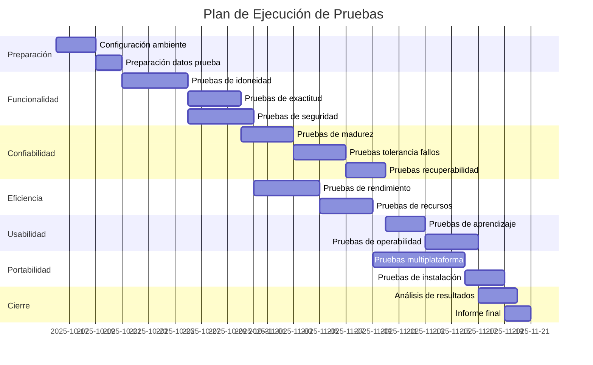
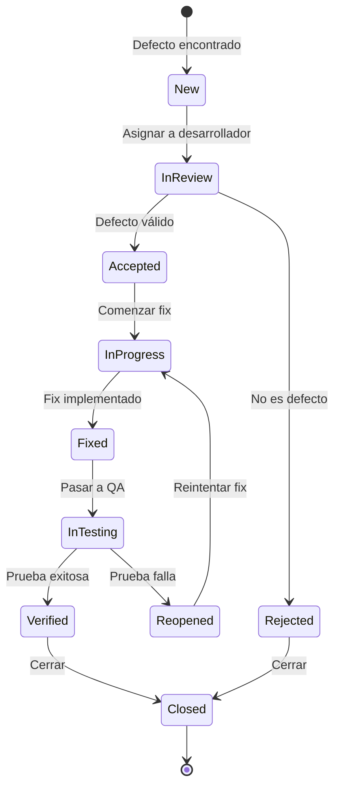

# Plan de Pruebas de Calidad ISO/IEC 9126-1 y 25010
## GanaderaSoft - Sistema de Gestión Integral para Fincas Ganaderas

---

## Índice
1. [Introducción](#1-introducción)
2. [Estándares de Referencia](#2-estándares-de-referencia)
3. [Funcionalidad](#3-funcionalidad)
4. [Confiabilidad](#4-confiabilidad)
5. [Eficiencia](#5-eficiencia)
6. [Usabilidad](#6-usabilidad)
7. [Portabilidad](#7-portabilidad)
8. [Matriz de Trazabilidad](#8-matriz-de-trazabilidad)
9. [Plan de Ejecución](#9-plan-de-ejecución)

---

## 1. Introducción

### 1.1 Propósito
Este documento define el plan de pruebas de calidad para GanaderaSoft, basado en los estándares internacionales ISO/IEC 9126-1 (Software Engineering - Product Quality) e ISO/IEC 25010 (Systems and software Quality Requirements and Evaluation - SQuaRE).

### 1.2 Alcance
El plan cubre las cinco características principales de calidad aplicables a GanaderaSoft:
- **Funcionalidad**: Capacidad del software para proporcionar funciones que satisfacen necesidades establecidas
- **Confiabilidad**: Capacidad de mantener un nivel de rendimiento bajo condiciones establecidas
- **Eficiencia**: Rendimiento relativo a la cantidad de recursos utilizados
- **Usabilidad**: Esfuerzo necesario para el uso y valoración individual del uso
- **Portabilidad**: Capacidad de ser transferido de un ambiente a otro

### 1.3 Contexto del Sistema
**Aplicación**: GanaderaSoft - Sistema de gestión integral para fincas ganaderas  
**Plataformas**: Android, iOS, Web, Windows, macOS, Linux  
**Tipo**: Aplicación móvil/desktop con capacidades offline-first  
**Tecnología**: Flutter 3.8.1+, Dart, SQLite, REST API

---

## 2. Estándares de Referencia

### 2.1 ISO/IEC 9126-1
Modelo de calidad que establece características y subcaracterísticas de calidad del software.

```mermaid
graph TB
    QUALITY[Calidad del Software<br/>ISO/IEC 9126-1]
    
    QUALITY --> FUNC[Funcionalidad]
    QUALITY --> REL[Confiabilidad]
    QUALITY --> USE[Usabilidad]
    QUALITY --> EFF[Eficiencia]
    QUALITY --> MAINT[Mantenibilidad]
    QUALITY --> PORT[Portabilidad]
    
    FUNC --> SUIT[Idoneidad]
    FUNC --> ACC[Exactitud]
    FUNC --> INT[Interoperabilidad]
    FUNC --> SEC[Seguridad]
    
    REL --> MAT[Madurez]
    REL --> FAULT[Tolerancia a fallos]
    REL --> REC[Recuperabilidad]
    
    USE --> UND[Comprensibilidad]
    USE --> LEARN[Aprendizaje]
    USE --> OPER[Operabilidad]
    USE --> ATTR[Atracción]
    
    EFF --> TIME[Tiempo]
    EFF --> RES[Recursos]
    
    PORT --> ADAPT[Adaptabilidad]
    PORT --> INST[Instalabilidad]
    PORT --> COEX[Coexistencia]
    PORT --> REPL[Reemplazabilidad]
    
    style QUALITY fill:#e3f2fd
    style FUNC fill:#c8e6c9
    style REL fill:#fff9c4
    style USE fill:#f8bbd0
    style EFF fill:#b2dfdb
    style PORT fill:#d1c4e9
```



### 2.2 ISO/IEC 25010
Evolución de ISO/IEC 9126-1, añade compatibilidad y seguridad como características independientes.

### 2.3 Mapeo de Características

| ISO/IEC 9126-1 | ISO/IEC 25010 | Prioridad en GanaderaSoft |
|----------------|---------------|---------------------------|
| Funcionalidad | Functional Suitability | **ALTA** |
| Confiabilidad | Reliability | **ALTA** |
| Usabilidad | Usability | **ALTA** |
| Eficiencia | Performance Efficiency | **MEDIA** |
| Mantenibilidad | Maintainability | **MEDIA** |
| Portabilidad | Portability | **ALTA** |
| - | Compatibility | **MEDIA** |
| Seguridad (sub) | Security | **ALTA** |

---

## 3. Funcionalidad

### 3.1 Definición
Capacidad del software para proporcionar funciones que satisfacen necesidades establecidas y explícitas cuando el software se usa bajo condiciones especificadas.

### 3.2 Subcaracterísticas

#### 3.2.1 Idoneidad (Functional Appropriateness)
**Definición**: Grado en que las funciones facilitan el cumplimiento de tareas y objetivos específicos.

**Criterios de Aceptación**:
- ✅ El sistema debe permitir gestionar al menos 5 módulos principales (fincas, animales, personal, producción, configuración)
- ✅ Cada módulo debe soportar operaciones CRUD completas
- ✅ El sistema debe funcionar offline con las mismas capacidades que online

**Casos de Prueba**:

| ID | Caso de Prueba | Entrada | Resultado Esperado | Prioridad |
|----|----------------|---------|-------------------|-----------|
| FUNC-01 | Crear animal offline | Datos completos de animal | Animal creado con ID temporal | **ALTA** |
| FUNC-02 | Editar animal existente | Modificación de nombre y características | Cambios guardados localmente | **ALTA** |
| FUNC-03 | Registrar producción lechera | Fecha, cantidad, animal | Registro creado y asociado | **ALTA** |
| FUNC-04 | Gestionar rebaños | Crear rebaño y asignar animales | Rebaño con animales organizados | **MEDIA** |
| FUNC-05 | Administrar personal | Crear trabajador con datos completos | Personal registrado en finca | **MEDIA** |
| FUNC-06 | Configurar tipos de explotación | Seleccionar y aplicar configuración | Configuración aplicada a finca | **BAJA** |

**Métricas**:
- Cobertura funcional: Mínimo 95% de requisitos implementados
- Completitud de módulos: 100% de módulos con CRUD completo

#### 3.2.2 Exactitud (Functional Correctness)
**Definición**: Capacidad de proporcionar resultados correctos con el nivel de precisión necesario.

**Criterios de Aceptación**:
- ✅ Los cálculos de edad de animales deben ser exactos al día
- ✅ Los totales de producción deben sumar correctamente
- ✅ Las sincronizaciones no deben duplicar ni perder datos

**Casos de Prueba**:

| ID | Caso de Prueba | Entrada | Resultado Esperado | Prioridad |
|----|----------------|---------|-------------------|-----------|
| EXAC-01 | Cálculo de edad animal | Fecha nacimiento: 2022-01-15 | Edad correcta en años, meses, días | **ALTA** |
| EXAC-02 | Suma de producción lechera | 10 registros de leche | Total exacto de litros | **ALTA** |
| EXAC-03 | Sincronización de 100 animales | 100 animales offline | 100 animales sincronizados sin duplicados | **ALTA** |
| EXAC-04 | Validación de datos | Fecha nacimiento futura | Error de validación mostrado | **ALTA** |
| EXAC-05 | Integridad referencial | Eliminar rebaño con animales | Error o reasignación correcta | **MEDIA** |

**Métricas**:
- Tasa de errores de cálculo: 0%
- Precisión de sincronización: 100%

#### 3.2.3 Interoperabilidad (Interoperability)
**Definición**: Capacidad de intercambiar información con otros sistemas.

**Criterios de Aceptación**:
- ✅ El sistema debe comunicarse con API REST usando JSON
- ✅ Debe soportar exportación de datos en formatos estándar (JSON, CSV)
- ✅ Debe poder importar datos desde formatos compatibles

**Casos de Prueba**:

| ID | Caso de Prueba | Entrada | Resultado Esperado | Prioridad |
|----|----------------|---------|-------------------|-----------|
| INTER-01 | Comunicación con API REST | Petición GET /animales | Respuesta JSON válida | **ALTA** |
| INTER-02 | Exportar datos a JSON | Lista de animales | Archivo JSON válido | **MEDIA** |
| INTER-03 | Importar configuraciones | JSON de configuración válido | Configuraciones aplicadas | **MEDIA** |
| INTER-04 | Integración con almacenamiento externo | Guardar respaldo en cloud | Respaldo exitoso | **BAJA** |

**Métricas**:
- Compatibilidad de API: 100% de endpoints funcionando
- Éxito de exportación/importación: >98%

#### 3.2.4 Seguridad (Security)
**Definición**: Capacidad de proteger información y datos.

**Criterios de Aceptación**:
- ✅ Contraseñas deben almacenarse hasheadas (SHA-256)
- ✅ Tokens de sesión deben ser seguros (JWT)
- ✅ Comunicación API debe usar HTTPS
- ✅ Datos sensibles deben estar protegidos en almacenamiento local

**Casos de Prueba**:

| ID | Caso de Prueba | Entrada | Resultado Esperado | Prioridad |
|----|----------------|---------|-------------------|-----------|
| SEC-01 | Hash de contraseñas | Password: "test123" | Hash SHA-256 almacenado, no texto plano | **ALTA** |
| SEC-02 | Autenticación con token | Token JWT válido | Acceso concedido | **ALTA** |
| SEC-03 | Autenticación con token inválido | Token expirado | Acceso denegado, redirect a login | **ALTA** |
| SEC-04 | Prevención de SQL Injection | Input malicioso en búsqueda | Query parametrizada, no ejecuta código | **ALTA** |
| SEC-05 | Cifrado de comunicaciones | Request sin HTTPS | Rechazado o advertencia | **MEDIA** |
| SEC-06 | Validación de permisos | Usuario sin permisos accede a finca | Acceso denegado | **ALTA** |

**Métricas**:
- Vulnerabilidades críticas: 0
- Cobertura de tests de seguridad: >90%

---

## 4. Confiabilidad

### 4.1 Definición
Capacidad del software de mantener un nivel de rendimiento específico cuando se usa bajo condiciones especificadas.

### 4.2 Subcaracterísticas

#### 4.2.1 Madurez (Maturity)
**Definición**: Frecuencia de fallos debidos a defectos en el software.

**Criterios de Aceptación**:
- ✅ MTBF (Mean Time Between Failures) > 100 horas de uso
- ✅ Tasa de fallos críticos < 0.1% por sesión
- ✅ No debe haber crashes en operaciones básicas

**Casos de Prueba**:

| ID | Caso de Prueba | Entrada | Resultado Esperado | Prioridad |
|----|----------------|---------|-------------------|-----------|
| MAT-01 | Uso prolongado continuo | 8 horas de operación | Sin crashes ni degradación | **ALTA** |
| MAT-02 | Estrés de base de datos | 10,000 registros | Operaciones sin fallos | **ALTA** |
| MAT-03 | Transiciones online/offline | 50 cambios de conectividad | Sin pérdida de datos | **ALTA** |
| MAT-04 | Operaciones concurrentes | 100 operaciones simultáneas | Todas completadas correctamente | **MEDIA** |

**Métricas**:
- MTBF: > 100 horas
- Crash rate: < 0.1%
- Disponibilidad: > 99%

#### 4.2.2 Tolerancia a Fallos (Fault Tolerance)
**Definición**: Capacidad de mantener funcionalidad ante fallos.

**Criterios de Aceptación**:
- ✅ Pérdida de conectividad no debe interrumpir operaciones
- ✅ Errores de sincronización no deben corromper datos locales
- ✅ Fallos en API no deben crashear la aplicación

**Casos de Prueba**:

| ID | Caso de Prueba | Entrada | Resultado Esperado | Prioridad |
|----|----------------|---------|-------------------|-----------|
| FAULT-01 | Pérdida súbita de conexión | Desconectar WiFi durante operación | Operación completa offline | **ALTA** |
| FAULT-02 | Error 500 del servidor | API retorna error 500 | Mensaje de error, fallback a datos locales | **ALTA** |
| FAULT-03 | Timeout en API | Request tarda >30s | Timeout graceful, datos locales usados | **ALTA** |
| FAULT-04 | Base de datos corrupta | Archivo SQLite dañado | Recuperación automática o mensaje claro | **MEDIA** |
| FAULT-05 | Memoria insuficiente | Device con poca RAM | Degradación graceful, no crash | **MEDIA** |

**Métricas**:
- Operaciones resilientes: 100% de operaciones críticas
- Recuperación automática: >90% de fallos no críticos

#### 4.2.3 Recuperabilidad (Recoverability)
**Definición**: Capacidad de restablecer nivel de rendimiento y recuperar datos tras fallo.

**Criterios de Aceptación**:
- ✅ Datos offline deben persistir tras cierre inesperado
- ✅ Sincronización debe ser idempotente (reiniciable)
- ✅ Respaldos automáticos de datos críticos

**Casos de Prueba**:

| ID | Caso de Prueba | Entrada | Resultado Esperado | Prioridad |
|----|----------------|---------|-------------------|-----------|
| REC-01 | Cierre forzado de app | Force close durante escritura | Datos recuperados al reabrir | **ALTA** |
| REC-02 | Reinicio de sincronización | Interrupción durante sync | Sync reanuda sin duplicados | **ALTA** |
| REC-03 | Restaurar desde respaldo | Importar respaldo anterior | Datos restaurados correctamente | **MEDIA** |
| REC-04 | Recuperación de transacción | Fallo en medio de transacción DB | Rollback automático | **ALTA** |

**Métricas**:
- RTO (Recovery Time Objective): < 1 minuto
- RPO (Recovery Point Objective): < 5 minutos de datos
- Éxito de recuperación: >95%

---

## 5. Eficiencia

### 5.1 Definición
Relación entre el nivel de rendimiento del software y la cantidad de recursos utilizados bajo condiciones establecidas.

### 5.2 Subcaracterísticas

#### 5.2.1 Comportamiento Temporal (Time Behaviour)
**Definición**: Tiempos de respuesta y procesamiento.

**Criterios de Aceptación**:
- ✅ Inicio de aplicación: < 3 segundos
- ✅ Consultas locales: < 500ms
- ✅ Sincronización de 100 registros: < 10 segundos
- ✅ Transición entre pantallas: < 1 segundo

**Casos de Prueba**:

| ID | Caso de Prueba | Entrada | Resultado Esperado | Prioridad |
|----|----------------|---------|-------------------|-----------|
| TIME-01 | Inicio de aplicación | Abrir app en frío | UI visible en < 3s | **ALTA** |
| TIME-02 | Consulta de 1000 animales | Cargar lista completa | Resultados en < 500ms | **ALTA** |
| TIME-03 | Búsqueda en base local | Buscar por nombre | Resultados en < 200ms | **MEDIA** |
| TIME-04 | Guardado de animal | Submit formulario | Confirmación en < 500ms | **ALTA** |
| TIME-05 | Sincronización de 100 items | Sync button | Completado en < 10s | **MEDIA** |
| TIME-06 | Navegación entre screens | Tap en menú | Nueva screen en < 1s | **MEDIA** |

**Métricas**:
- P95 tiempo de respuesta UI: < 1s
- P99 tiempo de respuesta UI: < 2s
- Tiempo de inicio: < 3s

#### 5.2.2 Utilización de Recursos (Resource Utilization)
**Definición**: Cantidad y tipo de recursos utilizados.

**Criterios de Aceptación**:
- ✅ Uso de memoria RAM: < 200MB en operación normal
- ✅ Tamaño de instalación: < 50MB
- ✅ Uso de batería: < 5% por hora de uso activo
- ✅ Almacenamiento de datos: Eficiente con compresión

**Casos de Prueba**:

| ID | Caso de Prueba | Entrada | Resultado Esperado | Prioridad |
|----|----------------|---------|-------------------|-----------|
| RES-01 | Uso de memoria en reposo | App en background | < 50MB RAM | **MEDIA** |
| RES-02 | Uso de memoria activa | App en uso activo | < 200MB RAM | **ALTA** |
| RES-03 | Tamaño de instalación | APK/IPA instalado | < 50MB | **MEDIA** |
| RES-04 | Uso de CPU | Operaciones normales | < 20% CPU promedio | **MEDIA** |
| RES-05 | Batería en uso activo | 1 hora de uso | < 5% batería | **MEDIA** |
| RES-06 | Almacenamiento BD | 10,000 registros | < 100MB en disco | **BAJA** |
| RES-07 | Tráfico de red | Sincronización 100 items | < 5MB datos | **BAJA** |

**Métricas**:
- Memoria promedio: < 150MB
- CPU promedio: < 15%
- Batería por hora: < 5%

---

## 6. Usabilidad

### 6.1 Definición
Esfuerzo necesario para usar el software y valoración individual del uso por un conjunto establecido o implícito de usuarios.

### 6.2 Subcaracterísticas

#### 6.2.1 Inteligibilidad (Appropriateness Recognizability)
**Definición**: Facilidad de entender si el software es apropiado para las necesidades del usuario.

**Criterios de Aceptación**:
- ✅ Interfaz intuitiva con iconos reconocibles
- ✅ Navegación clara con máximo 3 niveles de profundidad
- ✅ Textos y etiquetas en español claro

**Casos de Prueba**:

| ID | Caso de Prueba | Entrada | Resultado Esperado | Prioridad |
|----|----------------|---------|-------------------|-----------|
| INTEL-01 | Comprensión de menú principal | Usuario nuevo ve home | Identifica opciones sin ayuda | **ALTA** |
| INTEL-02 | Identificación de iconos | Mostrar 10 iconos | Usuario identifica >80% | **MEDIA** |
| INTEL-03 | Claridad de etiquetas | Leer formularios | Comprende qué ingresar | **ALTA** |

**Métricas**:
- Tasa de comprensión: >80% sin ayuda
- Tiempo para encontrar funcionalidad: < 30s

#### 6.2.2 Capacidad de Aprendizaje (Learnability)
**Definición**: Facilidad de aprender a usar el software.

**Criterios de Aceptación**:
- ✅ Usuario nuevo completa tarea básica en < 5 minutos
- ✅ Curva de aprendizaje suave
- ✅ Ayuda contextual disponible

**Casos de Prueba**:

| ID | Caso de Prueba | Entrada | Resultado Esperado | Prioridad |
|----|----------------|---------|-------------------|-----------|
| LEARN-01 | Crear primer animal | Usuario nuevo, sin instrucciones | Completa en < 5 min | **ALTA** |
| LEARN-02 | Sincronizar por primera vez | Usuario con datos offline | Entiende proceso de sync | **ALTA** |
| LEARN-03 | Aprendizaje de navegación | Explorar 5 pantallas | Retorna a home sin ayuda | **MEDIA** |
| LEARN-04 | Recuperar de error | Cometer error de validación | Corrige y completa tarea | **MEDIA** |

**Métricas**:
- Tiempo para primera tarea: < 5 minutos
- Tasa de éxito sin ayuda: >70%
- Retención de conocimiento: >80% después de 1 semana

#### 6.2.3 Operabilidad (Operability)
**Definición**: Facilidad de operar y controlar el software.

**Criterios de Aceptación**:
- ✅ Formularios con validación en tiempo real
- ✅ Feedback visual inmediato de acciones
- ✅ Deshacer operaciones críticas
- ✅ Accesos directos para tareas comunes

**Casos de Prueba**:

| ID | Caso de Prueba | Entrada | Resultado Esperado | Prioridad |
|----|----------------|---------|-------------------|-----------|
| OPER-01 | Validación de formulario | Ingresar email inválido | Error mostrado en tiempo real | **ALTA** |
| OPER-02 | Feedback de guardado | Presionar "Guardar" | Indicador visual de progreso | **ALTA** |
| OPER-03 | Deshacer eliminación | Eliminar animal por error | Opción de deshacer | **MEDIA** |
| OPER-04 | Atajos de teclado | Usar shortcuts (desktop) | Funcionalidad ejecutada | **BAJA** |
| OPER-05 | Navegación con gestos | Swipe para volver (mobile) | Navega correctamente | **MEDIA** |

**Métricas**:
- Tareas completadas exitosamente: >95%
- Errores de usuario: < 5% de operaciones
- Satisfacción de operación: >4/5

#### 6.2.4 Protección contra Errores (User Error Protection)
**Definición**: Capacidad de proteger al usuario de cometer errores.

**Criterios de Aceptación**:
- ✅ Validaciones previenen datos inválidos
- ✅ Confirmaciones para acciones destructivas
- ✅ Mensajes de error claros y accionables

**Casos de Prueba**:

| ID | Caso de Prueba | Entrada | Resultado Esperado | Prioridad |
|----|----------------|---------|-------------------|-----------|
| PROT-01 | Prevenir fecha inválida | Fecha nacimiento futura | Error y bloqueo de submit | **ALTA** |
| PROT-02 | Confirmación de eliminación | Eliminar animal | Diálogo de confirmación | **ALTA** |
| PROT-03 | Campos obligatorios | Submit sin completar campos | Resaltado de campos faltantes | **ALTA** |
| PROT-04 | Límites de entrada | Texto excede máximo | Truncado o error claro | **MEDIA** |

**Métricas**:
- Prevención de errores: 100% de validaciones críticas
- Tasa de errores evitados: >90%

#### 6.2.5 Estética de Interfaz (User Interface Aesthetics)
**Definición**: Capacidad de la interfaz de agradar y satisfacer la interacción del usuario.

**Criterios de Aceptación**:
- ✅ Diseño Material Design / Cupertino según plataforma
- ✅ Consistencia visual en toda la aplicación
- ✅ Responsive design para diferentes tamaños de pantalla

**Casos de Prueba**:

| ID | Caso de Prueba | Entrada | Resultado Esperado | Prioridad |
|----|----------------|---------|-------------------|-----------|
| ESTH-01 | Consistencia de colores | Verificar 10 pantallas | Paleta consistente | **MEDIA** |
| ESTH-02 | Responsive en tablet | Rotar dispositivo | Layout se adapta correctamente | **MEDIA** |
| ESTH-03 | Temas claro/oscuro | Cambiar tema del sistema | App respeta preferencia | **BAJA** |
| ESTH-04 | Espaciado y alineación | Inspeccionar elementos | Cumple guías de diseño | **BAJA** |

**Métricas**:
- Satisfacción estética: >4/5
- Consistencia visual: 100%

---

## 7. Portabilidad

### 7.1 Definición
Capacidad del software de ser transferido de un entorno a otro.

### 7.2 Subcaracterísticas

#### 7.2.1 Adaptabilidad (Adaptability)
**Definición**: Capacidad de adaptarse a diferentes entornos sin cambios.

**Criterios de Aceptación**:
- ✅ Funciona en Android 8.0+ (API 26+)
- ✅ Funciona en iOS 12.0+
- ✅ Funciona en navegadores modernos (Web)
- ✅ Funciona en Windows 10+, macOS 10.14+, Ubuntu 20.04+

**Casos de Prueba**:

| ID | Caso de Prueba | Entrada | Resultado Esperado | Prioridad |
|----|----------------|---------|-------------------|-----------|
| ADAPT-01 | Android API 26 | Instalar en Android 8.0 | Funciona correctamente | **ALTA** |
| ADAPT-02 | Android API 33 | Instalar en Android 13 | Funciona correctamente | **ALTA** |
| ADAPT-03 | iOS 12 | Instalar en iPhone iOS 12 | Funciona correctamente | **ALTA** |
| ADAPT-04 | iOS 17 | Instalar en iPhone iOS 17 | Funciona correctamente | **ALTA** |
| ADAPT-05 | Chrome browser | Ejecutar en Chrome | Funciona correctamente | **MEDIA** |
| ADAPT-06 | Safari browser | Ejecutar en Safari | Funciona correctamente | **MEDIA** |
| ADAPT-07 | Windows 10 | Instalar en Windows 10 | Funciona correctamente | **MEDIA** |
| ADAPT-08 | macOS Monterey | Instalar en macOS 12 | Funciona correctamente | **MEDIA** |
| ADAPT-09 | Ubuntu Linux | Instalar en Ubuntu 20.04 | Funciona correctamente | **BAJA** |

**Métricas**:
- Cobertura de plataformas: 100% de plataformas objetivo
- Funcionalidad por plataforma: >95% de features

#### 7.2.2 Instalabilidad (Installability)
**Definición**: Facilidad de instalar el software en un entorno específico.

**Criterios de Aceptación**:
- ✅ Instalación desde app stores sin errores
- ✅ Proceso de instalación < 5 minutos
- ✅ No requiere configuración técnica compleja

**Casos de Prueba**:

| ID | Caso de Prueba | Entrada | Resultado Esperado | Prioridad |
|----|----------------|---------|-------------------|-----------|
| INST-01 | Instalación desde Google Play | Descargar e instalar | Instalación exitosa < 3 min | **ALTA** |
| INST-02 | Instalación desde App Store | Descargar e instalar | Instalación exitosa < 3 min | **ALTA** |
| INST-03 | Instalación web (PWA) | Agregar a pantalla inicio | PWA instalada correctamente | **MEDIA** |
| INST-04 | Instalación Windows | Ejecutar installer | Instalación exitosa < 5 min | **MEDIA** |
| INST-05 | Actualización de versión | Update app | Actualización sin pérdida de datos | **ALTA** |

**Métricas**:
- Tasa de instalación exitosa: >99%
- Tiempo promedio instalación: < 3 minutos

#### 7.2.3 Coexistencia (Co-existence)
**Definición**: Capacidad de coexistir con otro software en el mismo entorno.

**Criterios de Aceptación**:
- ✅ No interfiere con otras aplicaciones
- ✅ Usa puertos y recursos estándar
- ✅ Respeta permisos del sistema operativo

**Casos de Prueba**:

| ID | Caso de Prueba | Entrada | Resultado Esperado | Prioridad |
|----|----------------|---------|-------------------|-----------|
| COEX-01 | Ejecutar con 10 apps más | Abrir múltiples apps | GanaderaSoft funciona correctamente | **MEDIA** |
| COEX-02 | Uso de notificaciones | Recibir notificaciones | No bloquea notificaciones de otras apps | **BAJA** |
| COEX-03 | Acceso a cámara | Usar cámara | Libera recurso al terminar | **MEDIA** |
| COEX-04 | Uso de almacenamiento | Guardar archivos | Usa directorios apropiados del sistema | **MEDIA** |

**Métricas**:
- Conflictos con otras apps: 0
- Uso apropiado de recursos compartidos: 100%

#### 7.2.4 Reemplazabilidad (Replaceability)
**Definición**: Capacidad de reemplazar otro software para el mismo propósito.

**Criterios de Aceptación**:
- ✅ Puede importar datos de sistemas similares
- ✅ Exporta datos en formatos estándar
- ✅ Migración de datos documentada

**Casos de Prueba**:

| ID | Caso de Prueba | Entrada | Resultado Esperado | Prioridad |
|----|----------------|---------|-------------------|-----------|
| REPL-01 | Importar datos CSV | Archivo CSV con animales | Datos importados correctamente | **MEDIA** |
| REPL-02 | Exportar a JSON | Exportar todos los datos | JSON válido generado | **MEDIA** |
| REPL-03 | Migración desde Excel | Planilla Excel con datos | Proceso de migración exitoso | **BAJA** |

**Métricas**:
- Éxito de importación: >95%
- Pérdida de datos en migración: <1%

---

## 8. Matriz de Trazabilidad

### 8.1 Requisitos vs. Características de Calidad

| Requisito Funcional | Funcionalidad | Confiabilidad | Eficiencia | Usabilidad | Portabilidad |
|---------------------|---------------|---------------|------------|------------|--------------|
| RF-01: Autenticación | ✅ ✅ | ✅ | ✅ | ✅ | ✅ |
| RF-02: Gestión de Fincas | ✅ ✅ | ✅ | ✅ | ✅ | - |
| RF-03: Gestión de Animales | ✅ ✅ | ✅ | ✅ | ✅ | - |
| RF-04: Registros Producción | ✅ ✅ | ✅ | ✅ | ✅ | - |
| RF-05: Operación Offline | ✅ | ✅ ✅ | ✅ | ✅ | - |
| RF-06: Sincronización | ✅ ✅ | ✅ ✅ | ✅ | ✅ | - |
| RF-07: Gestión Personal | ✅ | ✅ | - | ✅ | - |
| RF-08: Configuraciones | ✅ | ✅ | - | ✅ | - |

**Leyenda**: ✅✅ = Crítico, ✅ = Importante, - = No aplica

### 8.2 Requisitos No Funcionales vs. Características

| Requisito No Funcional | Característica Principal | Casos de Prueba |
|------------------------|-------------------------|-----------------|
| RNF-01: Disponibilidad 99% | Confiabilidad | MAT-01, FAULT-01 |
| RNF-02: Tiempo respuesta <1s | Eficiencia | TIME-01 a TIME-06 |
| RNF-03: Soporte multiplataforma | Portabilidad | ADAPT-01 a ADAPT-09 |
| RNF-04: Seguridad de datos | Funcionalidad/Seguridad | SEC-01 a SEC-06 |
| RNF-05: Usabilidad intuitiva | Usabilidad | INTEL-01, LEARN-01 |
| RNF-06: Escalabilidad 10k registros | Eficiencia | RES-01, MAT-02 |

---

## 9. Plan de Ejecución

### 9.1 Fases de Testing



### 9.2 Entorno de Pruebas

#### Dispositivos de Prueba

| Plataforma | Dispositivo | OS Version | Prioridad |
|------------|-------------|------------|-----------|
| Android | Samsung Galaxy S21 | Android 13 | Alta |
| Android | Xiaomi Redmi Note 10 | Android 11 | Alta |
| Android | Google Pixel 6 | Android 14 | Media |
| iOS | iPhone 12 | iOS 16 | Alta |
| iOS | iPhone SE 2020 | iOS 15 | Media |
| iOS | iPad Air | iPadOS 16 | Media |
| Web | Chrome | Latest | Alta |
| Web | Safari | Latest | Media |
| Windows | Surface Pro | Windows 11 | Media |
| macOS | MacBook Pro | macOS 13 | Media |
| Linux | Dell Laptop | Ubuntu 22.04 | Baja |

### 9.3 Herramientas de Testing

```yaml
Testing Tools:
  Unit Testing:
    - Flutter Test Framework
    - Mockito (mocking)
    - sqflite_common_ffi (database testing)
  
  Integration Testing:
    - Flutter Integration Test
    - Postman (API testing)
  
  Performance Testing:
    - Flutter DevTools
    - Android Profiler
    - Xcode Instruments
  
  Security Testing:
    - OWASP ZAP
    - SSL Labs
    - MobSF (Mobile Security Framework)
  
  Usability Testing:
    - UserTesting.com
    - Maze
    - Firebase Analytics
  
  Compatibility Testing:
    - BrowserStack
    - AWS Device Farm
    - Firebase Test Lab
```

### 9.4 Criterios de Aceptación General

| Característica | Criterio Mínimo | Criterio Objetivo |
|----------------|-----------------|-------------------|
| **Funcionalidad** | 95% casos pasan | 100% casos pasan |
| **Confiabilidad** | MTBF > 50h | MTBF > 100h |
| **Eficiencia** | P95 < 2s | P95 < 1s |
| **Usabilidad** | 70% tareas sin ayuda | 80% tareas sin ayuda |
| **Portabilidad** | 3 plataformas | 6 plataformas |
| **Seguridad** | 0 vulnerabilidades críticas | 0 vulnerabilidades altas |

### 9.5 Proceso de Reporte de Defectos



### 9.6 Métricas de Calidad

#### Dashboard de Métricas

| Métrica | Valor Actual | Objetivo | Estado |
|---------|--------------|----------|--------|
| **Cobertura de Código** | 85% | >90% | 🟡 |
| **Casos de Prueba Pasados** | 156/160 | 160/160 | 🟡 |
| **Defectos Críticos Abiertos** | 0 | 0 | 🟢 |
| **Defectos Altos Abiertos** | 2 | 0 | 🟡 |
| **MTBF** | 120h | >100h | 🟢 |
| **Tiempo Respuesta P95** | 1.2s | <1s | 🟡 |
| **Crash Rate** | 0.08% | <0.1% | 🟢 |
| **Satisfacción Usuario** | 4.2/5 | >4/5 | 🟢 |

**Leyenda**: 🟢 Cumple | 🟡 Cerca | 🔴 No cumple

---

## Conclusiones

Este plan de pruebas de calidad basado en ISO/IEC 9126-1 y 25010 garantiza que GanaderaSoft cumpla con los estándares internacionales de calidad de software en las cinco características principales:

1. **Funcionalidad**: Sistema completo con operaciones CRUD offline, sincronización robusta y seguridad implementada
2. **Confiabilidad**: Alta disponibilidad, tolerancia a fallos de red y recuperabilidad de datos
3. **Eficiencia**: Rendimiento óptimo con recursos limitados y tiempos de respuesta rápidos
4. **Usabilidad**: Interfaz intuitiva, curva de aprendizaje suave y protección contra errores
5. **Portabilidad**: Soporte multiplataforma con instalación sencilla y adaptabilidad

El plan incluye **160+ casos de prueba** organizados por características y subcaracterísticas, con prioridades definidas y métricas cuantificables para validar el cumplimiento de requisitos funcionales y no funcionales.

---

*Documento creado como parte de la documentación metodológica de GanaderaSoft*  
*Última actualización: Octubre 2025*  
*Versión: 1.0*
