# Arquitectura 4+1 Vistas - GanaderaSoft

## Visión General

Este documento presenta la arquitectura del sistema GanaderaSoft bajo el modelo de arquitectura 4+1 vistas de Kruchten. La aplicación es un sistema móvil de gestión integral para fincas ganaderas desarrollado con Flutter, que soporta operaciones offline mediante SQLite y sincronización con un backend API REST construido con Laravel.

## Tecnologías Identificadas en el Código

- **Frontend Móvil**: Flutter (SDK 3.8.1+)
- **Base de Datos Local**: SQLite (sqflite 2.3.0)
- **Almacenamiento Local**: SharedPreferences (2.2.2)
- **Comunicación HTTP**: http package (1.1.0)
- **Gestión de Estado**: Provider (6.0.5)
- **Detección de Conectividad**: connectivity_plus (5.0.2)
- **Backend API**: Laravel (REST API en http://52.53.127.245:8000)
- **Seguridad**: crypto package para hash SHA-256

---

## 1. Vista Lógica

La vista lógica muestra las principales clases, modelos y sus relaciones dentro del sistema.

### 1.1 Diagrama de Clases Principal

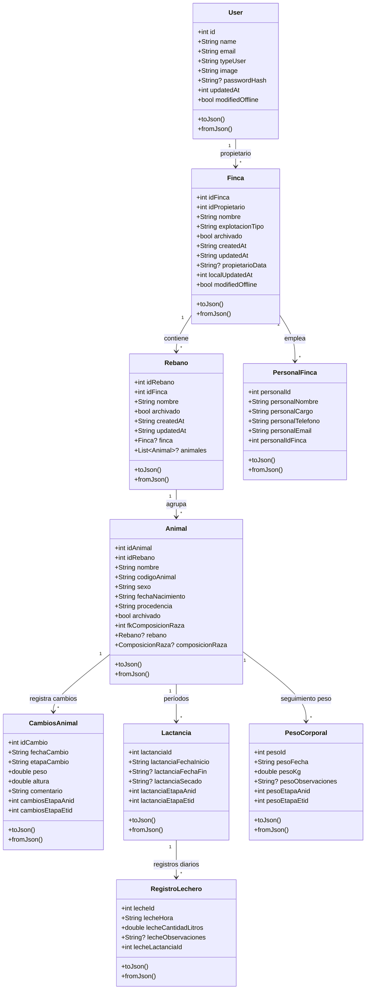
```mermaid
classDiagram
    class User {
        +int id
        +String name
        +String email
        +String typeUser
        +String image
        +String? passwordHash
        +int updatedAt
        +bool modifiedOffline
        +toJson()
        +fromJson()
    }

    class Finca {
        +int idFinca
        +int idPropietario
        +String nombre
        +String explotacionTipo
        +bool archivado
        +String createdAt
        +String updatedAt
        +String? propietarioData
        +int localUpdatedAt
        +bool modifiedOffline
        +toJson()
        +fromJson()
    }

    class Animal {
        +int idAnimal
        +int idRebano
        +String nombre
        +String codigoAnimal
        +String sexo
        +String fechaNacimiento
        +String procedencia
        +bool archivado
        +int fkComposicionRaza
        +Rebano? rebano
        +ComposicionRaza? composicionRaza
        +toJson()
        +fromJson()
    }

    class Rebano {
        +int idRebano
        +int idFinca
        +String nombre
        +bool archivado
        +String createdAt
        +String updatedAt
        +Finca? finca
        +List~Animal~? animales
        +toJson()
        +fromJson()
    }

    class CambiosAnimal {
        +int idCambio
        +String fechaCambio
        +String etapaCambio
        +double peso
        +double altura
        +String comentario
        +int cambiosEtapaAnid
        +int cambiosEtapaEtid
        +toJson()
        +fromJson()
    }

    class Lactancia {
        +int lactanciaId
        +String lactanciaFechaInicio
        +String? lactanciaFechaFin
        +String? lactanciaSecado
        +int lactanciaEtapaAnid
        +int lactanciaEtapaEtid
        +toJson()
        +fromJson()
    }

    class RegistroLechero {
        +int lecheId
        +String lecheHora
        +double lecheCantidadLitros
        +String? lecheObservaciones
        +int lecheLactanciaId
        +toJson()
        +fromJson()
    }

    class PesoCorporal {
        +int pesoId
        +String pesoFecha
        +double pesoKg
        +String? pesoObservaciones
        +int pesoEtapaAnid
        +int pesoEtapaEtid
        +toJson()
        +fromJson()
    }

    class PersonalFinca {
        +int personalId
        +String personalNombre
        +String personalCargo
        +String personalTelefono
        +String personalEmail
        +int personalIdFinca
        +toJson()
        +fromJson()
    }

    User "1" --> "*" Finca : propietario
    Finca "1" --> "*" Rebano : contiene
    Rebano "1" --> "*" Animal : agrupa
    Animal "1" --> "*" CambiosAnimal : registra cambios
    Animal "1" --> "*" Lactancia : períodos
    Lactancia "1" --> "*" RegistroLechero : registros diarios
    Animal "1" --> "*" PesoCorporal : seguimiento peso
    Finca "1" --> "*" PersonalFinca : emplea
```

### 1.2 Diagrama de Modelos de Configuración

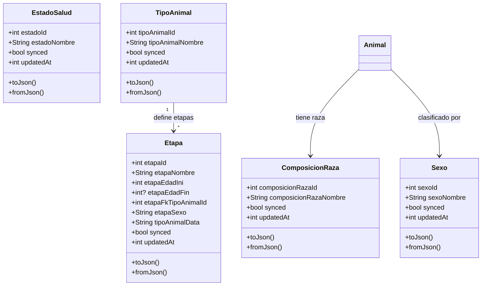
```mermaid
classDiagram
    class EstadoSalud {
        +int estadoId
        +String estadoNombre
        +bool synced
        +int updatedAt
        +toJson()
        +fromJson()
    }

    class TipoAnimal {
        +int tipoAnimalId
        +String tipoAnimalNombre
        +bool synced
        +int updatedAt
        +toJson()
        +fromJson()
    }

    class Etapa {
        +int etapaId
        +String etapaNombre
        +int etapaEdadIni
        +int? etapaEdadFin
        +int etapaFkTipoAnimalId
        +String etapaSexo
        +String tipoAnimalData
        +bool synced
        +int updatedAt
        +toJson()
        +fromJson()
    }

    class ComposicionRaza {
        +int composicionRazaId
        +String composicionRazaNombre
        +bool synced
        +int updatedAt
        +toJson()
        +fromJson()
    }

    class Sexo {
        +int sexoId
        +String sexoNombre
        +bool synced
        +int updatedAt
        +toJson()
        +fromJson()
    }

    TipoAnimal "1" --> "*" Etapa : define etapas
    Animal --> ComposicionRaza : tiene raza
    Animal --> Sexo : clasificado por
```

### 1.3 Descripción Técnica

El modelo de dominio está organizado en dos grandes grupos:

**Entidades Principales de Negocio:**
- **User**: Representa usuarios del sistema (propietarios, administradores)
- **Finca**: Unidad principal de gestión ganadera con información de explotación
- **Rebano**: Agrupación lógica de animales dentro de una finca
- **Animal**: Entidad central que representa cada animal del ganado
- **CambiosAnimal**: Historial de cambios de etapa y mediciones del animal
- **Lactancia**: Períodos de lactancia de animales productores
- **RegistroLechero**: Registros diarios de producción de leche
- **PesoCorporal**: Seguimiento histórico del peso de los animales
- **PersonalFinca**: Personal empleado en cada finca

**Entidades de Configuración:**
- **EstadoSalud**: Catálogo de estados de salud posibles
- **TipoAnimal**: Clasificación de tipos de animales (bovino, porcino, etc.)
- **Etapa**: Etapas de vida de los animales según tipo y sexo
- **ComposicionRaza**: Catálogo de razas y composiciones raciales
- **Sexo**: Clasificación por sexo del animal

Todos los modelos incluyen atributos de sincronización (`modifiedOffline`, `synced`) para soportar la funcionalidad offline-first.

---

## 2. Vista de Desarrollo

La vista de desarrollo muestra la organización del código fuente y las dependencias entre módulos.

### 2.1 Estructura de Directorios

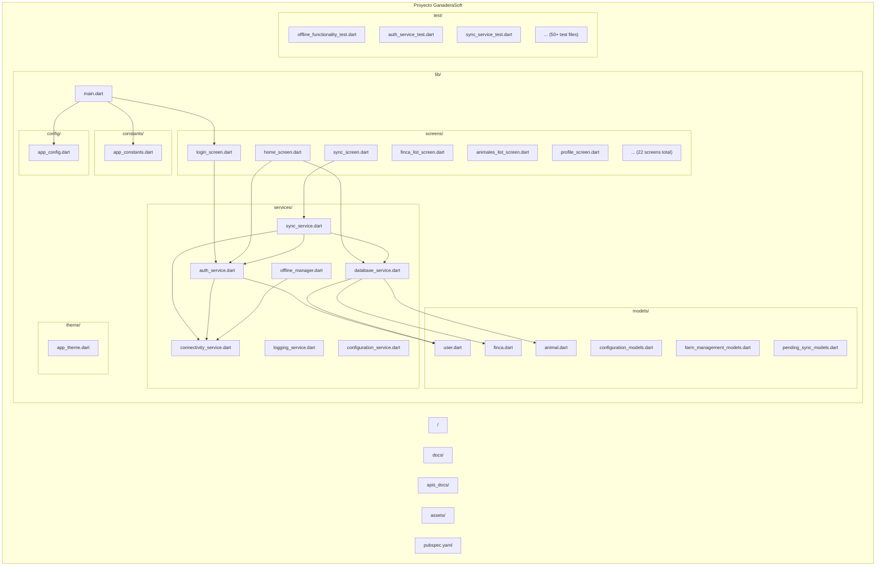
```mermaid
graph TB
    subgraph "Proyecto GanaderaSoft"
        ROOT["/"]
        
        subgraph "lib/"
            MAIN[main.dart]
            
            subgraph "config/"
                CONFIG[app_config.dart]
            end
            
            subgraph "constants/"
                CONST[app_constants.dart]
            end
            
            subgraph "models/"
                M1[user.dart]
                M2[finca.dart]
                M3[animal.dart]
                M4[configuration_models.dart]
                M5[farm_management_models.dart]
                M6[pending_sync_models.dart]
            end
            
            subgraph "services/"
                S1[auth_service.dart]
                S2[database_service.dart]
                S3[sync_service.dart]
                S4[connectivity_service.dart]
                S5[offline_manager.dart]
                S6[logging_service.dart]
                S7[configuration_service.dart]
            end
            
            subgraph "screens/"
                SC1[login_screen.dart]
                SC2[home_screen.dart]
                SC3[finca_list_screen.dart]
                SC4[animales_list_screen.dart]
                SC5[sync_screen.dart]
                SC6[profile_screen.dart]
                SC7["... (22 screens total)"]
            end
            
            subgraph "theme/"
                THEME[app_theme.dart]
            end
        end
        
        subgraph "test/"
            T1[offline_functionality_test.dart]
            T2[auth_service_test.dart]
            T3[sync_service_test.dart]
            T4["... (50+ test files)"]
        end
        
        DOCS[docs/]
        APIS[apis_docs/]
        ASSETS[assets/]
        PUBSPEC[pubspec.yaml]
    end
    
    MAIN --> CONFIG
    MAIN --> CONST
    MAIN --> SC1
    SC1 --> S1
    SC2 --> S1
    SC2 --> S2
    SC5 --> S3
    S1 --> M1
    S2 --> M1
    S2 --> M2
    S2 --> M3
    S3 --> S1
    S3 --> S2
    S3 --> S4
    S1 --> S4
    S5 --> S4
```

### 2.2 Dependencias entre Módulos

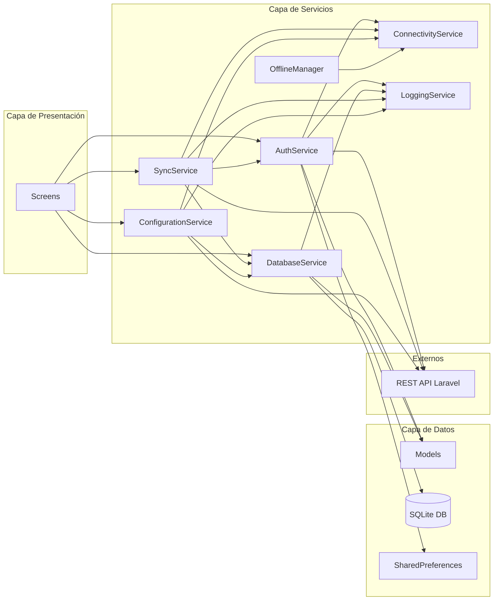
```mermaid
graph LR
    subgraph "Capa de Presentación"
        SCREENS[Screens]
    end
    
    subgraph "Capa de Servicios"
        AUTH[AuthService]
        DB[DatabaseService]
        SYNC[SyncService]
        CONN[ConnectivityService]
        OFFLINE[OfflineManager]
        LOG[LoggingService]
        CONF[ConfigurationService]
    end
    
    subgraph "Capa de Datos"
        MODELS[Models]
        SQLITE[(SQLite DB)]
        PREFS[SharedPreferences]
    end
    
    subgraph "Externos"
        API[REST API Laravel]
    end
    
    SCREENS --> AUTH
    SCREENS --> DB
    SCREENS --> SYNC
    SCREENS --> CONF
    
    AUTH --> MODELS
    AUTH --> PREFS
    AUTH --> API
    AUTH --> CONN
    
    DB --> MODELS
    DB --> SQLITE
    
    SYNC --> AUTH
    SYNC --> DB
    SYNC --> CONN
    SYNC --> API
    
    CONF --> API
    CONF --> DB
    CONF --> CONN
    
    OFFLINE --> CONN
    
    AUTH --> LOG
    DB --> LOG
    SYNC --> LOG
    CONF --> LOG
```

### 2.3 Descripción Técnica

**Organización del Código:**

1. **config/**: Configuración centralizada de URLs y endpoints del API
2. **constants/**: Constantes de la aplicación (claves de almacenamiento, nombres)
3. **models/**: Clases de dominio con serialización JSON bidireccional
4. **services/**: Lógica de negocio y comunicación con persistencia/API
5. **screens/**: Interfaces de usuario organizadas por funcionalidad
6. **theme/**: Configuración de temas claro/oscuro de Material Design

**Dependencias Clave (pubspec.yaml):**
- `flutter`: SDK principal
- `http 1.1.0`: Cliente HTTP para comunicación REST
- `sqflite 2.3.0`: Base de datos SQLite local
- `shared_preferences 2.2.2`: Almacenamiento clave-valor persistente
- `provider 6.0.5`: Gestión de estado reactivo
- `connectivity_plus 5.0.2`: Monitoreo de conectividad de red
- `crypto 3.0.3`: Algoritmos criptográficos (SHA-256 para passwords)

**Patrones de Arquitectura:**
- **MVS (Model-View-Service)**: Separación clara entre datos, UI y lógica
- **Repository Pattern**: DatabaseService actúa como repositorio local
- **Service Layer**: Abstracción de lógica de negocio en servicios especializados
- **Singleton Pattern**: Servicios implementados como clases estáticas

---

## 3. Vista de Procesos

La vista de procesos describe los flujos de ejecución y la concurrencia del sistema.

### 3.1 Flujo de Autenticación Offline/Online

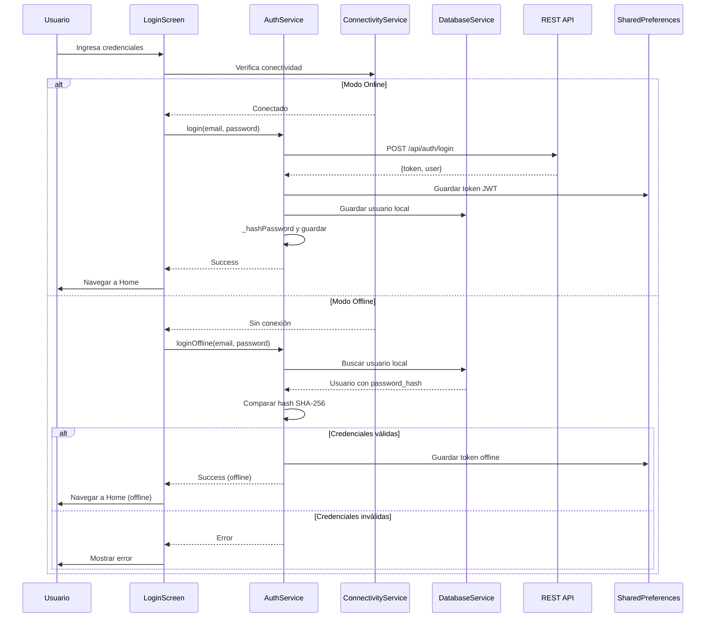
```mermaid
sequenceDiagram
    participant U as Usuario
    participant LS as LoginScreen
    participant AS as AuthService
    participant CS as ConnectivityService
    participant DB as DatabaseService
    participant API as REST API
    participant SP as SharedPreferences

    U->>LS: Ingresa credenciales
    LS->>CS: Verifica conectividad
    
    alt Modo Online
        CS-->>LS: Conectado
        LS->>AS: login(email, password)
        AS->>API: POST /api/auth/login
        API-->>AS: {token, user}
        AS->>SP: Guardar token JWT
        AS->>DB: Guardar usuario local
        AS->>AS: _hashPassword y guardar
        AS-->>LS: Success
        LS->>U: Navegar a Home
    else Modo Offline
        CS-->>LS: Sin conexión
        LS->>AS: loginOffline(email, password)
        AS->>DB: Buscar usuario local
        DB-->>AS: Usuario con password_hash
        AS->>AS: Comparar hash SHA-256
        alt Credenciales válidas
            AS->>SP: Guardar token offline
            AS-->>LS: Success (offline)
            LS->>U: Navegar a Home (offline)
        else Credenciales inválidas
            AS-->>LS: Error
            LS->>U: Mostrar error
        end
    end
```

### 3.2 Flujo de Sincronización de Datos

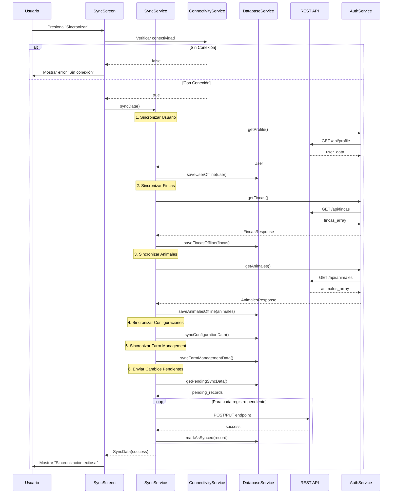
```mermaid
sequenceDiagram
    participant U as Usuario
    participant SS as SyncScreen
    participant SyncS as SyncService
    participant CS as ConnectivityService
    participant DB as DatabaseService
    participant API as REST API
    participant AS as AuthService

    U->>SS: Presiona "Sincronizar"
    SS->>CS: Verificar conectividad
    
    alt Sin Conexión
        CS-->>SS: false
        SS->>U: Mostrar error "Sin conexión"
    else Con Conexión
        CS-->>SS: true
        SS->>SyncS: syncData()
        
        Note over SyncS: 1. Sincronizar Usuario
        SyncS->>AS: getProfile()
        AS->>API: GET /api/profile
        API-->>AS: user_data
        AS-->>SyncS: User
        SyncS->>DB: saveUserOffline(user)
        
        Note over SyncS: 2. Sincronizar Fincas
        SyncS->>AS: getFincas()
        AS->>API: GET /api/fincas
        API-->>AS: fincas_array
        AS-->>SyncS: FincasResponse
        SyncS->>DB: saveFincasOffline(fincas)
        
        Note over SyncS: 3. Sincronizar Animales
        SyncS->>AS: getAnimales()
        AS->>API: GET /api/animales
        API-->>AS: animales_array
        AS-->>SyncS: AnimalesResponse
        SyncS->>DB: saveAnimalesOffline(animales)
        
        Note over SyncS: 4. Sincronizar Configuraciones
        SyncS->>DB: syncConfigurationData()
        
        Note over SyncS: 5. Sincronizar Farm Management
        SyncS->>DB: syncFarmManagementData()
        
        Note over SyncS: 6. Enviar Cambios Pendientes
        SyncS->>DB: getPendingSyncData()
        DB-->>SyncS: pending_records
        
        loop Para cada registro pendiente
            SyncS->>API: POST/PUT endpoint
            API-->>SyncS: success
            SyncS->>DB: markAsSynced(record)
        end
        
        SyncS-->>SS: SyncData(success)
        SS->>U: Mostrar "Sincronización exitosa"
    end
```

### 3.3 Flujo de Operaciones CRUD Offline

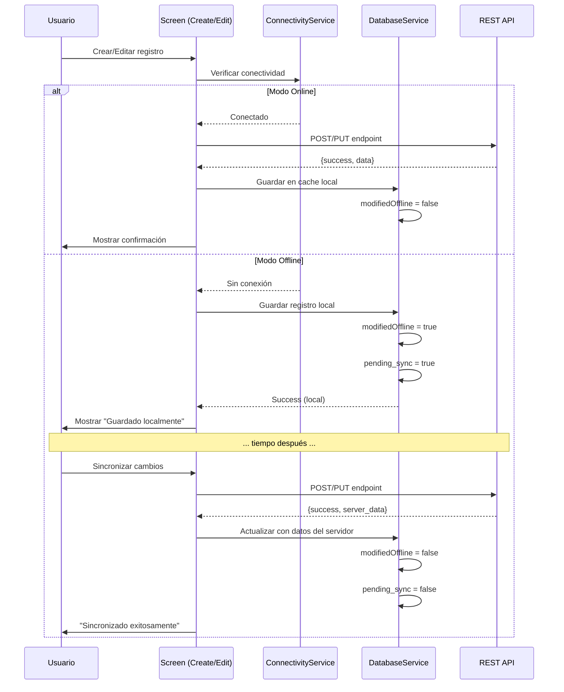
```mermaid
sequenceDiagram
    participant U as Usuario
    participant Screen as Screen (Create/Edit)
    participant CS as ConnectivityService
    participant DB as DatabaseService
    participant API as REST API

    U->>Screen: Crear/Editar registro
    Screen->>CS: Verificar conectividad
    
    alt Modo Online
        CS-->>Screen: Conectado
        Screen->>API: POST/PUT endpoint
        API-->>Screen: {success, data}
        Screen->>DB: Guardar en cache local
        DB->>DB: modifiedOffline = false
        Screen->>U: Mostrar confirmación
    else Modo Offline
        CS-->>Screen: Sin conexión
        Screen->>DB: Guardar registro local
        DB->>DB: modifiedOffline = true
        DB->>DB: pending_sync = true
        DB-->>Screen: Success (local)
        Screen->>U: Mostrar "Guardado localmente"
        
        Note over U,API: ... tiempo después ...
        
        U->>Screen: Sincronizar cambios
        Screen->>API: POST/PUT endpoint
        API-->>Screen: {success, server_data}
        Screen->>DB: Actualizar con datos del servidor
        DB->>DB: modifiedOffline = false
        DB->>DB: pending_sync = false
        Screen->>U: "Sincronizado exitosamente"
    end
```

### 3.4 Monitoreo de Conectividad

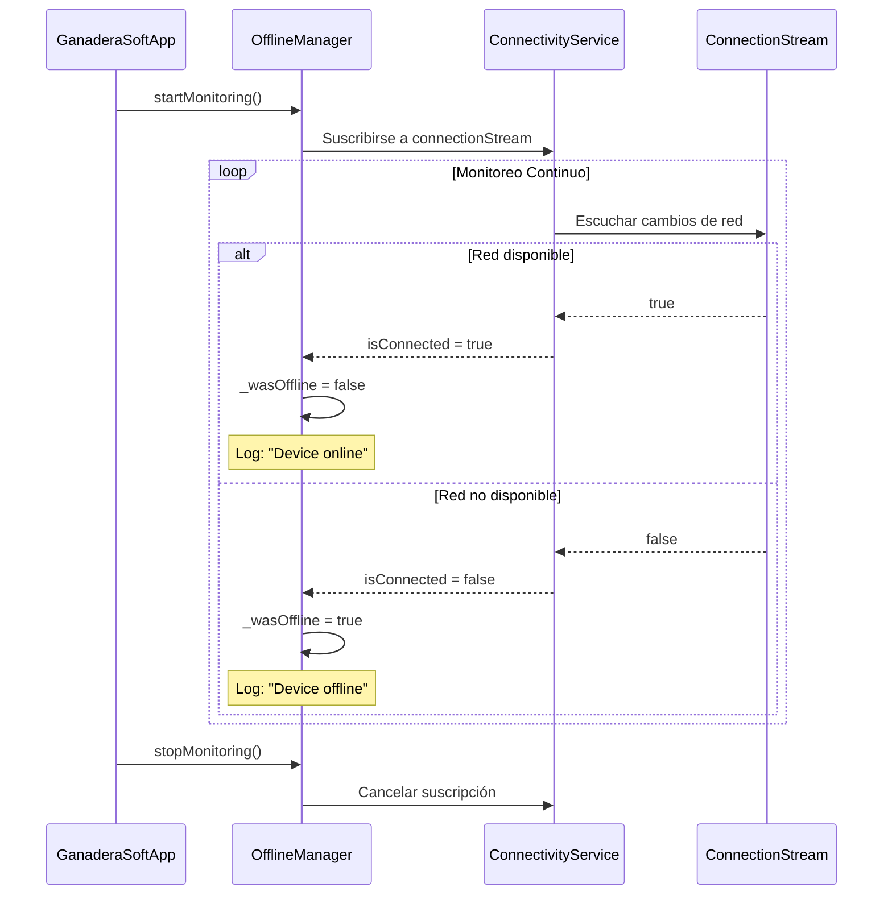
```mermaid
sequenceDiagram
    participant App as GanaderaSoftApp
    participant OM as OfflineManager
    participant CS as ConnectivityService
    participant Stream as ConnectionStream

    App->>OM: startMonitoring()
    OM->>CS: Suscribirse a connectionStream
    
    loop Monitoreo Continuo
        CS->>Stream: Escuchar cambios de red
        
        alt Red disponible
            Stream-->>CS: true
            CS-->>OM: isConnected = true
            OM->>OM: _wasOffline = false
            Note over OM: Log: "Device online"
        else Red no disponible
            Stream-->>CS: false
            CS-->>OM: isConnected = false
            OM->>OM: _wasOffline = true
            Note over OM: Log: "Device offline"
        end
    end
    
    App->>OM: stopMonitoring()
    OM->>CS: Cancelar suscripción
```

### 3.5 Descripción Técnica

**Gestión de Concurrencia:**

1. **Async/Await Pattern**: Todas las operaciones de I/O utilizan programación asíncrona de Dart
2. **Streams**: El monitoreo de conectividad usa `Stream<bool>` broadcast para notificar cambios a múltiples suscriptores
3. **StreamController**: SyncService emite eventos de progreso mediante StreamController broadcast
4. **Future-based**: Todas las llamadas HTTP y operaciones de base de datos retornan Futures

**Procesos Principales:**

1. **Autenticación Dual**: Soporta login online (JWT) y offline (hash SHA-256)
2. **Sincronización Multi-fase**: Proceso secuencial que sincroniza usuarios, fincas, animales, configuraciones y farm management
3. **CRUD Híbrido**: Las operaciones se ejecutan localmente en modo offline y se sincronizan cuando hay conexión
4. **Monitoreo de Conectividad**: Thread de fondo que detecta cambios de red sin auto-sincronización

**Manejo de Estado:**
- No hay concurrencia explícita de hilos (Dart usa event loop single-threaded)
- Las operaciones asíncronas no bloquean la UI
- Los Streams permiten actualización reactiva de la interfaz

---

## 4. Vista Física

La vista física describe la topología de despliegue y la distribución de componentes en el hardware.

### 4.1 Diagrama de Despliegue

```mermaid
graph TB
    subgraph "Dispositivos Móviles"
        subgraph "Android/iOS Device"
            FLUTTER[Flutter App<br/>GanaderaSoft]
            SQLITE[(SQLite Database<br/>ganaderasoft.db)]
            PREFS[SharedPreferences<br/>Token, Config]
            
            FLUTTER -->|Lee/Escribe| SQLITE
            FLUTTER -->|Almacena| PREFS
        end
    end
    
    subgraph "Red Internet"
        HTTP[HTTP/HTTPS<br/>REST Protocol]
    end
    
    subgraph "Servidor Backend - AWS EC2"
        subgraph "52.53.127.245:8000"
            LARAVEL[Laravel API<br/>Framework 10+]
            
            subgraph "Endpoints REST"
                E1[/api/auth/login]
                E2[/api/profile]
                E3[/api/fincas]
                E4[/api/animales]
                E5[/api/rebanos]
                E6[/api/lactancia]
                E7[/api/leche]
                E8[/api/peso-corporal]
                E9["... otros endpoints"]
            end
            
            LARAVEL --> E1
            LARAVEL --> E2
            LARAVEL --> E3
            LARAVEL --> E4
            LARAVEL --> E5
            LARAVEL --> E6
            LARAVEL --> E7
            LARAVEL --> E8
            LARAVEL --> E9
        end
        
        MYSQL[(MySQL Database<br/>Remota)]
        
        LARAVEL -->|Consultas SQL| MYSQL
    end
    
    FLUTTER <-->|HTTP Requests| HTTP
    HTTP <-->|JSON| LARAVEL
    
    style FLUTTER fill:#4FC3F7
    style LARAVEL fill:#FF7043
    style SQLITE fill:#FFF176
    style MYSQL fill:#81C784
```

### 4.2 Componentes y Nodos

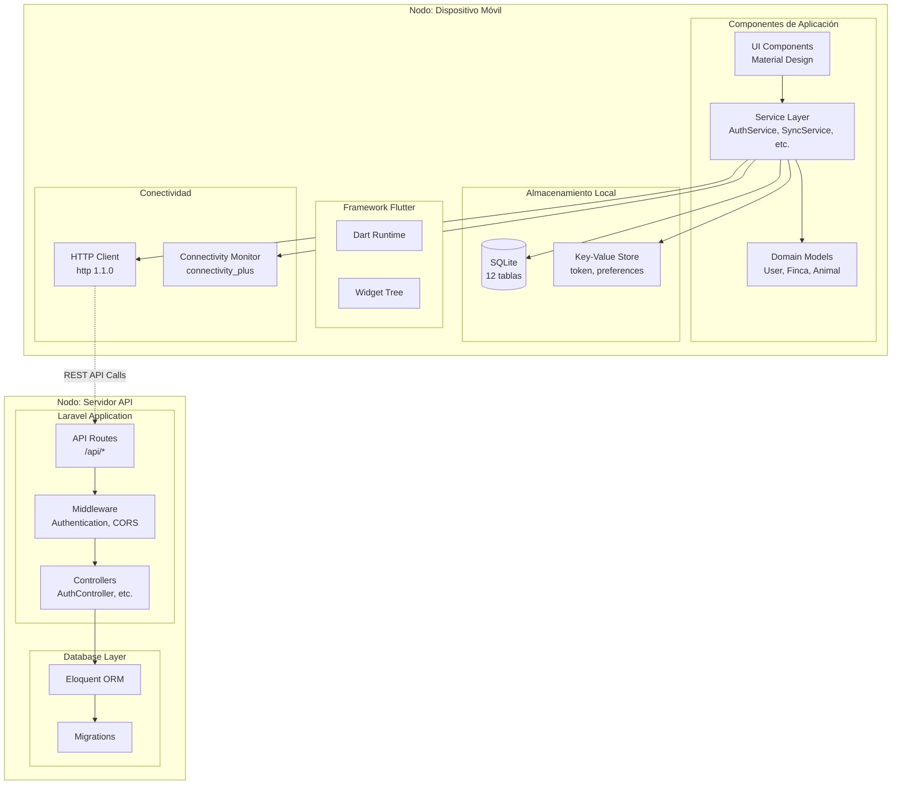
```mermaid
graph TB
    subgraph "Nodo: Dispositivo Móvil"
        direction TB
        
        subgraph "Componentes de Aplicación"
            UI[UI Components<br/>Material Design]
            SERVICES[Service Layer<br/>AuthService, SyncService, etc.]
            MODELS[Domain Models<br/>User, Finca, Animal]
        end
        
        subgraph "Framework Flutter"
            DART[Dart Runtime]
            WIDGETS[Widget Tree]
        end
        
        subgraph "Almacenamiento Local"
            SQLiteDB[(SQLite<br/>12 tablas)]
            KeyValue[Key-Value Store<br/>token, preferences]
        end
        
        subgraph "Conectividad"
            HTTP_CLIENT[HTTP Client<br/>http 1.1.0]
            CONN_MONITOR[Connectivity Monitor<br/>connectivity_plus]
        end
        
        UI --> SERVICES
        SERVICES --> MODELS
        SERVICES --> SQLiteDB
        SERVICES --> KeyValue
        SERVICES --> HTTP_CLIENT
        SERVICES --> CONN_MONITOR
    end
    
    subgraph "Nodo: Servidor API"
        direction TB
        
        subgraph "Laravel Application"
            ROUTES[API Routes<br/>/api/*]
            CONTROLLERS[Controllers<br/>AuthController, etc.]
            MIDDLEWARE[Middleware<br/>Authentication, CORS]
        end
        
        subgraph "Database Layer"
            ELOQUENT[Eloquent ORM]
            MIGRATIONS[Migrations]
        end
        
        ROUTES --> MIDDLEWARE
        MIDDLEWARE --> CONTROLLERS
        CONTROLLERS --> ELOQUENT
        ELOQUENT --> MIGRATIONS
    end
    
    HTTP_CLIENT -.->|REST API Calls| ROUTES
```

### 4.3 Descripción Técnica

**Nodo 1: Dispositivo Móvil (Cliente)**

- **Hardware**: Smartphones/tablets Android (API 21+) o iOS (iOS 12+)
- **Sistema Operativo**: Android 5.0+ / iOS 12+
- **Runtime**: Dart VM / Flutter Engine
- **Almacenamiento Local**:
  - SQLite v3 (ganaderasoft.db) - Aproximadamente 12 tablas
  - SharedPreferences - Almacenamiento clave-valor nativo
- **Conectividad**: WiFi, datos móviles (3G/4G/5G)
- **Memoria**: Mínimo 2GB RAM recomendado

**Componentes del Cliente:**
1. **Capa de Presentación**: 25+ pantallas Material Design
2. **Capa de Servicios**: 7 servicios principales (Auth, Database, Sync, etc.)
3. **Modelos de Datos**: 15+ clases de dominio
4. **Cliente HTTP**: Timeouts de 10 segundos, manejo de errores
5. **Base de Datos Local**: 
   - Versión actual: 12
   - Soporta migraciones automáticas
   - Tablas principales: users, fincas, animales, rebanos, lactancia, leche, etc.

**Nodo 2: Servidor Backend**

- **Infraestructura**: AWS EC2 (inferido por IP pública)
- **IP Pública**: 52.53.127.245
- **Puerto**: 8000
- **Servidor Web**: Probablemente Apache/Nginx
- **Framework**: Laravel (versión 10+ inferida)
- **Base de Datos**: MySQL (remota)
- **Protocolo**: HTTP REST
- **Formato de Datos**: JSON
- **Autenticación**: Bearer Token (Laravel Sanctum inferido)

**Endpoints Identificados:**
- `/api/auth/login` - Autenticación
- `/api/auth/logout` - Cierre de sesión
- `/api/profile` - Perfil del usuario
- `/api/fincas` - Gestión de fincas
- `/api/animales` - Gestión de animales
- `/api/rebanos` - Gestión de rebaños
- `/api/lactancia` - Registros de lactancia
- `/api/leche` - Registros de leche
- `/api/peso-corporal` - Registros de peso
- `/api/medidas-corporales` - Medidas corporales
- `/api/personal-finca` - Personal de finca
- `/api/cambios-animal` - Cambios en animales
- Endpoints de configuración (tipos de animales, etapas, etc.)

**Comunicación Cliente-Servidor:**
- **Protocolo**: HTTP/1.1
- **Formato**: JSON (application/json)
- **Headers**: Authorization: Bearer {token}, Content-Type, Accept
- **Métodos**: GET, POST, PUT, DELETE
- **Timeout**: 10 segundos por petición
- **Retry**: No hay retry automático

**Flujo de Datos:**
1. Cliente verifica conectividad
2. Si online: Peticiones HTTP REST al servidor
3. Si offline: Operaciones en SQLite local con flag `modifiedOffline=true`
4. Sincronización manual: Envío de cambios pendientes al servidor

---

## 5. Vista de Escenarios (Casos de Uso)

La vista de escenarios valida la arquitectura mediante casos de uso principales.

### 5.1 Escenario: Autenticación Offline

**Descripción**: Un usuario inicia sesión sin conexión a internet utilizando credenciales previamente sincronizadas.

**Precondiciones**:
- Usuario ha iniciado sesión anteriormente con conexión
- Datos del usuario están almacenados localmente en SQLite
- Password hash SHA-256 guardado en base de datos local

**Flujo Principal**:

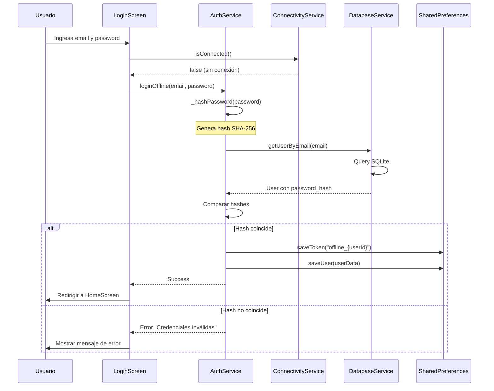
```mermaid
sequenceDiagram
    participant Usuario
    participant LoginScreen
    participant AuthService
    participant ConnectivityService
    participant DatabaseService
    participant SharedPreferences

    Usuario->>LoginScreen: Ingresa email y password
    LoginScreen->>ConnectivityService: isConnected()
    ConnectivityService-->>LoginScreen: false (sin conexión)
    
    LoginScreen->>AuthService: loginOffline(email, password)
    AuthService->>AuthService: _hashPassword(password)
    Note over AuthService: Genera hash SHA-256
    
    AuthService->>DatabaseService: getUserByEmail(email)
    DatabaseService->>DatabaseService: Query SQLite
    DatabaseService-->>AuthService: User con password_hash
    
    AuthService->>AuthService: Comparar hashes
    
    alt Hash coincide
        AuthService->>SharedPreferences: saveToken("offline_{userId}")
        AuthService->>SharedPreferences: saveUser(userData)
        AuthService-->>LoginScreen: Success
        LoginScreen->>Usuario: Redirigir a HomeScreen
    else Hash no coincide
        AuthService-->>LoginScreen: Error "Credenciales inválidas"
        LoginScreen->>Usuario: Mostrar mensaje de error
    end
```

**Postcondiciones**:
- Usuario autenticado con token offline
- Token temporal con formato `offline_{userId}`
- Acceso completo a datos locales
- Operaciones CRUD disponibles en modo offline

### 5.2 Escenario: Sincronización Bidireccional

**Descripción**: Sincronización completa de datos entre servidor y dispositivo, incluyendo envío de cambios locales.

**Precondiciones**:
- Conexión a internet disponible
- Usuario autenticado (token JWT válido)
- Existen cambios pendientes locales (modifiedOffline=true)

**Flujo Principal**:

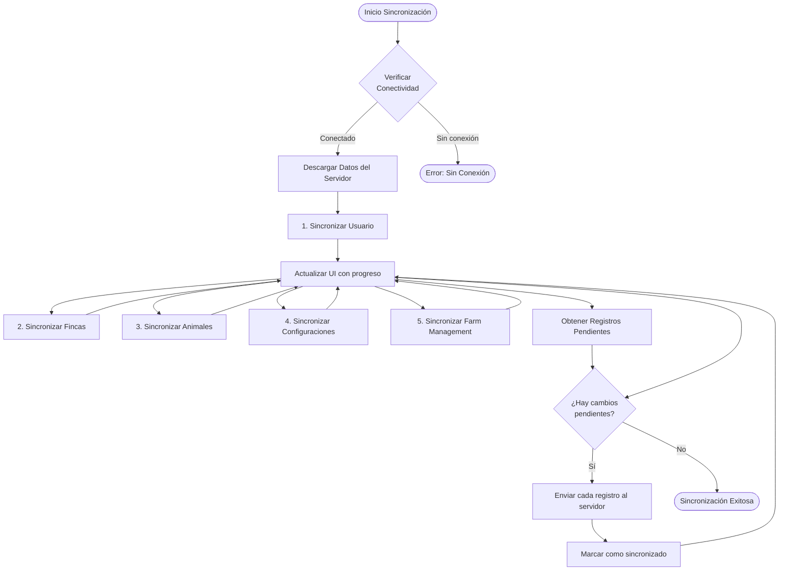
```mermaid
graph TB
    START([Inicio Sincronización])
    
    CHECK_CONN{Verificar<br/>Conectividad}
    
    SYNC_DOWN[Descargar Datos del Servidor]
    SYNC_USER[1. Sincronizar Usuario]
    SYNC_FINCAS[2. Sincronizar Fincas]
    SYNC_ANIMALS[3. Sincronizar Animales]
    SYNC_CONFIG[4. Sincronizar Configuraciones]
    SYNC_FARM[5. Sincronizar Farm Management]
    
    GET_PENDING[Obtener Registros Pendientes]
    HAS_PENDING{¿Hay cambios<br/>pendientes?}
    
    UPLOAD_LOOP[Enviar cada registro al servidor]
    MARK_SYNCED[Marcar como sincronizado]
    
    UPDATE_UI[Actualizar UI con progreso]
    SUCCESS([Sincronización Exitosa])
    ERROR([Error: Sin Conexión])
    
    START --> CHECK_CONN
    CHECK_CONN -->|Sin conexión| ERROR
    CHECK_CONN -->|Conectado| SYNC_DOWN
    
    SYNC_DOWN --> SYNC_USER
    SYNC_USER --> UPDATE_UI
    UPDATE_UI --> SYNC_FINCAS
    SYNC_FINCAS --> UPDATE_UI
    UPDATE_UI --> SYNC_ANIMALS
    SYNC_ANIMALS --> UPDATE_UI
    UPDATE_UI --> SYNC_CONFIG
    SYNC_CONFIG --> UPDATE_UI
    UPDATE_UI --> SYNC_FARM
    SYNC_FARM --> UPDATE_UI
    
    UPDATE_UI --> GET_PENDING
    GET_PENDING --> HAS_PENDING
    
    HAS_PENDING -->|Sí| UPLOAD_LOOP
    UPLOAD_LOOP --> MARK_SYNCED
    MARK_SYNCED --> UPDATE_UI
    UPDATE_UI --> HAS_PENDING
    
    HAS_PENDING -->|No| SUCCESS
```

**Postcondiciones**:
- Datos locales actualizados con información del servidor
- Cambios locales enviados y confirmados
- Flags `modifiedOffline` y `pending_sync` en false
- Usuario notificado del éxito de la sincronización

### 5.3 Escenario: Gestión de Finca en Modo Offline

**Descripción**: Creación y edición de una finca sin conexión a internet.

**Precondiciones**:
- Usuario autenticado en modo offline
- Sin conexión a internet

**Flujo Principal**:

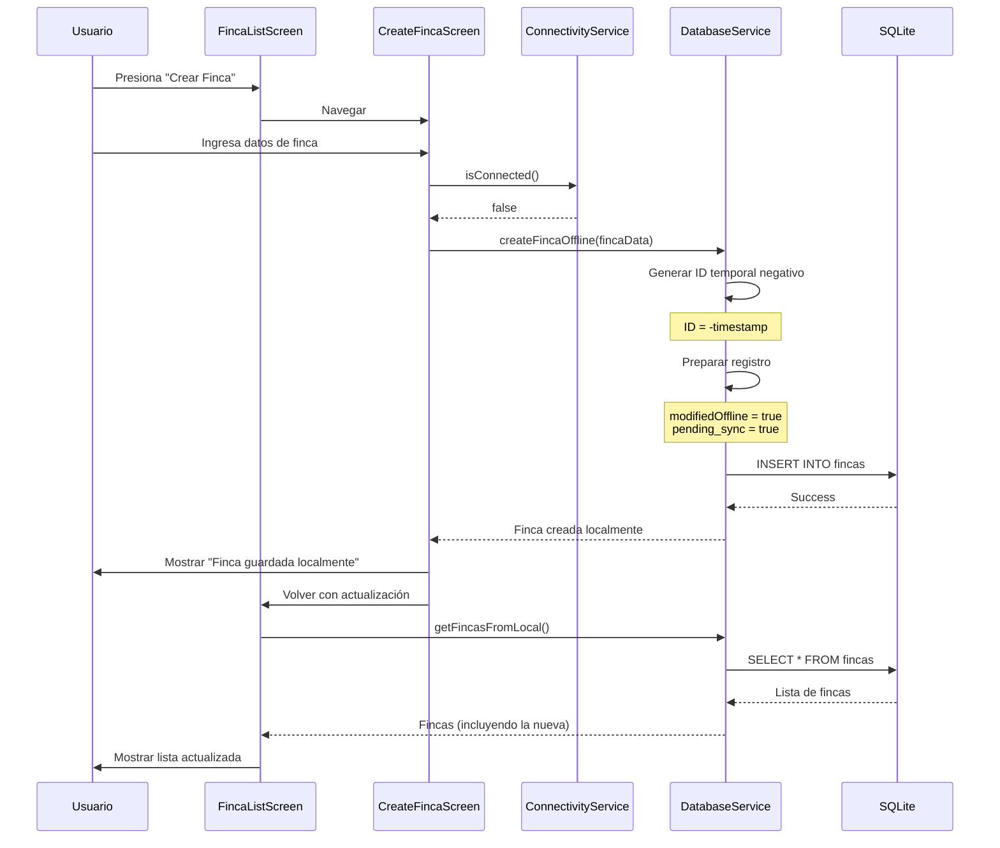
```mermaid
sequenceDiagram
    participant Usuario
    participant FincaListScreen
    participant CreateFincaScreen
    participant ConnectivityService
    participant DatabaseService
    participant SQLite

    Usuario->>FincaListScreen: Presiona "Crear Finca"
    FincaListScreen->>CreateFincaScreen: Navegar
    
    Usuario->>CreateFincaScreen: Ingresa datos de finca
    CreateFincaScreen->>ConnectivityService: isConnected()
    ConnectivityService-->>CreateFincaScreen: false
    
    CreateFincaScreen->>DatabaseService: createFincaOffline(fincaData)
    
    DatabaseService->>DatabaseService: Generar ID temporal negativo
    Note over DatabaseService: ID = -timestamp
    
    DatabaseService->>DatabaseService: Preparar registro
    Note over DatabaseService: modifiedOffline = true<br/>pending_sync = true
    
    DatabaseService->>SQLite: INSERT INTO fincas
    SQLite-->>DatabaseService: Success
    
    DatabaseService-->>CreateFincaScreen: Finca creada localmente
    CreateFincaScreen->>Usuario: Mostrar "Finca guardada localmente"
    CreateFincaScreen->>FincaListScreen: Volver con actualización
    
    FincaListScreen->>DatabaseService: getFincasFromLocal()
    DatabaseService->>SQLite: SELECT * FROM fincas
    SQLite-->>DatabaseService: Lista de fincas
    DatabaseService-->>FincaListScreen: Fincas (incluyendo la nueva)
    FincaListScreen->>Usuario: Mostrar lista actualizada
```

**Postcondiciones**:
- Finca creada con ID temporal negativo
- Registro marcado como `modifiedOffline=true`
- Finca visible en lista local
- Datos pendientes de sincronización

### 5.4 Escenario: Registro de Producción de Leche

**Descripción**: Registro diario de producción lechera de un animal en lactancia.

**Precondiciones**:
- Animal con período de lactancia activo
- Usuario autenticado
- Puede estar online u offline

**Diagrama de Actividad**:

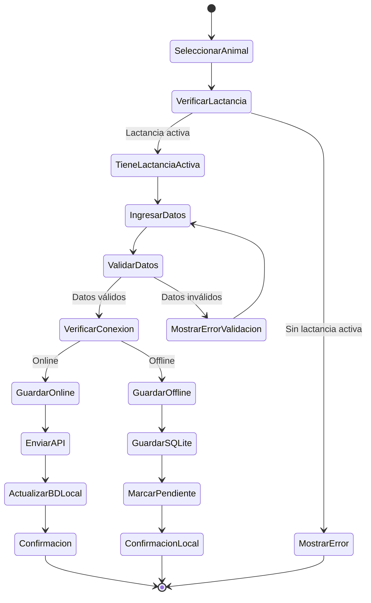
```mermaid
stateDiagram-v2
    [*] --> SeleccionarAnimal
    SeleccionarAnimal --> VerificarLactancia
    
    VerificarLactancia --> TieneLactanciaActiva: Lactancia activa
    VerificarLactancia --> MostrarError: Sin lactancia activa
    MostrarError --> [*]
    
    TieneLactanciaActiva --> IngresarDatos
    IngresarDatos --> ValidarDatos
    
    ValidarDatos --> VerificarConexion: Datos válidos
    ValidarDatos --> MostrarErrorValidacion: Datos inválidos
    MostrarErrorValidacion --> IngresarDatos
    
    VerificarConexion --> GuardarOnline: Online
    VerificarConexion --> GuardarOffline: Offline
    
    GuardarOnline --> EnviarAPI
    EnviarAPI --> ActualizarBDLocal
    ActualizarBDLocal --> Confirmacion
    
    GuardarOffline --> GuardarSQLite
    GuardarSQLite --> MarcarPendiente
    MarcarPendiente --> ConfirmacionLocal
    
    Confirmacion --> [*]
    ConfirmacionLocal --> [*]
```

**Postcondiciones Online**:
- Registro guardado en servidor MySQL
- Copia local actualizada en SQLite
- ID definitivo asignado por servidor

**Postcondiciones Offline**:
- Registro guardado en SQLite con ID temporal
- Marcado como `pending_sync=true`
- Disponible para sincronización posterior

### 5.5 Escenario: Recuperación ante Fallo de Conexión

**Descripción**: Manejo de pérdida de conexión durante una operación.

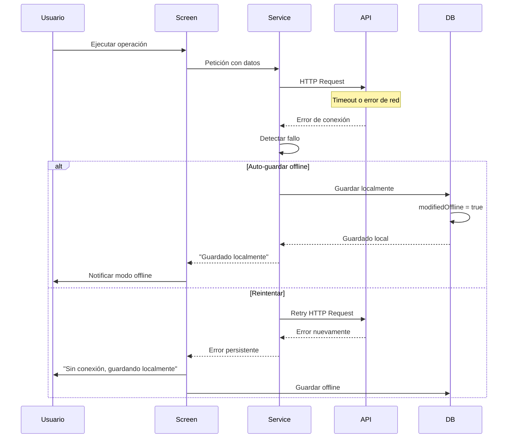
```mermaid
sequenceDiagram
    participant Usuario
    participant Screen
    participant Service
    participant API
    participant DB

    Usuario->>Screen: Ejecutar operación
    Screen->>Service: Petición con datos
    Service->>API: HTTP Request
    
    Note over API: Timeout o error de red
    
    API-->>Service: Error de conexión
    Service->>Service: Detectar fallo
    
    alt Auto-guardar offline
        Service->>DB: Guardar localmente
        DB->>DB: modifiedOffline = true
        DB-->>Service: Guardado local
        Service-->>Screen: "Guardado localmente"
        Screen->>Usuario: Notificar modo offline
    else Reintentar
        Service->>API: Retry HTTP Request
        API-->>Service: Error nuevamente
        Service-->>Screen: Error persistente
        Screen->>Usuario: "Sin conexión, guardando localmente"
        Screen->>DB: Guardar offline
    end
```

### 5.6 Descripción Técnica de Escenarios

**Validación de la Arquitectura:**

Los casos de uso demuestran que la arquitectura soporta:

1. **Resiliencia**: Funcionamiento completo sin conexión
2. **Consistencia Eventual**: Sincronización bidireccional diferida
3. **Experiencia de Usuario Fluida**: Transiciones transparentes entre modos
4. **Integridad de Datos**: Manejo de IDs temporales y resolución de conflictos
5. **Seguridad**: Hash SHA-256 para autenticación offline

**Trazabilidad con el Código:**

- **Autenticación Offline**: Implementado en `auth_service.dart:loginOffline()`
- **Sincronización**: Implementado en `sync_service.dart:syncData()`
- **CRUD Offline**: Métodos `*Offline()` en `database_service.dart`
- **Monitoreo**: `offline_manager.dart` y `connectivity_service.dart`
- **IDs Temporales**: Generación con `-DateTime.now().millisecondsSinceEpoch`

---

## Conclusión

Este documento presenta la arquitectura completa de GanaderaSoft bajo el modelo 4+1 vistas, basándose exclusivamente en el análisis del código fuente del repositorio. La aplicación implementa una arquitectura robusta de tipo offline-first con las siguientes características clave:

**Tecnologías Verificadas en el Código:**
- Flutter 3.8.1+ para desarrollo móvil multiplataforma
- SQLite para persistencia local con 12+ tablas
- API REST Laravel en servidor remoto (52.53.127.245:8000)
- HTTP 1.1.0 para comunicación cliente-servidor
- Provider para gestión de estado
- Connectivity Plus para monitoreo de red
- SharedPreferences para configuración persistente
- Crypto (SHA-256) para seguridad

**Decisiones Arquitectónicas Destacadas:**
1. Patrón MVS (Model-View-Service) con clara separación de responsabilidades
2. Estrategia offline-first con sincronización manual
3. IDs temporales negativos para registros offline
4. Autenticación dual (JWT online / hash offline)
5. Sincronización bidireccional multi-fase
6. Manejo robusto de conectividad intermitente

La arquitectura está diseñada para entornos rurales con conectividad limitada, permitiendo operación continua y sincronización diferida.
