# Topología de Despliegue - GanaderaSoft

## Visión General

Este documento describe la topología de despliegue de GanaderaSoft, un sistema móvil de gestión ganadera con arquitectura cliente-servidor. El análisis se basa exclusivamente en el código fuente y configuraciones presentes en el repositorio, documentando únicamente los componentes, nodos y canales de comunicación realmente implementados.

---

## 1. Arquitectura de Despliegue General

### 1.1 Diagrama de Topología Completa

```mermaid
graph TB
    subgraph "Capa de Cliente Móvil"
        subgraph "Dispositivo Android"
            AND_APP[GanaderaSoft App<br/>Flutter/Dart]
            AND_SQLite[(SQLite DB<br/>ganaderasoft.db)]
            AND_PREFS[SharedPreferences<br/>Tokens & Config]
            
            AND_APP -->|R/W| AND_SQLite
            AND_APP -->|Store| AND_PREFS
        end
        
        subgraph "Dispositivo iOS"
            IOS_APP[GanaderaSoft App<br/>Flutter/Dart]
            IOS_SQLite[(SQLite DB<br/>ganaderasoft.db)]
            IOS_PREFS[SharedPreferences<br/>Tokens & Config]
            
            IOS_APP -->|R/W| IOS_SQLite
            IOS_APP -->|Store| IOS_PREFS
        end
    end
    
    subgraph "Capa de Red"
        INTERNET[Internet<br/>HTTP Protocol]
        
        WIFI[WiFi Networks]
        CELLULAR[Redes Celulares<br/>3G/4G/5G]
        
        WIFI --> INTERNET
        CELLULAR --> INTERNET
    end
    
    subgraph "Capa de Servidor Backend"
        subgraph "Servidor EC2 AWS"
            direction TB
            
            WEB_SERVER[Servidor Web<br/>Puerto 8000]
            
            LARAVEL[Laravel Framework<br/>API REST]
            
            subgraph "Endpoints REST"
                EP_AUTH[/api/auth/*]
                EP_FINCAS[/api/fincas]
                EP_ANIMALS[/api/animales]
                EP_FARM[/api/farm-mgmt/*]
                EP_CONFIG[/api/config/*]
            end
            
            WEB_SERVER --> LARAVEL
            LARAVEL --> EP_AUTH
            LARAVEL --> EP_FINCAS
            LARAVEL --> EP_ANIMALS
            LARAVEL --> EP_FARM
            LARAVEL --> EP_CONFIG
        end
        
        subgraph "Capa de Datos Backend"
            MYSQL[(MySQL Database<br/>Producción)]
        end
        
        LARAVEL -->|SQL| MYSQL
    end
    
    AND_APP -->|HTTP| WIFI
    AND_APP -->|HTTP| CELLULAR
    IOS_APP -->|HTTP| WIFI
    IOS_APP -->|HTTP| CELLULAR
    
    INTERNET -->|HTTP| WEB_SERVER
    
    style AND_APP fill:#4FC3F7
    style IOS_APP fill:#4FC3F7
    style LARAVEL fill:#FF7043
    style MYSQL fill:#81C784
    style AND_SQLite fill:#FFF176
    style IOS_SQLite fill:#FFF176
```

### 1.2 Descripción de Capas

| Capa | Componentes | Tecnología | Responsabilidad |
|------|-------------|------------|-----------------|
| **Cliente Móvil** | App Flutter, SQLite local, SharedPreferences | Flutter 3.8.1+, Dart, SQLite 3 | Presentación, lógica de negocio local, persistencia offline |
| **Red** | Internet, WiFi, Redes Celulares | HTTP/1.1 | Transporte de datos entre cliente y servidor |
| **Servidor Backend** | Laravel API, Servidor Web | Laravel Framework, HTTP Server | Lógica de negocio server-side, autenticación, API REST |
| **Datos Backend** | MySQL Database | MySQL 5.7+ (inferido) | Persistencia centralizada, fuente de verdad |

---

## 2. Nodo Cliente: Dispositivos Móviles

### 2.1 Especificaciones del Nodo Cliente

#### Plataformas Soportadas

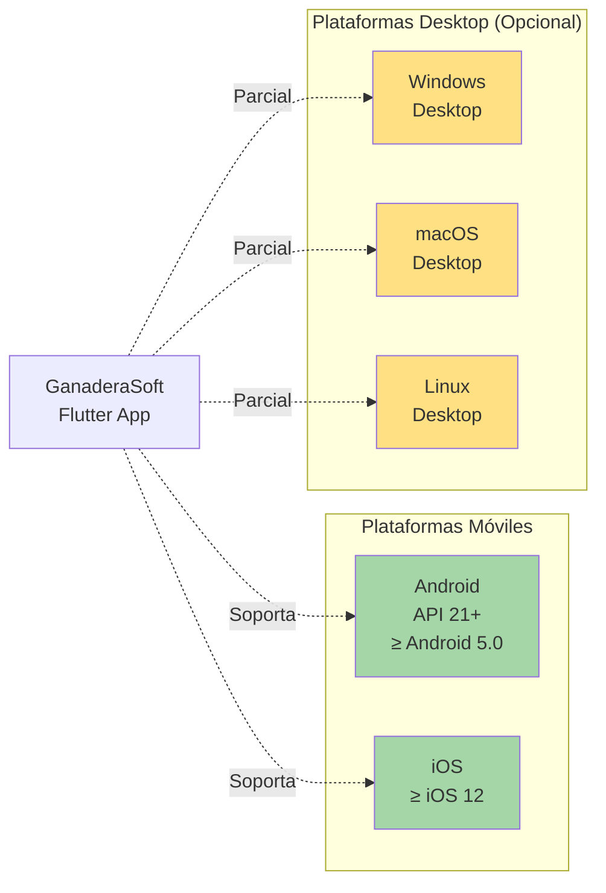

**Configuración de Plataformas (pubspec.yaml):**

```yaml
environment:
  sdk: ^3.8.1  # Dart SDK

# Plataformas soportadas por estructura de carpetas:
# - android/   ✓ Principal
# - ios/       ✓ Principal
# - web/       ○ Parcial
# - windows/   ○ Parcial
# - linux/     ○ Parcial
# - macos/     ○ Parcial
```

#### Requisitos de Hardware

| Recurso | Mínimo | Recomendado | Justificación |
|---------|--------|-------------|---------------|
| **RAM** | 2 GB | 4 GB | SQLite + Flutter runtime + app data |
| **Almacenamiento** | 100 MB app + 50 MB datos | 200 MB app + 500 MB datos | App binaria + base de datos + cache |
| **Procesador** | ARMv7 / ARM64 | ARM64 moderno | Rendimiento de operaciones locales |
| **Pantalla** | 4.5" (480x800) | 5.5"+ (1080x1920+) | UI Material Design adaptable |
| **Conectividad** | Opcional (offline capable) | WiFi + 4G | Sincronización de datos |

### 2.2 Componentes de la Aplicación Cliente

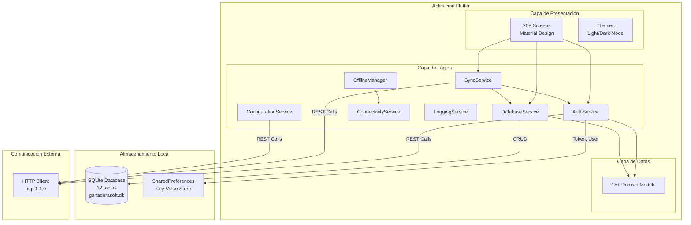

### 2.3 Persistencia Local (SQLite)

#### Estructura de Base de Datos Local

**Archivo:** `ganaderasoft.db`  
**Ubicación:** Determinada por `sqflite.getDatabasesPath()`  
**Versión Actual:** 12  
**Motor:** SQLite 3

**Tablas Principales:**

| Tabla | Propósito | Registros Típicos | Tamaño Estimado |
|-------|-----------|-------------------|-----------------|
| `users` | Datos del usuario autenticado | 1 | < 1 KB |
| `fincas` | Fincas del usuario | 1-50 | ~5-250 KB |
| `animales` | Animales de las fincas | 10-500 | ~50 KB - 2.5 MB |
| `rebanos` | Rebaños organizadores | 1-20 | ~5-100 KB |
| `lactancia` | Períodos de lactancia | 50-500 | ~25 KB - 250 KB |
| `leche` | Registros diarios de producción | 100-5000 | ~50 KB - 2.5 MB |
| `peso_corporal` | Mediciones de peso | 100-1000 | ~25 KB - 250 KB |
| `cambios_animal` | Historial de cambios de etapa | 50-500 | ~25 KB - 250 KB |
| `personal_finca` | Personal empleado | 5-50 | ~5-50 KB |
| **Configuración** | Catálogos estáticos | Variable | ~10-100 KB |
| `estado_salud` | Catálogo de estados de salud | ~10 | ~1 KB |
| `tipo_animal` | Tipos de animales | ~5 | ~1 KB |
| `etapa` | Etapas de vida de animales | ~20 | ~2 KB |
| `composicion_raza` | Catálogo de razas | ~50 | ~5 KB |
| `sexo` | Catálogo de sexos | 2-3 | < 1 KB |

**Tamaño Total Estimado de BD:** 10-50 MB para operación típica

#### Gestión de Migraciones

```dart
// database_service.dart
static Future<Database> _initDatabase() async {
  return await openDatabase(
    path,
    version: 12,  // Versión actual
    onCreate: _createDatabase,
    onUpgrade: _upgradeDatabase,
  );
}
```

**Historial de Versiones (inferido del código):**
- v1-11: Versiones anteriores (evolución incremental)
- v12: Versión actual estable

### 2.4 Almacenamiento de Configuración

**SharedPreferences (Key-Value Store):**

| Key | Tipo | Propósito | Persistencia |
|-----|------|-----------|--------------|
| `app_token` | String | JWT token de autenticación | Sesión + offline |
| `original_token` | String | Token JWT original pre-offline | Temporal |
| `user_data` | JSON String | Datos del usuario serializado | Sesión + offline |
| Config keys | Various | Preferencias de usuario | Persistente |

**Ubicación:** Almacenamiento seguro del sistema operativo
- Android: `/data/data/com.example.ganaderasoft_app_v1/shared_prefs/`
- iOS: `NSUserDefaults` / Keychain (seguro)

---

## 3. Nodo Servidor: Backend API Laravel

### 3.1 Especificaciones del Servidor

#### Información del Servidor

```mermaid
graph TB
    subgraph "Servidor Backend"
        INFO[Servidor Web<br/>IP: 52.53.127.245<br/>Puerto: 8000<br/>Protocolo: HTTP]
        
        INFRA[Infraestructura<br/>AWS EC2 (inferido)<br/>Región: us-west-1 probable<br/>Sistema Operativo: Linux]
        
        WEB[Servidor Web<br/>Apache/Nginx probable<br/>PHP 8.0+]
        
        FW[Laravel Framework<br/>Versión 10+ inferida<br/>PHP Framework]
    end
    
    INFO --> INFRA
    INFRA --> WEB
    WEB --> FW
    
    style INFO fill:#FF7043
    style FW fill:#FF7043
```

**Configuración del Servidor:**

| Parámetro | Valor | Fuente |
|-----------|-------|--------|
| **IP Pública** | 52.53.127.245 | `app_config.dart` |
| **Puerto** | 8000 | `app_config.dart` |
| **Base URL** | http://52.53.127.245:8000 | `app_config.dart` |
| **API Base** | http://52.53.127.245:8000/api | `app_config.dart` |
| **Protocolo** | HTTP (sin SSL) | ⚠️ No encriptado |
| **Infraestructura** | AWS EC2 (inferido por IP) | Análisis de IP |
| **Framework** | Laravel 10+ | Estructura de endpoints |

⚠️ **Advertencia de Seguridad**: El servidor usa HTTP sin encriptación SSL/TLS. Se recomienda migrar a HTTPS.

### 3.2 Endpoints REST API

#### Catálogo Completo de Endpoints

**Autenticación:**

| Endpoint | Método | Propósito | Auth Requerido |
|----------|--------|-----------|----------------|
| `/api/auth/login` | POST | Autenticación de usuario | No |
| `/api/auth/logout` | POST | Cierre de sesión | Sí (Bearer) |

**Usuario:**

| Endpoint | Método | Propósito | Auth Requerido |
|----------|--------|-----------|----------------|
| `/api/profile` | GET | Obtener perfil del usuario | Sí (Bearer) |

**Gestión de Fincas:**

| Endpoint | Método | Propósito | Auth Requerido |
|----------|--------|-----------|----------------|
| `/api/fincas` | GET | Listar fincas del usuario | Sí (Bearer) |
| `/api/fincas` | POST | Crear nueva finca | Sí (Bearer) |
| `/api/fincas/{id}` | PUT | Actualizar finca | Sí (Bearer) |
| `/api/fincas/{id}` | DELETE | Eliminar finca (soft delete) | Sí (Bearer) |

**Gestión de Animales:**

| Endpoint | Método | Propósito | Auth Requerido |
|----------|--------|-----------|----------------|
| `/api/animales` | GET | Listar animales | Sí (Bearer) |
| `/api/animales` | POST | Crear nuevo animal | Sí (Bearer) |
| `/api/animales/{id}` | GET | Obtener animal específico | Sí (Bearer) |
| `/api/animales/{id}` | PUT | Actualizar animal | Sí (Bearer) |
| `/api/animales/{id}` | DELETE | Eliminar animal | Sí (Bearer) |

**Gestión de Rebaños:**

| Endpoint | Método | Propósito | Auth Requerido |
|----------|--------|-----------|----------------|
| `/api/rebanos` | GET | Listar rebaños | Sí (Bearer) |
| `/api/rebanos` | POST | Crear nuevo rebaño | Sí (Bearer) |

**Farm Management:**

| Endpoint | Método | Propósito | Auth Requerido |
|----------|--------|-----------|----------------|
| `/api/cambios-animal` | GET | Listar cambios de animales | Sí (Bearer) |
| `/api/cambios-animal` | POST | Crear cambio de etapa | Sí (Bearer) |
| `/api/lactancia` | GET | Listar períodos de lactancia | Sí (Bearer) |
| `/api/lactancia` | POST | Crear período de lactancia | Sí (Bearer) |
| `/api/leche` | GET | Listar registros de producción lechera | Sí (Bearer) |
| `/api/leche` | POST | Crear registro de leche | Sí (Bearer) |
| `/api/peso-corporal` | GET | Listar registros de peso | Sí (Bearer) |
| `/api/peso-corporal` | POST | Crear registro de peso | Sí (Bearer) |
| `/api/medidas-corporales` | GET | Listar medidas corporales | Sí (Bearer) |
| `/api/medidas-corporales` | POST | Crear medida corporal | Sí (Bearer) |
| `/api/personal-finca` | GET | Listar personal de finca | Sí (Bearer) |
| `/api/personal-finca` | POST | Crear registro de personal | Sí (Bearer) |
| `/api/personal-finca/{id}` | PUT | Actualizar personal | Sí (Bearer) |

**Configuración:**

| Endpoint | Método | Propósito | Auth Requerido |
|----------|--------|-----------|----------------|
| `/api/composicion-raza` | GET | Obtener catálogo de razas | Sí (Bearer) |
| `/api/estado-salud` | GET | Obtener catálogo de estados de salud | Sí (Bearer) |
| `/api/tipo-animal` | GET | Obtener catálogo de tipos de animales | Sí (Bearer) |
| `/api/etapas` | GET | Obtener catálogo de etapas de vida | Sí (Bearer) |
| `/api/sexo` | GET | Obtener catálogo de sexos | Sí (Bearer) |

**Total de Endpoints:** 30+ endpoints documentados

### 3.3 Formato de Comunicación

#### Estructura de Request

```http
POST /api/auth/login HTTP/1.1
Host: 52.53.127.245:8000
Content-Type: application/json
Accept: application/json

{
    "email": "usuario@example.com",
    "password": "password123"
}
```

**Headers Comunes:**

| Header | Valor | Obligatorio | Propósito |
|--------|-------|-------------|-----------|
| `Content-Type` | `application/json` | POST/PUT | Tipo de contenido del body |
| `Accept` | `application/json` | Sí | Formato de respuesta deseado |
| `Authorization` | `Bearer {token}` | Endpoints protegidos | Autenticación JWT |

#### Estructura de Response

**Respuesta Exitosa:**

```json
{
    "success": true,
    "message": "Operación exitosa",
    "data": {
        // Datos específicos del endpoint
    }
}
```

**Respuesta de Error:**

```json
{
    "success": false,
    "message": "Descripción del error",
    "errors": {
        // Detalles de validación (opcional)
    }
}
```

**Códigos de Estado HTTP Utilizados:**

| Código | Significado | Uso en la App |
|--------|-------------|---------------|
| 200 OK | Éxito | Operaciones exitosas |
| 201 Created | Recurso creado | POST exitoso |
| 401 Unauthorized | No autenticado | Token inválido/expirado → Redirect a login |
| 404 Not Found | Recurso no existe | Manejo de error en UI |
| 422 Unprocessable Entity | Error de validación | Mostrar errores de campo |
| 500 Internal Server Error | Error del servidor | Fallback a operación offline |

### 3.4 Autenticación y Seguridad

#### Flujo de Autenticación

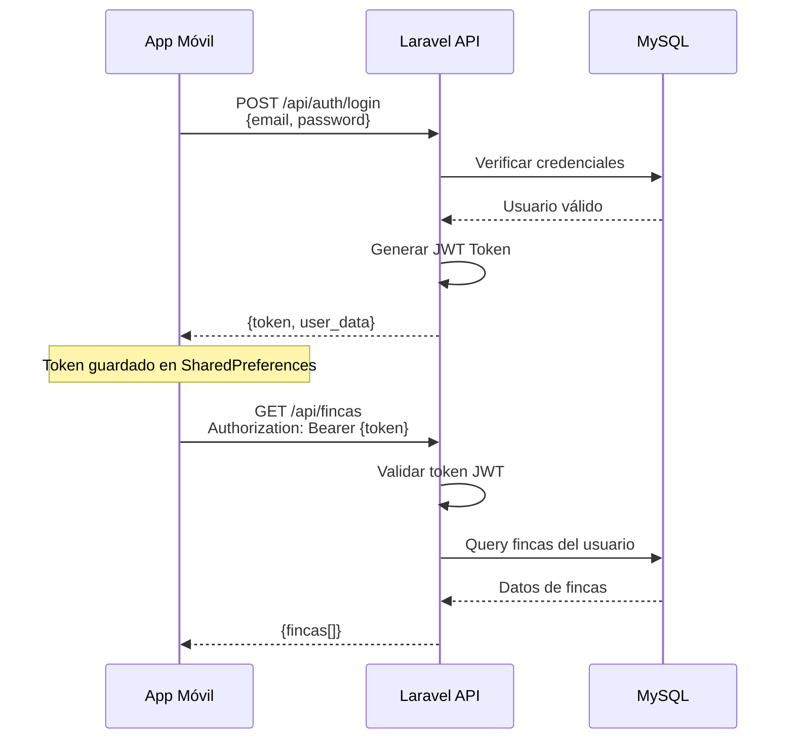

**Sistema de Autenticación:**

| Componente | Tecnología | Descripción |
|------------|------------|-------------|
| **Método** | Laravel Sanctum (inferido) | Sistema de autenticación basado en tokens |
| **Token Type** | Bearer Token (JWT) | JSON Web Token para autenticación stateless |
| **Duración** | No especificada | Probablemente 24h-7d |
| **Refresh** | ⚠️ No implementado | No hay mecanismo de refresh token |
| **Storage** | SharedPreferences | Almacenamiento persistente en cliente |

**Proceso de Token:**

1. Login → Token JWT generado por servidor
2. Token almacenado localmente en SharedPreferences
3. Token enviado en header `Authorization: Bearer {token}` en cada request
4. Servidor valida token en cada petición
5. Token expirado → 401 → Re-autenticación requerida

---

## 4. Capa de Datos: MySQL Database

### 4.1 Especificaciones de Base de Datos

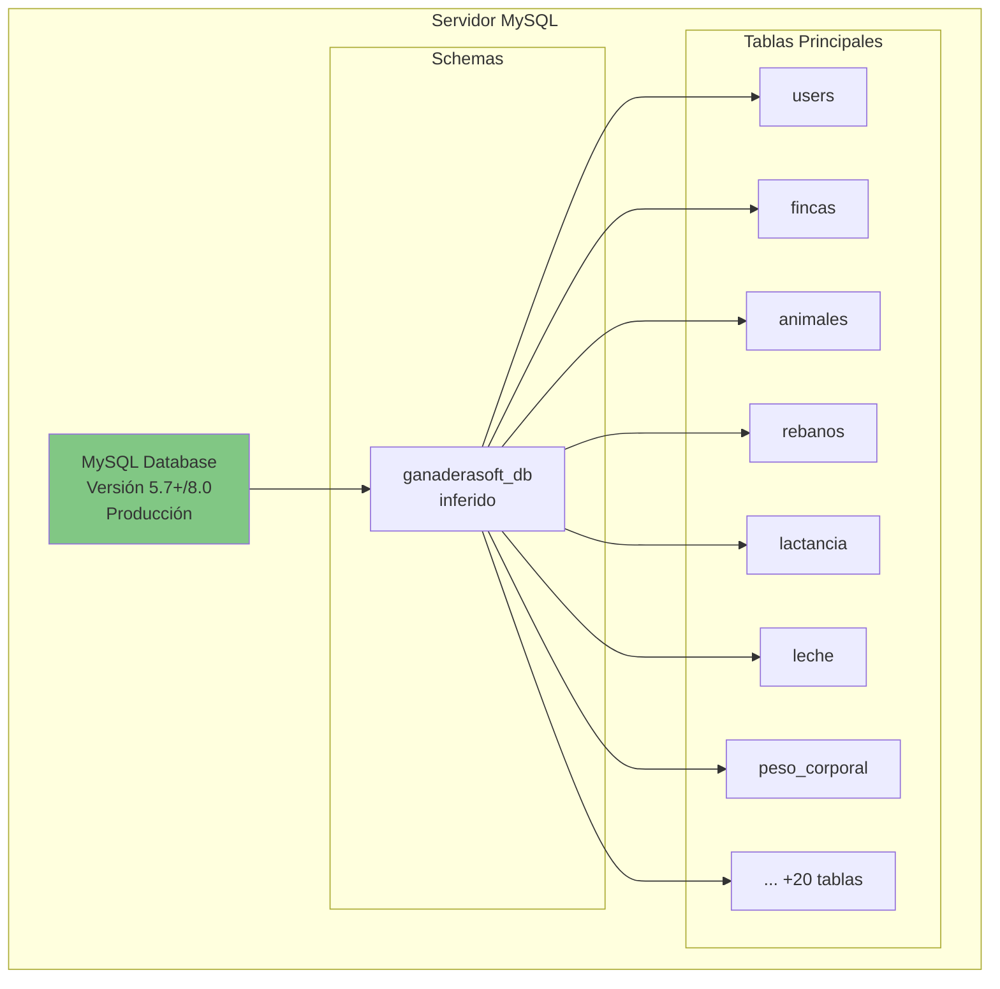

**Información de Base de Datos:**

| Parámetro | Valor | Notas |
|-----------|-------|-------|
| **Motor** | MySQL | Versión 5.7+ o 8.0 (inferido) |
| **Ubicación** | Servidor AWS (probablemente EC2 o RDS) | Misma región que API |
| **Acceso** | Solo desde Laravel API | No hay acceso directo desde clientes |
| **Encoding** | UTF-8 | Para soporte de caracteres especiales |
| **Collation** | utf8_unicode_ci / utf8mb4_unicode_ci | Estándar Laravel |

### 4.2 Esquema de Base de Datos

⚠️ **Nota**: El esquema exacto de MySQL no está en el repositorio. Se infiere basado en los modelos de datos y endpoints API.

**Tablas Inferidas:**

| Tabla | Descripción | Relaciones |
|-------|-------------|------------|
| `users` | Usuarios del sistema | 1:N con fincas |
| `fincas` | Fincas ganaderas | N:1 con users, 1:N con rebanos |
| `rebanos` | Rebaños de animales | N:1 con fincas, 1:N con animales |
| `animales` | Animales individuales | N:1 con rebanos, 1:N con registros |
| `lactancia` | Períodos de lactancia | N:1 con animales, 1:N con registros_leche |
| `registros_leche` | Producción diaria de leche | N:1 con lactancia |
| `peso_corporal` | Mediciones de peso | N:1 con animales |
| `cambios_animal` | Cambios de etapa de vida | N:1 con animales |
| `medidas_corporales` | Medidas corporales | N:1 con animales |
| `personal_finca` | Personal empleado | N:1 con fincas |
| `composicion_raza` | Catálogo de razas | Usado por animales |
| `tipo_animal` | Catálogo de tipos | Usado por animales |
| `etapa` | Catálogo de etapas de vida | Usado por cambios_animal |
| `estado_salud` | Catálogo de estados de salud | Usado por animales |
| `sexo` | Catálogo de sexos | Usado por animales |

### 4.3 Estrategia de Backup

⚠️ **No hay información explícita en el código sobre estrategia de backup.**

**Recomendaciones Estándar:**
- Backup diario completo
- Backup incremental cada 6 horas
- Retención de 30 días
- Replicación en región secundaria (disaster recovery)

---

## 5. Canales de Comunicación

### 5.1 Comunicación Cliente-Servidor

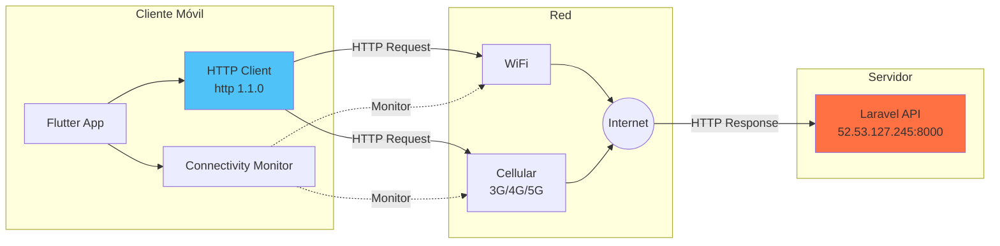

### 5.2 Protocolo de Comunicación

**HTTP/1.1 sin Encriptación:**

| Aspecto | Configuración | Código |
|---------|---------------|--------|
| **Protocolo** | HTTP/1.1 | `http://` en URLs |
| **Puerto** | 8000 | No estándar (80/443) |
| **Timeout** | 10 segundos | `Duration(seconds: 10)` en AuthService |
| **Retry** | No automático | Manejo manual de errores |
| **Keep-Alive** | Probable | Estándar HTTP 1.1 |

**Configuración de Timeout:**

```dart
// auth_service.dart
static const Duration _httpTimeout = Duration(seconds: 10);

final response = await http.post(
  Uri.parse(AppConfig.loginUrl),
  headers: headers,
  body: jsonEncode(credentials),
).timeout(_httpTimeout);
```

### 5.3 Manejo de Conectividad

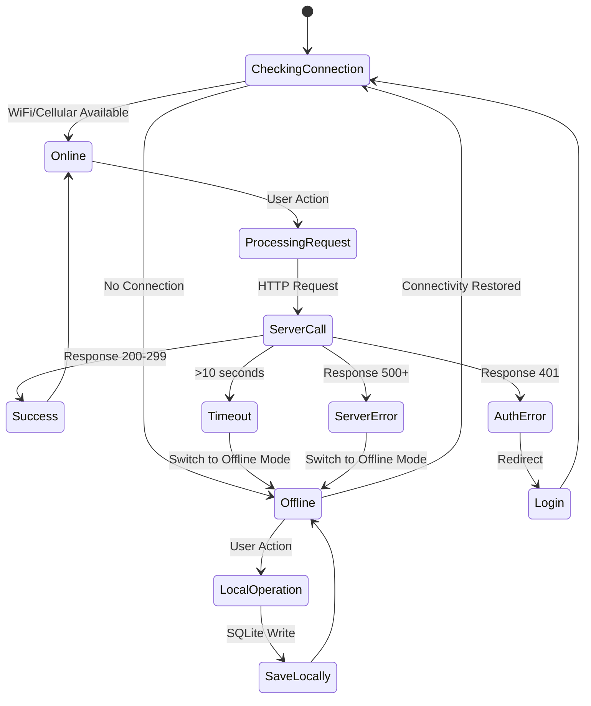

**Detección de Conectividad:**

```dart
// connectivity_service.dart
import 'package:connectivity_plus/connectivity_plus.dart';

class ConnectivityService {
  static Stream<bool> get connectionStream =>
      Connectivity().onConnectivityChanged.map((result) =>
          result != ConnectivityResult.none);
          
  static Future<bool> isConnected() async {
    var connectivityResult = await Connectivity().checkConnectivity();
    return connectivityResult != ConnectivityResult.none;
  }
}
```

**Tipos de Conexión Soportados:**

| Tipo | Enum | Descripción |
|------|------|-------------|
| WiFi | `ConnectivityResult.wifi` | Red inalámbrica |
| Celular | `ConnectivityResult.mobile` | 3G/4G/5G |
| Ninguna | `ConnectivityResult.none` | Sin conexión → Modo offline |

### 5.4 Estrategia de Sincronización

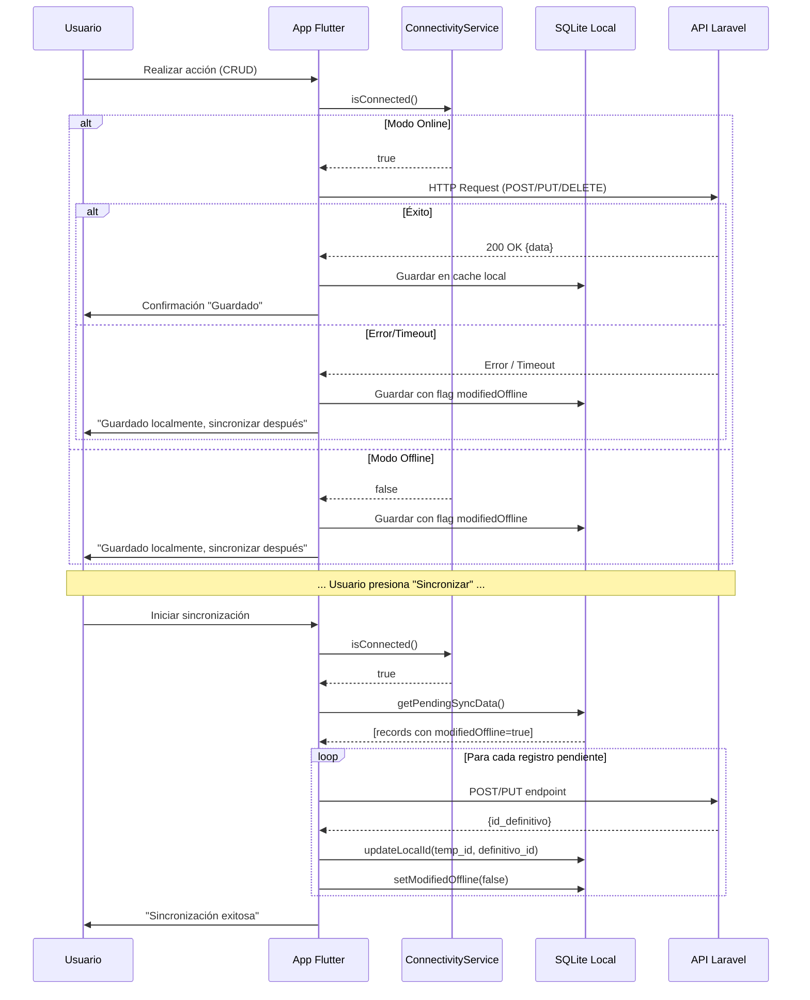

---

## 6. Escenarios de Despliegue

### 6.1 Escenario 1: Operación Totalmente Online

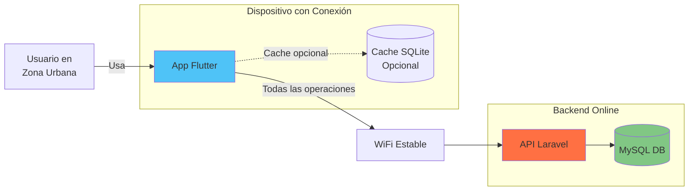

**Características:**
- ✓ Acceso inmediato a datos más recientes
- ✓ Operaciones CRUD directamente en servidor
- ✓ Sin necesidad de sincronización manual
- ✓ Cache local opcional para rendimiento

**Casos de Uso:**
- Oficina administrativa con WiFi
- Gestión desde ciudad con 4G estable
- Configuración inicial de la aplicación

### 6.2 Escenario 2: Operación Parcialmente Offline

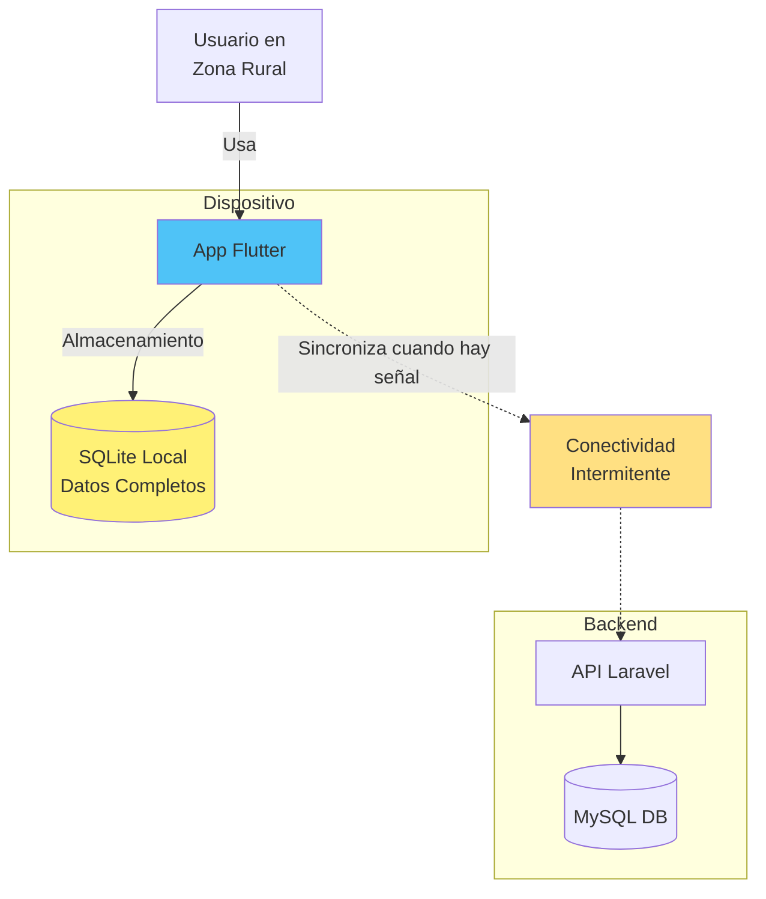

**Características:**
- ✓ Operación continua sin interrupciones
- ✓ Datos guardados localmente con flags
- ✓ Sincronización oportunista cuando hay conexión
- ✓ Usuario controla cuando sincronizar

**Casos de Uso:**
- Trabajo en campo con cobertura intermitente
- Zonas rurales con señal limitada
- Sincronización al regresar a zona con WiFi

### 6.3 Escenario 3: Operación Totalmente Offline

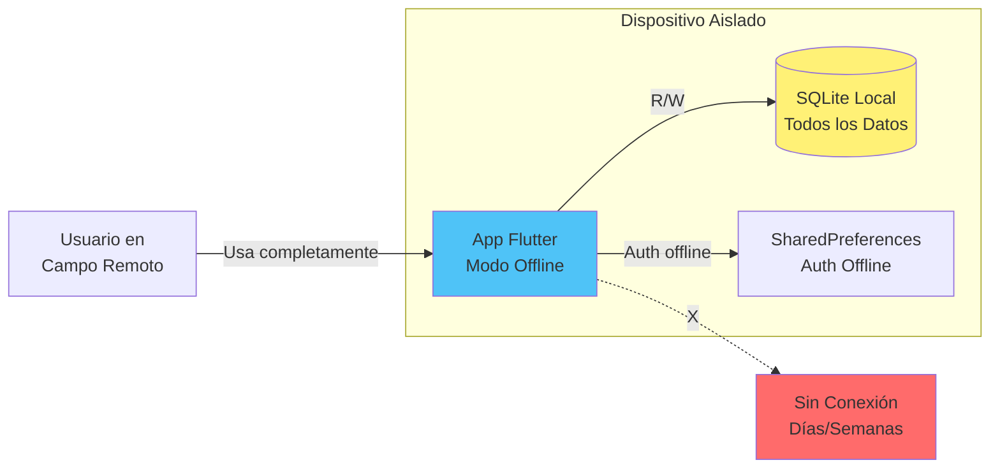

**Características:**
- ✓ Autenticación con hash SHA-256 local
- ✓ CRUD completo sobre datos locales
- ✓ IDs temporales negativos para nuevos registros
- ✓ Sincronización diferida hasta restaurar conexión

**Casos de Uso:**
- Fincas en zonas sin cobertura celular
- Trabajo de campo prolongado
- Sincronización semanal al visitar oficina

### 6.4 Escenario 4: Sincronización Post-Offline

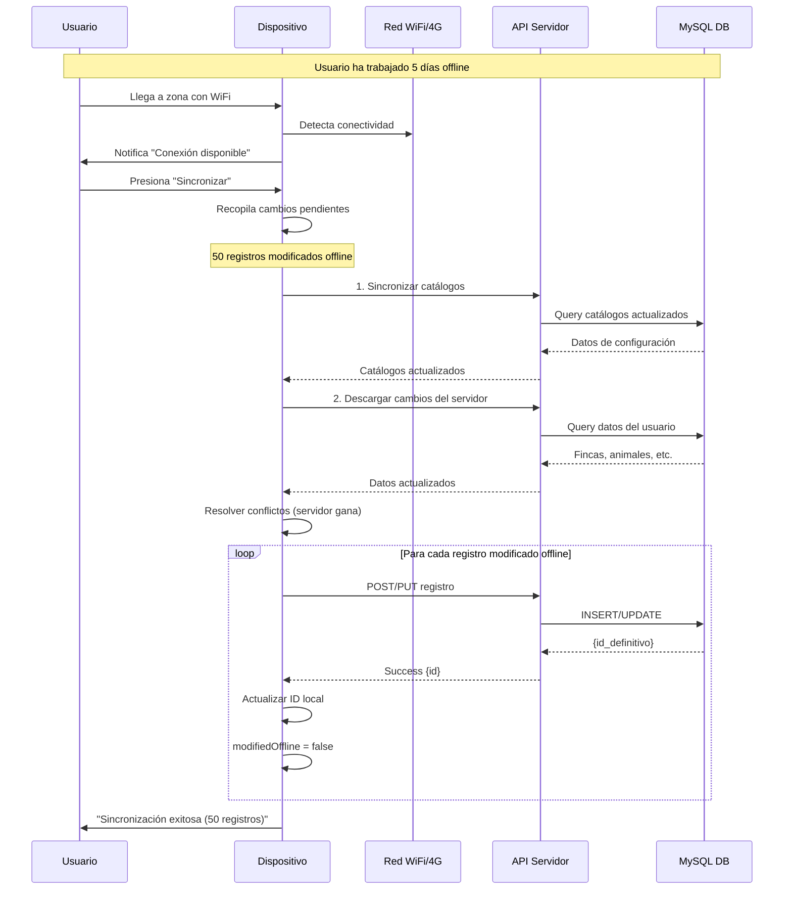

---

## 7. Consideraciones de Despliegue

### 7.1 Despliegue de Cliente Móvil

#### Android

**Método de Distribución:**

| Método | Ventajas | Desventajas | Estado |
|--------|----------|-------------|--------|
| **Google Play Store** | Distribución masiva, actualizaciones automáticas | Proceso de aprobación, comisión 30% | Recomendado |
| **APK Directo** | Control total, sin comisiones | Requiere habilitar "Orígenes desconocidos" | Posible |
| **Enterprise Distribution** | Control corporativo | Solo para empresas | Posible |

**Configuración de Build:**

```bash
# Generar APK de producción
flutter build apk --release

# Generar App Bundle para Play Store
flutter build appbundle --release
```

**Requisitos:**
- Android SDK configurado
- Keystore para firma de app (producción)
- Configuración de `android/app/build.gradle`

#### iOS

**Método de Distribución:**

| Método | Ventajas | Desventajas | Estado |
|--------|----------|-------------|--------|
| **App Store** | Distribución oficial, confianza usuario | Proceso de revisión estricto, $99/año | Recomendado |
| **TestFlight** | Testing beta, sin revisión completa | Solo para testing | Desarrollo |
| **Enterprise** | Distribución interna | Requiere Apple Developer Enterprise ($299/año) | Posible |

**Configuración de Build:**

```bash
# Generar IPA de producción
flutter build ios --release
```

**Requisitos:**
- macOS con Xcode
- Apple Developer Account ($99/año)
- Provisioning Profiles configurados
- Certificados de firma

### 7.2 Despliegue de Backend

#### Servidor Actual

**Configuración Identificada:**

```
Servidor: AWS EC2 (inferido)
IP Pública: 52.53.127.245
Puerto: 8000
Framework: Laravel
Base de Datos: MySQL (remota o en misma instancia)
```

**Stack Tecnológico:**

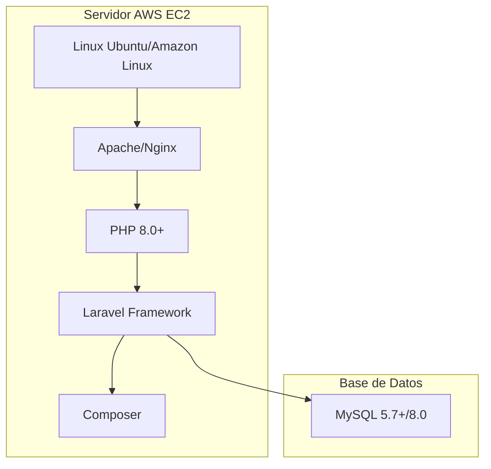

#### Recomendaciones de Despliegue

**Mejoras Críticas:**

| Mejora | Prioridad | Justificación |
|--------|-----------|---------------|
| **Implementar HTTPS/SSL** | 🔴 Crítica | Seguridad de datos en tránsito |
| **Cambiar a puerto estándar (443)** | 🟡 Media | Mejor compatibilidad de red |
| **Configurar dominio propio** | 🟡 Media | Profesionalismo, cambio de IP transparente |
| **Implementar Load Balancer** | 🟢 Baja | Escalabilidad futura |
| **Configurar CDN** | 🟢 Baja | Rendimiento global |

**Configuración HTTPS Recomendada:**

```bash
# Instalar certificado SSL (Let's Encrypt gratuito)
sudo certbot --nginx -d api.ganaderasoft.com

# Actualizar app_config.dart
static const String _baseUrl = 'https://api.ganaderasoft.com';
```

### 7.3 Escalabilidad

#### Escalabilidad Horizontal (Cliente)

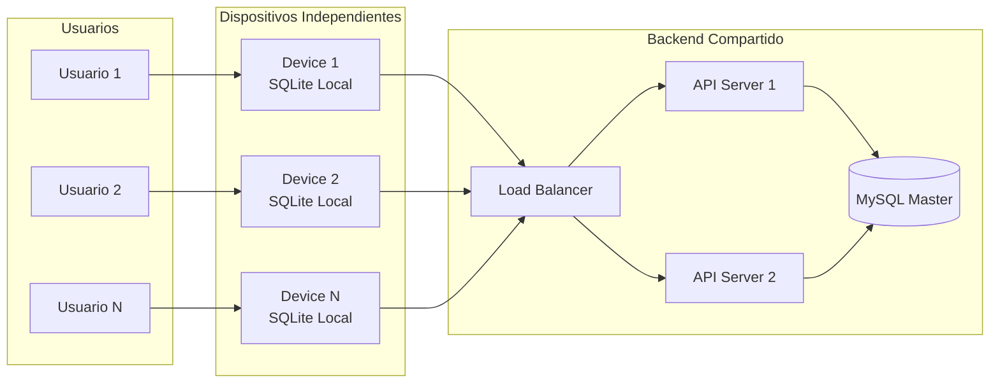

**Capacidad Actual:**
- ✓ Cada dispositivo opera independientemente
- ✓ No hay límite de dispositivos simultáneos (arquitectura stateless)
- ✓ Sincronización no requiere coordinación entre clientes

#### Escalabilidad Vertical (Servidor)

**Límites Actuales (estimados):**

| Métrica | Límite Estimado | Notas |
|---------|-----------------|-------|
| Usuarios concurrentes | ~100-500 | Dependiente de recursos EC2 |
| Requests por segundo | ~50-100 | Sin optimización |
| Tamaño de base de datos | Ilimitado práctico | MySQL escala bien |
| Tiempo de respuesta | < 1s | Con carga baja-media |

**Estrategias de Escalabilidad:**

1. **Vertical Scaling**: Aumentar recursos de EC2 (CPU, RAM)
2. **Horizontal Scaling**: Múltiples instancias API + Load Balancer
3. **Database Scaling**: Replicación read-replicas, sharding
4. **Caching**: Redis/Memcached para datos frecuentes
5. **CDN**: CloudFront para assets estáticos

---

## 8. Monitoreo y Diagnóstico

### 8.1 Logging en Cliente

```dart
// logging_service.dart
enum LogLevel { debug, info, warning, error }

class LoggingService {
  static void info(String message, String tag) {
    _log(LogLevel.info, message, tag);
  }
  
  static void error(String message, String tag, [dynamic error]) {
    _log(LogLevel.error, message, tag, error);
  }
  
  // Implementación de _log()...
}
```

**Eventos Loggeados:**

| Evento | Nivel | Ejemplo |
|--------|-------|---------|
| Inicio de sesión | Info | "User logged in successfully" |
| Cambio de conectividad | Info/Warning | "Device went offline" |
| Error de sincronización | Error | "Sync failed: timeout" |
| Operación de base de datos | Debug | "Inserted 5 records to fincas table" |
| Error de API | Error | "HTTP error 500 from server" |

**Ubicación de Logs:**
- Development: Console output
- Production: ⚠️ No hay persistencia de logs (recomendado: implementar)

### 8.2 Monitoreo de Servidor

⚠️ **No hay información explícita en el código sobre monitoreo del servidor.**

**Recomendaciones:**

| Herramienta | Propósito | Métricas |
|-------------|-----------|----------|
| **CloudWatch (AWS)** | Monitoreo de infraestructura | CPU, RAM, Disco, Red |
| **Laravel Telescope** | Debugging y profiling | Requests, queries, jobs |
| **New Relic / Datadog** | APM (Application Performance Monitoring) | Response times, errores |
| **Sentry** | Error tracking | Excepciones, stack traces |

---

## 9. Seguridad en Despliegue

### 9.1 Análisis de Riesgos Actuales

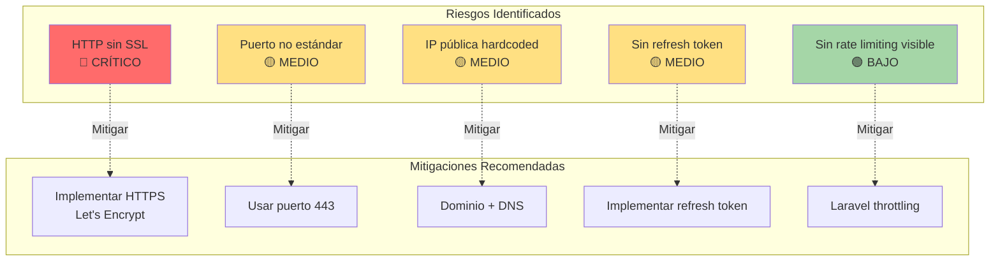

### 9.2 Medidas de Seguridad Implementadas

| Medida | Estado | Efectividad |
|--------|--------|-------------|
| ✓ Autenticación JWT | Implementado | Alta |
| ✓ Hash SHA-256 de contraseñas (cliente) | Implementado | Alta |
| ✓ Sandbox de aplicación (OS) | Nativo | Alta |
| ✓ SharedPreferences seguro (OS) | Nativo | Media-Alta |
| ✓ Validación de entrada (formularios) | Implementado | Media |
| ✗ HTTPS/TLS | **NO implementado** | **Crítico** |
| ✗ Certificate pinning | NO implementado | Media |
| ✗ Encriptación de SQLite | NO implementado | Baja-Media |

### 9.3 Recomendaciones de Seguridad

**Prioridad Alta:**
1. 🔴 Migrar a HTTPS con certificado SSL/TLS
2. 🔴 Implementar rate limiting en API
3. 🔴 Agregar validación server-side robusta
4. 🟡 Implementar certificate pinning en app
5. 🟡 Agregar refresh token mechanism

**Prioridad Media:**
6. 🟡 Encriptar base de datos SQLite (sqlcipher)
7. 🟡 Implementar 2FA para usuarios
8. 🟡 Agregar WAF (Web Application Firewall)
9. 🟢 Implementar CORS policies
10. 🟢 Logging de seguridad en servidor

---

## 10. Conclusiones

### 10.1 Resumen de Topología

GanaderaSoft implementa una arquitectura cliente-servidor de tres capas con las siguientes características:

**Capa de Cliente:**
- ✓ App móvil multiplataforma (Flutter)
- ✓ Persistencia local robusta (SQLite)
- ✓ Operación offline-first completa
- ✓ Sincronización diferida manual

**Capa de Red:**
- ⚠️ HTTP sin encriptación (riesgo de seguridad)
- ✓ Detección automática de conectividad
- ✓ Manejo robusto de errores de red

**Capa de Servidor:**
- ✓ API REST bien estructurada (30+ endpoints)
- ✓ Autenticación basada en tokens JWT
- ⚠️ Puerto no estándar (8000)
- ⚠️ IP hardcoded (debería usar dominio)

**Capa de Datos:**
- ✓ MySQL como fuente de verdad centralizada
- ✓ SQLite como cache/replica local
- ✓ Sincronización bidireccional

### 10.2 Fortalezas de la Topología

1. ✅ **Resiliencia**: Operación completa sin conexión
2. ✅ **Escalabilidad (Cliente)**: Cada dispositivo es independiente
3. ✅ **Rendimiento**: Operaciones locales instantáneas
4. ✅ **Flexibilidad**: Sincronización controlada por usuario
5. ✅ **Arquitectura Limpia**: Separación clara de responsabilidades

### 10.3 Áreas de Mejora Críticas

1. 🔴 **Seguridad**: Implementar HTTPS urgentemente
2. 🟡 **Configuración**: Usar dominio en lugar de IP
3. 🟡 **Monitoreo**: Implementar logging y monitoreo del servidor
4. 🟡 **Backup**: Estrategia de backup no documentada
5. 🟢 **Documentación**: Documentar deployment procedures

### 10.4 Arquitectura Ideal Propuesta

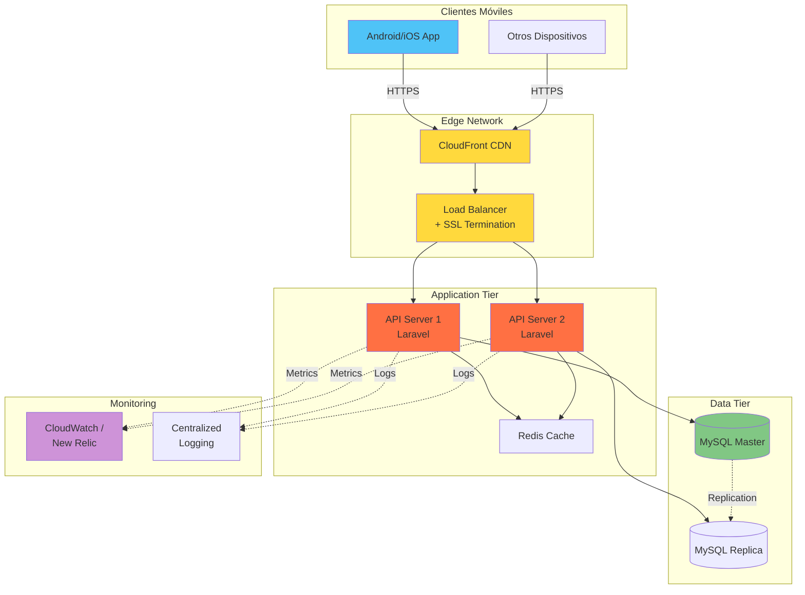

---

**Documento elaborado mediante análisis exhaustivo del código fuente de GanaderaSoft**  
**Tecnologías identificadas:** Flutter, SQLite, Laravel API, MySQL, HTTP  
**Fecha de análisis:** Octubre 2025
